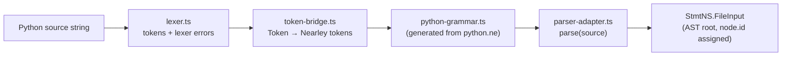
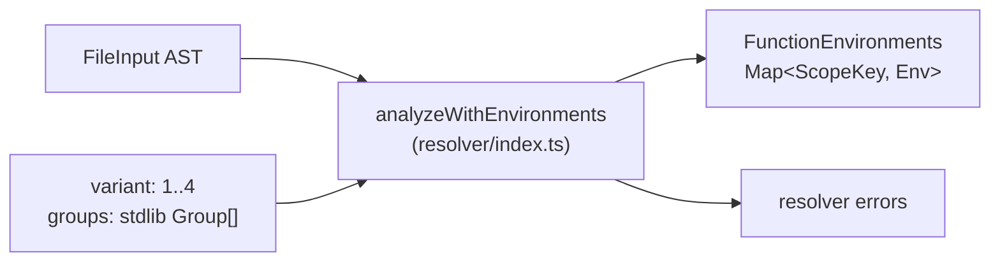
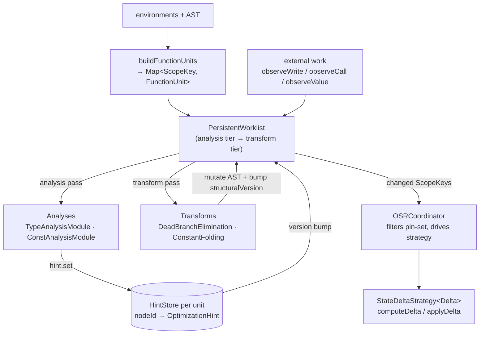
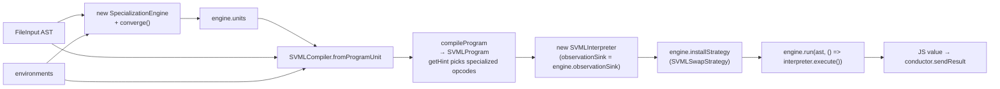
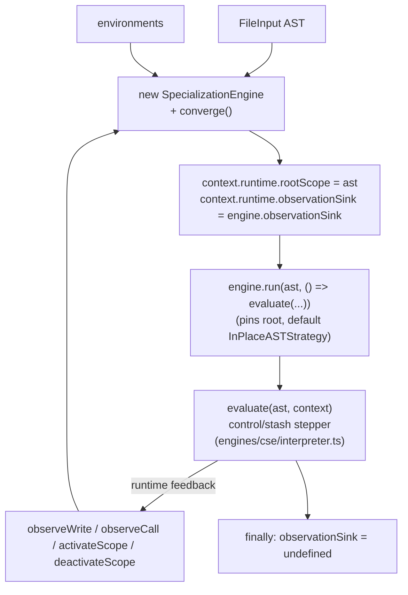
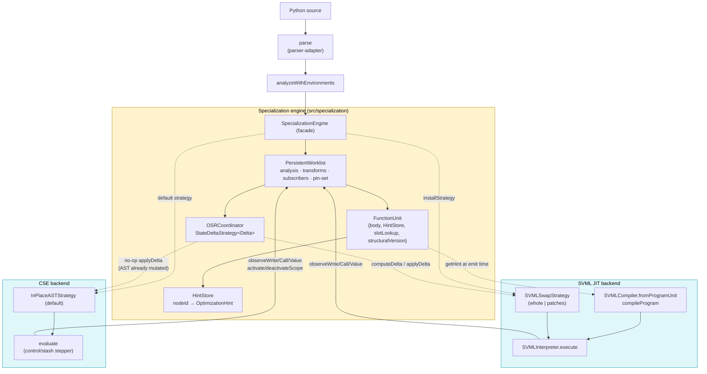

# py-slang compilation & execution flow

This document traces a Python source string from ingestion through to execution,
covering the available execution backends and the specialization engine they
share. Each phase includes a mermaid diagram of just that phase; a consolidated
end-to-end diagram sits at the end.

The goal is to make the interfaces between layers legible so the pipeline can
be dry-tested and reasoned about in isolation. For a hands-on view of what
specialization produces, run:

```
npx tsx scripts/dump-ast.ts <file.py> -o out.dot
```

`dump-ast` writes a DOT graph of the AST before and after the static
optimization pipeline, and prints a per-unit summary of hint counts, concrete
types, and constants to stderr.

---

## Phase 1 — Frontend: source → AST

Entry points:

- `parse(source: string)` (`src/parser/parser-adapter.ts`) — wraps a
  Nearley-generated grammar (`src/parser/python-grammar.ts`) driven by a
  hand-written lexer (`src/parser/lexer.ts`) via `token-bridge.ts`.
- Produces a `StmtNS.FileInput` (root of the AST), using the class-based node
  hierarchy in `src/ast-types.ts`. Every node has a stable `id` that downstream
  stages key on.



Failure mode: syntax errors surface as thrown `SyntaxError` / `LexerError`
instances from `parse`. Callers (the evaluators) catch and route them through
the conductor error channel.

---

## Phase 2 — Resolver: AST → environments

`analyzeWithEnvironments(ast, source, variant, groups?)` in `src/resolver`
walks the AST and returns:

- `errors`: scope / binding / variant-rule violations (stdlib groups gate which
  names are visible per variant).
- `environments`: a `FunctionEnvironments` map keyed by `FileInput | FunctionDef`
  describing each scope's declarations, free variables, and nesting. This is
  the input both the specialization engine and the SVML compiler need to reason
  about slots and closures.



Evaluators stop and surface errors before proceeding to specialization or
execution.

---

## Phase 3 — Specialization engine

Shared by all backends. Located under `src/specialization/`. The single
public entry point is `SpecializationEngine` (`src/specialization/engine.ts`),
which owns the full reactive lifecycle: worklist, OSR coordinator, hint
store, and default pipeline.

Typical shape:

```
const engine = new SpecializationEngine(ast, environments);
engine.converge();                               // initial static pass
// … compile / construct interpreter with engine.units …
engine.installStrategy(strategy);                // optional; CSE skips
await engine.run(rootScope, () => runtime());    // pins rootScope, drains on exit
```

`createReactiveOptimization` in `src/specialization/optimize.ts` remains as an
`@internal` escape hatch that hands back the raw `PersistentWorklist` for
tests and advanced consumers; production paths do not use it.

The engine composes:

- **FunctionUnits** (`framework/function-unit.ts`): per-scope container owning
  the scope's body reference, a `HintStore`, a slot lookup, and a
  `structuralVersion` that transforms bump when they mutate the body.
- **PersistentWorklist** (`framework/persistent-worklist.ts`): priority-scheduled
  fixpoint driver. Tier 1 is analysis over CFG blocks (type before const). Tier
  2 is transforms, which run only after local analysis fixpoint. It is also the
  ingest point for runtime observations (`observeWrite`, `observeCall`,
  `observeValue`) and the publisher for subscribers (e.g. the OSR coordinator).
- **HintStore** (`framework/hint.ts`): open-record `Map<nodeId, OptimizationHint>`.
  Each analysis reads/writes its own named field directly (`hint.type`,
  `hint.constVal`, …). Equality-on-write consults the registered
  `AnalysisModule.latticeEquals` for each field.
- **Analyses** (`type-analysis/`, `const-analysis/`): dataflow modules producing
  lattice values at named hint fields.
- **Transforms** (`transforms/`): `DeadBranchEliminationRule`,
  `ConstantFoldingRule`. Mutate the AST and bump `structuralVersion`, which
  invalidates downstream analysis for that unit.
- **OSRCoordinator** (`framework/osr.ts`): subscribes to the worklist and, for
  each changed unit whose scope is not pinned, invokes the installed
  `StateDeltaStrategy` to compute + apply a delta.



### Specialization lifecycle (safepoint contract)

The OSR coordinator and the worklist's pin-set jointly implement a safepoint
contract: **a transform's materialized form is never installed while a frame
of the target scope is on the stack.** Mechanics:

1. Interpreter calls `engine.observationSink.activateScope(scope)` on call
   entry (pin count +1).
2. Any transform enqueued against a pinned scope stays parked in the worklist
   (`hasProcessableTransform` / `processTransform` skip it).
3. Interpreter calls `deactivateScope(scope)` on return (pin count −1).
4. The surrounding `engine.run()` / `withActiveScope()` finally block calls
   `tick()`, which drains parked transforms whose scopes are now unpinned,
   mutates AST / hints, and synchronously `notify()`s subscribers.
5. `OSRCoordinator.onChange` re-checks `isScopeActive` (defence in depth),
   calls `strategy.computeDelta(unit)`, then `strategy.applyDelta(scopeKey, delta)`.

`StateDeltaStrategy<Delta>` takes two shapes in practice:

- `Delta = void` — `InPlaceASTStrategy` for engines whose materialized form is
  the AST itself (CSE). The transform already wrote through during `tick`;
  `applyDelta` is a no-op by design, not by absence of feature.
- `Delta = { kind: 'whole' | 'patches' }` — `SVMLSwapStrategy` for the SVML
  JIT path. `whole` emits a fresh `SVMLIR` for the unit and the interpreter's
  `patchFunction` swaps the function-table slot; `patches` emits a minimal
  `OperandPatch[]` and the interpreter mutates the existing typed arrays via
  `applyOperandPatches`. Both paths go through the same safepoint gate.

Rationale for this shape (five AST-mutation failure classes and why pin-set
mitigates them) lives in `optimization-roadmap.md` under "Why the pin-set exists."

### Public surface (from `src/specialization/index.ts`)

- `SpecializationEngine` — facade used by all evaluators.
- `PersistentWorklist`, `ObservationSink`, `ExternalWorkItem`, `WorklistStats`.
- `FunctionUnit`, `buildFunctionUnits`, `SlotInfo`, `SlotLookup`, `buildSlotTable`.
- `HintStore`, `OptimizationHint`, `hintEquals`.
- `OSRCoordinator`, `StateDeltaStrategy`, `InPlaceASTStrategy`, `OSRStats`.
- `AnalysisModule`, `TransformRule`, `StmtTransformRule`, `ExprTransformRule`.
- Analyses/lattices (`TypeAnalysisModule`, `ConstAnalysisModule`, lattice
  constructors).
- Transforms (`ConstantFoldingRule`, `DeadBranchEliminationRule`).

Unit ownership matters: `engine.hintsFor(node)` routes a lookup to the owning
unit's store — there is no single merged store. The SVML compiler reads hints
through per-unit nested compilers at compile time. The CSE interpreter does
not read hints at all on the hot path — visualizer consumers read them
externally via `engine.hintsFor(node)`.

---

## Phase 4a — SVML evaluators

Three SVML evaluators live in `src/conductor/`:

| Evaluator | File | Role |
|---|---|---|
| `PySvmlEvaluator` | `PySvmlEvaluator.ts` | One-shot: converge, compile, run. No OSR. |
| `PySvmlJitEvaluator` | `PySvmlJitEvaluator.ts` | Reactive JIT: runtime observations feed the worklist; OSR swaps IR between safepoints. |
| `PySvmlSinterEvaluator` | `PySvmlSinterEvaluator.ts` | Compiles to SVML bytecode and executes on the Sinter WebAssembly VM. No reactive loop. |

The JIT path is the one illustrated below; the non-JIT path is identical up
through `engine.converge()` + compile + execute, minus `installStrategy` and
the post-execution OSR loop. Flow:

1. `parse(script)` → AST.
2. `analyzeWithEnvironments(...)` → environments.
3. `engine = new SpecializationEngine(ast, environments); engine.converge()`.
4. `compiler = SVMLCompiler.fromProgramUnit(ast, environments, engine.units)`
   — root compiler with nested per-unit compilers keyed by scope.
5. `program = compiler.compileProgram(ast)`. At emission time, `getHint(node)`
   reads from the owning unit's `HintStore` to choose specialized opcodes
   (e.g. `ADDF`/`NOTB` vs generic `ADDG`/`NOTG`) and to elide observation-site
   metadata for already-concrete expressions.
6. `interpreter = new SVMLInterpreter(program, { sendOutput, observationSink: engine.observationSink })`.
7. `engine.installStrategy(new SVMLSwapStrategy(compiler, interpreter))` — the
   strategy captures both because its `computeDelta` may recompile the unit
   and its `applyDelta` calls `interpreter.patchFunction` or
   `interpreter.applyOperandPatches`.
8. `await engine.run(ast, () => interpreter.execute())` — pins the root
   scope, starts the OSR coordinator, runs the interpreter, drains on exit.



Runtime feedback: the interpreter emits `observeWrite`/`observeCall`/
`observeValue` through `engine.observationSink`, which enqueues analysis
refinements. When a refinement triggers a transform, the OSR coordinator fires
`SVMLSwapStrategy.computeDelta`/`applyDelta` at the next safepoint.

---

## Phase 4b — CSE evaluator (reactive, no code install)

File: `src/conductor/PyCseEvaluator.ts`. The CSE (control-stash-environment)
machine in `src/engines/cse/interpreter.ts` is a stepper over control and
stash stacks. Flow:

1. `parse` + `analyzeWithEnvironments` as before.
2. `engine = new SpecializationEngine(ast, environments); engine.converge()`.
3. `context.runtime.rootScope = ast`.
4. `context.runtime.observationSink = engine.observationSink` — the CSE
   interpreter emits observations through this during execution.
5. `await engine.run(ast, () => evaluate(...))` — pins the root scope, starts
   the OSR coordinator with the default `InPlaceASTStrategy`, runs the
   interpreter, drains on exit. There is no `installStrategy` call: CSE's
   materialized form is the AST, which transforms mutate directly, so the
   default "no-op install" is the honest choice.
6. Inside `evaluate`:
   - The interpreter **does not read hints on the hot path.** The single hint
     read that used to exist (per-step visualization metadata) has been
     removed; visualizer consumers read `engine.hintsFor(node)` externally.
   - After writes / calls / return points, the interpreter calls
     `observationSink.observeWrite(...)` / `.observeCall(...)` /
     `.activateScope(...)` / `.deactivateScope(...)`, feeding the worklist.



Failure modes worth noting:

- If `evaluate` throws, `engine.run` / `withActiveScope` deactivates the scope
  but skips the post-run `tick()` — otherwise a subscriber could try to
  install against a unit whose interpreter state has unwound. See
  `persistent-worklist.ts` `deactivateAndTick`.
- `observationSink` is cleared in `finally` so subsequent chunks get a clean
  runtime.

---

## Consolidated diagram



---

## Quick reference: files and interfaces

| Concern | File | Key symbols |
|---|---|---|
| Parse | `src/parser/parser-adapter.ts` | `parse` |
| Resolve | `src/resolver/index.ts` | `analyzeWithEnvironments`, `FunctionEnvironments` |
| Specialization entry | `src/specialization/engine.ts` | `SpecializationEngine` (`converge`, `units`, `hintsFor`, `observationSink`, `installStrategy`, `run`) |
| Internal escape hatch | `src/specialization/optimize.ts` | `createReactiveOptimization` (`@internal`) |
| Units | `src/specialization/framework/function-unit.ts` | `FunctionUnit`, `buildFunctionUnits` |
| Worklist | `src/specialization/framework/persistent-worklist.ts` | `PersistentWorklist`, `observeWrite`, `observeCall`, `observeValue`, `activateScope`, `deactivateScope`, `withActiveScope`, `subscribe` |
| Hints | `src/specialization/framework/hint.ts` | `HintStore`, `OptimizationHint`, `hintEquals` |
| OSR | `src/specialization/framework/osr.ts` | `OSRCoordinator`, `StateDeltaStrategy`, `InPlaceASTStrategy` |
| SVML compile | `src/engines/svml/svml-compiler.ts` | `SVMLCompiler.fromProgramUnit`, `compileProgram`, `getHint` |
| SVML run | `src/engines/svml/svml-interpreter.ts` | `SVMLInterpreter.execute`, `patchFunction`, `applyOperandPatches`, `toJSValue` |
| SVML swap | `src/conductor/svml-swap-strategy.ts` | `SVMLSwapStrategy` (`computeDelta`, `applyDelta`) |
| CSE run | `src/engines/cse/interpreter.ts` | `evaluate` (writes to `runtime.observationSink`; does not read hints) |
| SVML evaluators | `src/conductor/PySvmlEvaluator.ts`, `PySvmlJitEvaluator.ts`, `PySvmlSinterEvaluator.ts` | `evaluateChunk` |
| CSE evaluator | `src/conductor/PyCseEvaluator.ts` | `PyCseEvaluator*.evaluateChunk` |
