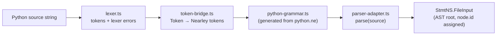
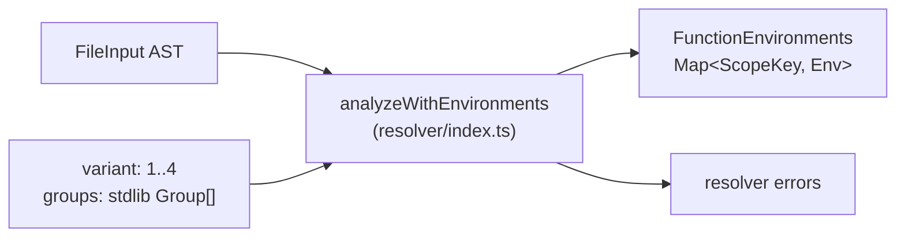
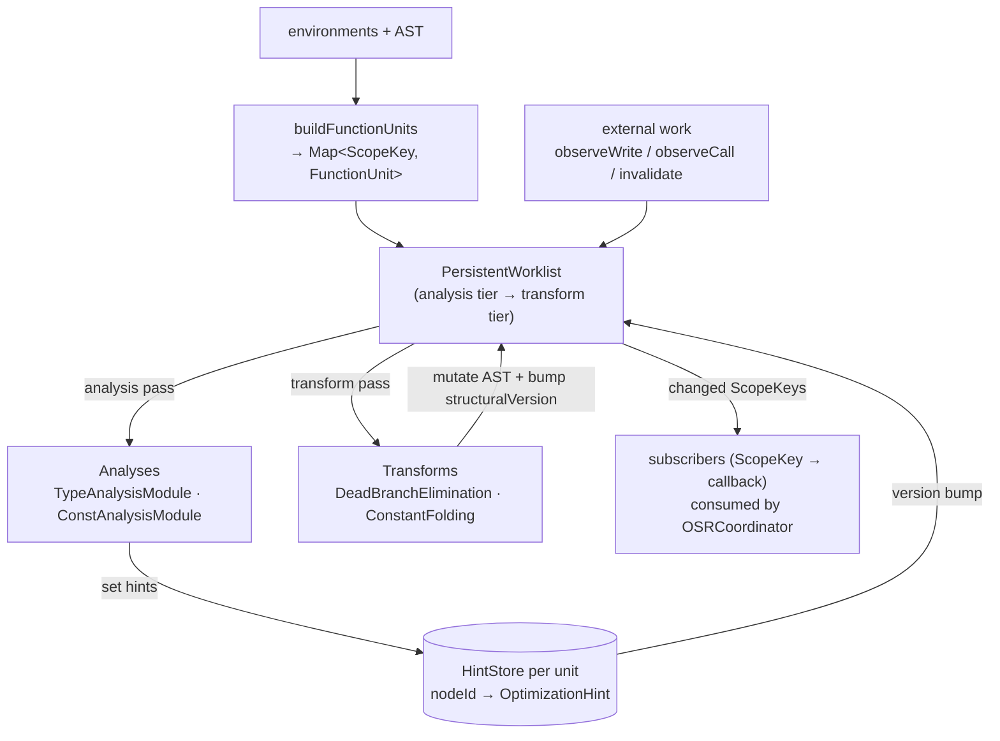
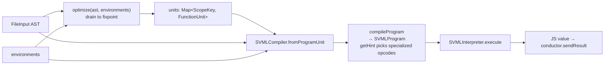
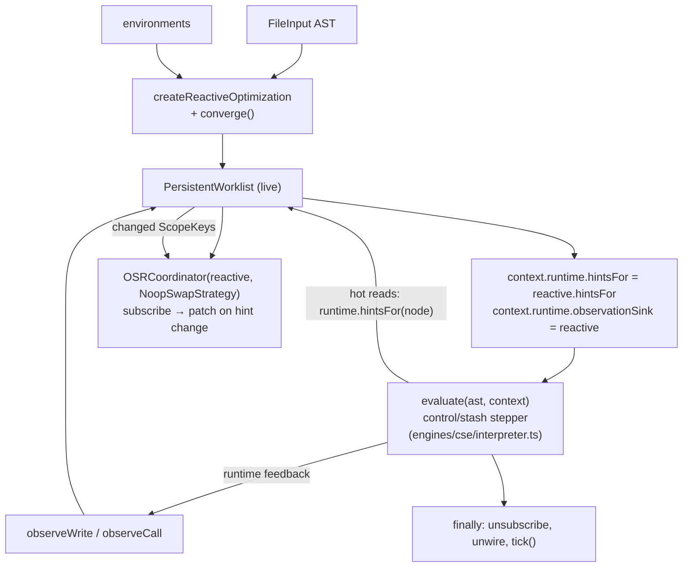
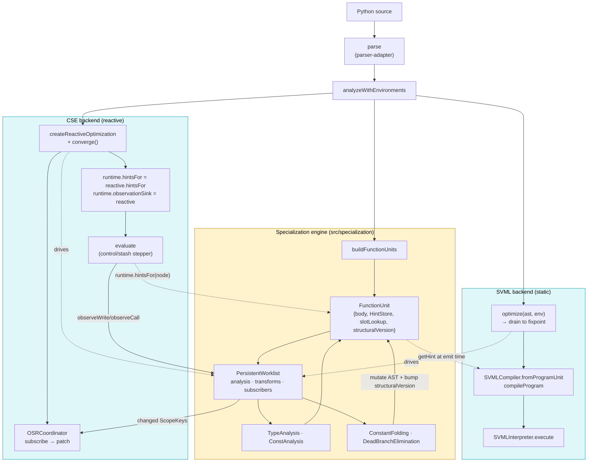

# py-slang compilation & execution flow

This document traces a Python source string from ingestion through to execution,
covering both available execution backends (SVML bytecode VM and CSE machine),
and the specialization engine they both share. Each phase includes a mermaid
diagram of just that phase; a consolidated end-to-end diagram sits at the end.

The goal is to make the interfaces between layers legible so the pipeline can
be dry-tested and reasoned about in isolation. For a hands-on view of what
specialization produces, run:

```
npx tsx scripts/dump-ast.ts <file.py> -o out.dot
```

`dump-ast` writes a DOT graph of the AST before and after the static
optimization pipeline, and prints a per-unit summary of hint counts, concrete
types, and constants to stderr.

---

## Phase 1 — Frontend: source → AST

Entry points:

- `parse(source: string)` (`src/parser/parser-adapter.ts`) — wraps a
  Nearley-generated grammar (`src/parser/python-grammar.ts`) driven by a
  hand-written lexer (`src/parser/lexer.ts`) via `token-bridge.ts`.
- Produces a `StmtNS.FileInput` (root of the AST), using the class-based node
  hierarchy in `src/ast-types.ts`. Every node has a stable `id` that downstream
  stages key on.



Failure mode: syntax errors surface as thrown `SyntaxError` / `LexerError`
instances from `parse`. Callers (the evaluators) catch and route them through
the conductor error channel.

---

## Phase 2 — Resolver: AST → environments

`analyzeWithEnvironments(ast, source, variant, groups?)` in `src/resolver`
walks the AST and returns:

- `errors`: scope / binding / variant-rule violations (stdlib groups gate which
  names are visible per variant).
- `environments`: a `FunctionEnvironments` map keyed by `FileInput | FunctionDef`
  describing each scope's declarations, free variables, and nesting. This is
  the input both the specialization engine and the SVML compiler need to reason
  about slots and closures.



Evaluators stop and surface errors before proceeding to specialization or
execution.

---

## Phase 3 — Specialization engine

Shared by both backends. Located under `src/specialization/`. Two entry points,
both in `src/specialization/optimize.ts`:

- `optimize(ast, environments)` — static mode: build the worklist, drain it to
  fixpoint, return the unit map. Used by the SVML backend at compile time.
- `createReactiveOptimization(ast, environments)` — returns a live
  `PersistentWorklist` that the CSE backend keeps wired to the runtime for the
  duration of execution so runtime observations can refine hints online.

Both paths construct:

- **FunctionUnits** (`framework/function-unit.ts`): per-scope container owning
  the scope's body reference, a `HintStore`, a slot lookup, and a
  `structuralVersion` that transforms bump when they mutate the body.
- **PersistentWorklist** (`framework/persistent-worklist.ts`): priority-scheduled
  fixpoint driver. Tier 1 is analysis over CFG blocks (type before const). Tier
  2 is transforms, which run only after local analysis fixpoint. It is also the
  ingest point for runtime observations (`observeWrite`, `observeCall`) and the
  publisher for subscribers (e.g. the OSR coordinator).
- **Analyses** (`type-analysis/`, `const-analysis/`): dataflow modules producing
  `OptimizationHint`s written into the owning unit's `HintStore`.
- **Transforms** (`transforms/`): `DeadBranchEliminationRule`,
  `ConstantFoldingRule`. Mutate the AST and bump `structuralVersion`, which
  invalidates downstream analysis for that unit.



Key shape of the public surface (from `src/specialization/index.ts`):

- `optimize`, `createReactiveOptimization`
- `PersistentWorklist` with `converge()`, `drain()`, `tick(limit?)`,
  `observeWrite(scopeKey, rhsNode, value)`, `observeCall(scopeKey, calleeKey)`,
  `hintsFor(node)`, `withActiveScope(scope, fn)`, `subscribe(cb)`
- `HintStore` (`get`, `set`, `changesSince(version)`, `version`)
- `OSRCoordinator`, `NoopSwapStrategy` — subscribes to the worklist and can hot-
  swap compiled code when a scope's hints change.

Unit ownership matters: `hintsFor(node)` routes a lookup to the owning unit's
store — there is no single merged store in the current design. The SVML
compiler reads hints through per-unit nested compilers; the CSE interpreter
reads them through `context.runtime.hintsFor`.

---

## Phase 4a — SVML backend (static pipeline)

File: `src/conductor/PySvmlEvaluator.ts`. Flow:

1. `parse(script)` → AST.
2. `analyzeWithEnvironments(...)` → environments.
3. `optimize(ast, environments)` → units map, drained to fixpoint.
4. `SVMLCompiler.fromProgramUnit(ast, environments, units)` builds a root
   compiler with nested per-unit compilers keyed by scope.
5. `compileProgram(ast)` emits an `SVMLProgram`. At emission time, `getHint(node)`
   reads from the owning unit's `HintStore` to choose specialized opcodes
   (e.g. `ADDF`/`NOTB` vs generic `ADDG`/`NOTG`) and to elide work when a
   subtree is a known constant.
6. `SVMLInterpreter(program, { sendOutput }).execute()` runs the bytecode and
   returns a VM value, converted via `SVMLInterpreter.toJSValue`.

SVML is read-only with respect to specialization: hints are consumed once at
compile time; no runtime feedback loops back into the worklist.



---

## Phase 4b — CSE backend (reactive pipeline)

File: `src/conductor/PyCseEvaluator.ts`. The CSE (control-stash-environment)
machine in `src/engines/cse/interpreter.ts` is a stepper over control and
stash stacks. Flow:

1. `parse` + `analyzeWithEnvironments` as before.
2. `createReactiveOptimization(ast, environments)` — build the live worklist.
3. `reactive.converge()` — run the static portion to local fixpoint so the
   first execution step already sees refined hints.
4. Wire the runtime: `context.runtime.rootScope = ast`,
   `context.runtime.hintsFor = node => reactive.hintsFor(node)`,
   `context.runtime.observationSink = reactive`.
5. Start an `OSRCoordinator(reactive, new NoopSwapStrategy())` — it subscribes
   to worklist change notifications and can swap compiled code for a scope
   when its hints change. `NoopSwapStrategy` is the stub used by the CSE
   runner, which does not itself pre-compile scopes; the coordinator is still
   useful because it drives the subscribe/unsubscribe lifecycle.
6. `reactive.withActiveScope(ast, () => evaluate(...))` — pins the root scope
   as active, runs the interpreter, and on clean exit calls `tick()` once to
   drain any deferred transforms triggered by observations made during
   execution. On thrown execution we skip the final tick (see
   `persistent-worklist.ts` comment for why).
7. Inside `evaluate`:
   - Hot read sites call `context.runtime.hintsFor?.(node)` to consult the
     current per-unit hint for `node` (e.g. to pick a specialized arithmetic
     path).
   - After writes / calls, the interpreter calls
     `context.runtime.observationSink.observeWrite(...)` /
     `.observeCall(...)`, feeding kind bits back into the worklist, which
     enqueues an analysis refinement in the relevant unit.



Failure modes worth noting:

- If `evaluate` throws, `withActiveScope` deactivates the scope but skips the
  post-run `tick()` — otherwise a subscriber (OSR) could try to patch a
  function whose runtime has already unwound.
- `observationSink` and `hintsFor` are cleared in `finally` so subsequent
  chunks get a clean runtime.

---

## Consolidated diagram



---

## Quick reference: files and interfaces

| Concern | File | Key symbols |
|---|---|---|
| Parse | `src/parser/parser-adapter.ts` | `parse` |
| Resolve | `src/resolver/index.ts` | `analyzeWithEnvironments`, `FunctionEnvironments` |
| Specialization entry | `src/specialization/optimize.ts` | `optimize`, `createReactiveOptimization` |
| Units | `src/specialization/framework/function-unit.ts` | `FunctionUnit`, `ScopeKey`, `buildFunctionUnits` |
| Worklist | `src/specialization/framework/persistent-worklist.ts` | `PersistentWorklist`, `observeWrite`, `subscribe`, `hintsFor`, `withActiveScope` |
| Hints | `src/specialization/framework/hint.ts` | `HintStore`, `OptimizationHint`, `changesSince` |
| OSR | `src/specialization/framework/osr.ts` | `OSRCoordinator`, `CodeSwapStrategy`, `NoopSwapStrategy` |
| SVML compile | `src/engines/svml/svml-compiler.ts` | `SVMLCompiler.fromProgramUnit`, `compileProgram`, `getHint` |
| SVML run | `src/engines/svml/svml-interpreter.ts` | `SVMLInterpreter.execute`, `toJSValue` |
| CSE run | `src/engines/cse/interpreter.ts` | `evaluate` (reads `runtime.hintsFor`, writes to `runtime.observationSink`) |
| SVML evaluator | `src/conductor/PySvmlEvaluator.ts` | `PySvmlEvaluator.evaluateChunk` |
| CSE evaluator | `src/conductor/PyCseEvaluator.ts` | `PyCseEvaluator*.evaluateChunk` |
