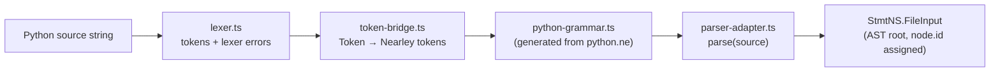
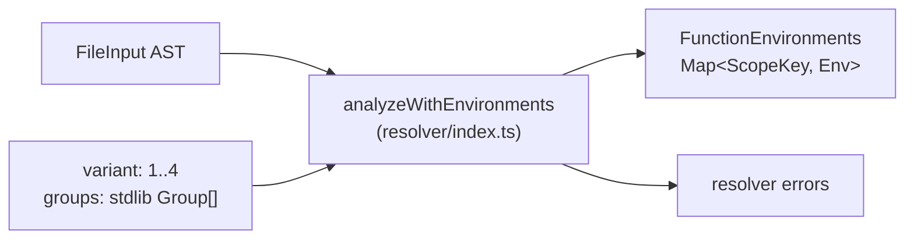
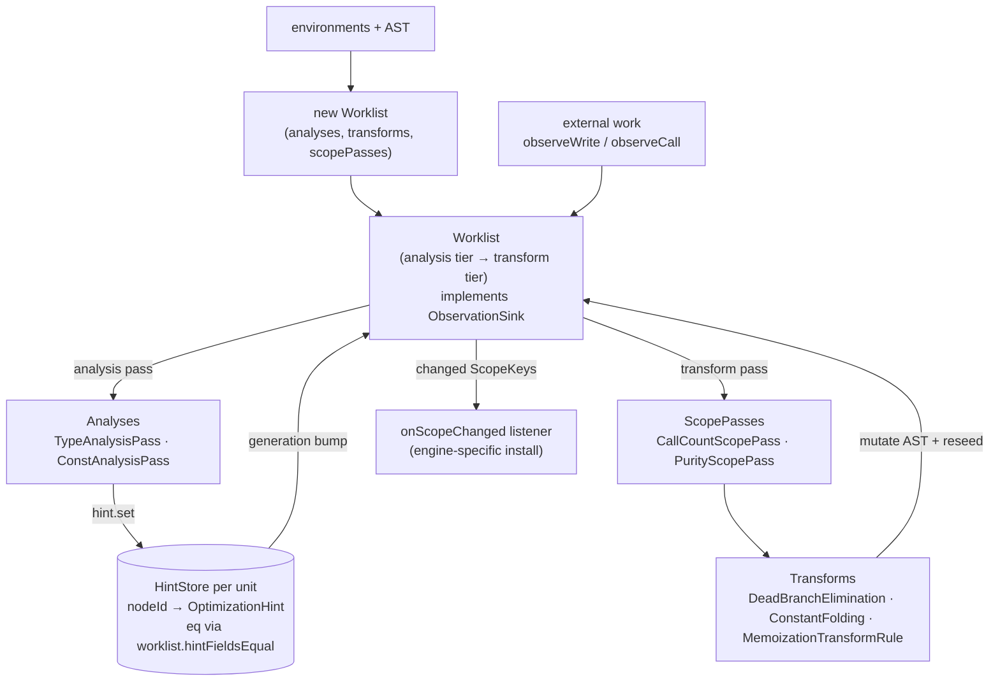
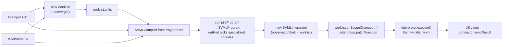
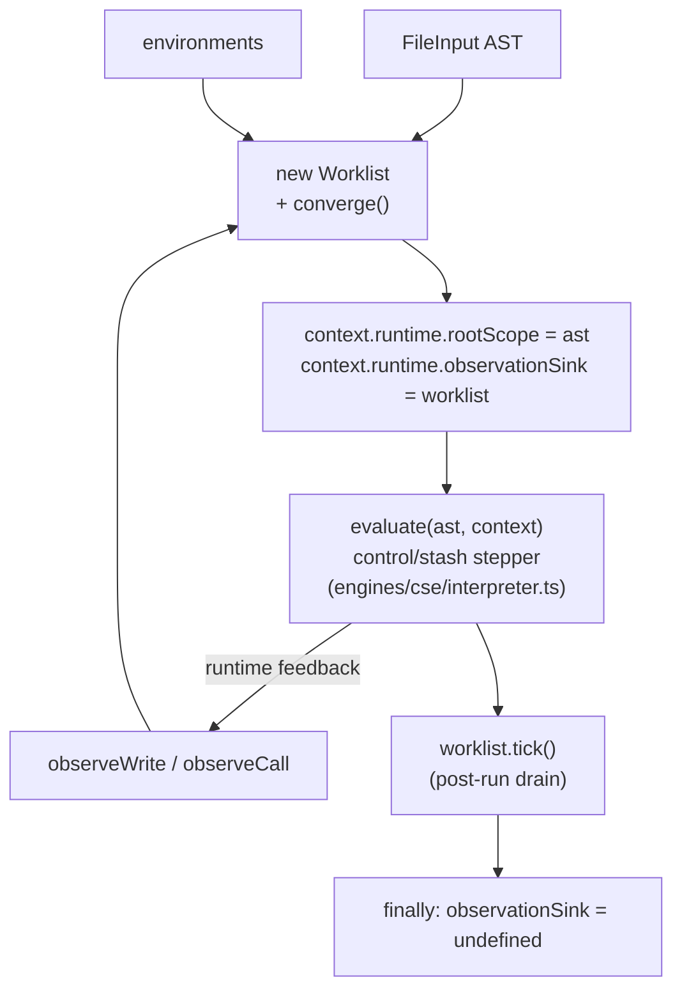
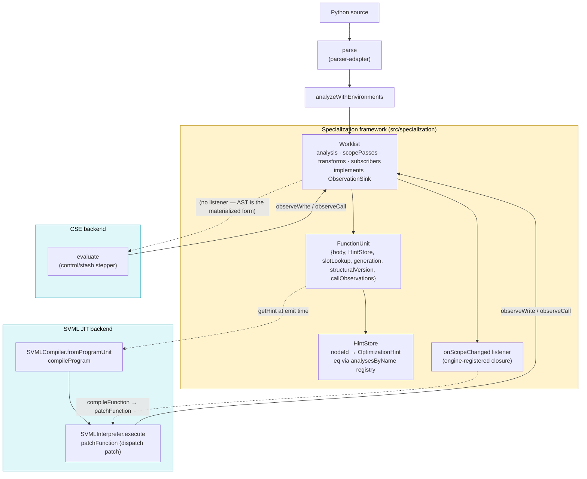

# py-slang compilation & execution flow

This document traces a Python source string from ingestion through to execution,
covering the available execution backends and the specialization framework they
share. Each phase includes a mermaid diagram of just that phase; a consolidated
end-to-end diagram sits at the end.

The goal is to make the interfaces between layers legible so the pipeline can
be dry-tested and reasoned about in isolation. For a hands-on view of what
specialization produces, run:

```
npx tsx scripts/dump-ast.ts <file.py> -o out.dot
```

`dump-ast` writes a DOT graph of the AST before and after the static
optimization pipeline, and prints a per-unit summary of hint counts, concrete
types, and constants to stderr.

---

## Phase 1 — Frontend: source → AST

Entry points:

- `parse(source: string)` (`src/parser/parser-adapter.ts`) — wraps a
  Nearley-generated grammar (`src/parser/python-grammar.ts`) driven by a
  hand-written lexer (`src/parser/lexer.ts`) via `token-bridge.ts`.
- Produces a `StmtNS.FileInput` (root of the AST), using the class-based node
  hierarchy in `src/ast-types.ts`. Every node has a stable `id` that downstream
  stages key on.



Failure mode: syntax errors surface as thrown `SyntaxError` / `LexerError`
instances from `parse`. Callers (the evaluators) catch and route them through
the conductor error channel.

---

## Phase 2 — Resolver: AST → environments

`analyzeWithEnvironments(ast, source, variant, groups?)` in `src/resolver`
walks the AST and returns:

- `errors`: scope / binding / variant-rule violations (stdlib groups gate which
  names are visible per variant).
- `environments`: a `FunctionEnvironments` map keyed by `FileInput | FunctionDef`
  describing each scope's declarations, free variables, and nesting. This is
  the input both the specialization framework and the SVML compiler need to
  reason about slots and closures.



Evaluators stop and surface errors before proceeding to specialization or
execution.

---

## Phase 3 — Specialization framework

Shared by all backends. Located under `src/specialization/`. There is no
facade: evaluators construct `Worklist` directly, call `converge()` once
statically, then run the interpreter with the worklist wired in as an
`ObservationSink`. Engines that materialize the AST into some external
form (SVML IR) additionally register a scope-change listener via
`worklist.onScopeChanged` so mid-run transforms can be patched into that
form.

**Naming note.** This is *not* on-stack replacement. No live frame is
rebuilt; no state mapping exists. The mechanism is **dispatch patching**:
`SVMLInterpreter.CallFrame` captures IR by reference at CALL time, so
patching the program's function-table slot affects only subsequent CALLs —
live frames drain on the old IR. The literature calls this "lazy
replacement" (V8) or nmethod trampoline swap (HotSpot).

Typical shape (SVML JIT — the richest path):

```ts
const worklist = new Worklist(
  ast, environments,
  [new TypeAnalysisPass(), new ConstAnalysisPass()],
  [new DeadBranchEliminationRule(), new ConstantFoldingRule(), new MemoizationTransformRule()],
  [new CallCountScopePass(), new PurityScopePass()],
);
worklist.converge(); // initial static pass

const compiler    = SVMLCompiler.fromProgramUnit(ast, environments, worklist.units);
const program     = compiler.compileProgram(ast);
const interpreter = new SVMLInterpreter(program, { observationSink: worklist });

worklist.onScopeChanged((scope, unit) => {
  if (!(scope instanceof StmtNS.FunctionDef)) return;
  const index = compiler.indexOf(scope);
  if (index === undefined) return;
  interpreter.patchFunction(index, compiler.compileFunction(unit));
});

await interpreter.execute();
worklist.tick(); // drain any work queued during the run
```

CSE does not register a listener — its materialized form *is* the AST, so
the transforms that mutate it are the install. See Phase 4b.

The framework composes:

- **FunctionUnits** (`framework/function-unit.ts`): per-scope container owning
  the scope's body reference, a `HintStore`, a slot lookup, a `generation`
  counter bumped on rebuild, a `structuralVersion` bumped when transforms
  mutate the body, and a `callObservations` buffer consumed by
  `CallCountScopePass`.
- **Worklist** (`framework/worklist.ts`): priority-scheduled fixpoint driver.
  Tier 1 is analysis over CFG blocks (earlier analyses process first). Tier 2
  is transforms, which run only after local analysis fixpoint. The worklist
  directly implements `ObservationSink` — interpreters call `observeWrite` /
  `observeCall` on it during execution. `onScopeChanged(cb)` / `subscribe(cb)`
  publish scope-set notifications to engine-side dispatch patchers.
- **ObservationSink** (`framework/observation-sink.ts`): nominal interface
  giving the two push-side methods (`observeWrite`, `observeCall`) their own
  name, so test mocks and interpreter typing don't have to structurally
  subtype the whole worklist. `Worklist implements ObservationSink`.
- **HintStore** (`framework/hint.ts`): `Map<nodeId, OptimizationHint>` with an
  injected `eq` callback. The worklist passes a closure over its private
  `hintFieldsEqual`, which walks each field of the hint record and dispatches
  to the registered `AnalysisPass.latticeEquals` via `analysesByName`.
- **Analyses** (`type-analysis/`, `const-analysis/`, `purity-analysis/`):
  dataflow modules producing lattice values at named hint fields.
- **Transforms** (`transforms/`): `DeadBranchEliminationRule`,
  `ConstantFoldingRule`, `MemoizationTransformRule`. Mutate the AST; the
  worklist bumps `structuralVersion` and `generation` and reseeds analysis
  for the affected unit.
- **ScopePasses** (`memoization-analysis/call-count.ts`,
  `purity-analysis/scope-pass.ts`): run once per scope per generation, after
  the expression-level fixpoint converges and before scope-level transforms
  read their output. Passed to the `Worklist` constructor.
- **`Worklist.onScopeChanged(cb)`**: pre-unpacked convenience over
  `subscribe`. Receives each changed scope with its `FunctionUnit`.
  Listeners install unconditionally: a scope only enters the `changed` set
  if a transform actually mutated it.



### Specialization lifecycle (reactive loop)

Runtime observations drive specialization via two hooks and one scheduler
flag. The critical invariant: **non-monotone rules (those that can't use a
lattice fact to block their own re-fire) declare `fireOnce = true`; the
scheduler records `(scope, rule)` after the first success so `matches` is
skipped forever after.** Mechanics:

1. Interpreter calls `worklist.observeCall(callerKey, calleeKey)` on call
   entry. The worklist:
   - Pushes `{callerKey, calleeKey}` onto the callee unit's
     `callObservations`.
   - `rebuildAndReseed(calleeKey)` — bumps `generation`, rebuilds the CFG,
     reseeds analysis queues, re-enqueues a transform round.
   - If any transform is `fireOnce` (the `hasNonMonotoneRule` flag, cached
     at construction), calls `this.tick()` to drain mid-execution. For
     purely monotone configurations this tick is redundant and skipped.
2. Interpreter calls `worklist.observeWrite(scope, rhsNode, rawValue)` on
   assignment — each observing analysis turns the runtime value into a
   lattice point and merges it into the node's hint. A hint change reseeds
   that scope.
3. During drain, `processTransform(unit)` runs scope passes first
   (`CallCountScopePass` folds the observation buffer into a saturating
   `callCount` hint; `PurityScopePass` summarizes body-level purity), then
   transform rules. `MemoizationTransformRule.matches` gates on
   `callCount ≥ MEMOIZATION_THRESHOLD (10)` and `pure === true`;
   `apply` mutates `fd.body` in place (prepends `if __memo_has(id, *args):
   return __memo_get(id, *args)` and rewrites `return E` →
   `return __memo_put(id, *args, E)`). The scheduler records
   `(scope, rule)` in `firedOneShotRules` so it never re-fires.
4. Any scope mutated during drain appears in the `changed` set passed to
   subscribers. Listeners registered via `onScopeChanged` recompile and
   install. For SVML: `interpreter.patchFunction(index, newIR)` — a direct
   reassignment of the function-table slot, which new CALLs read fresh
   while live frames continue on the IR captured in their `CallFrame.ir`
   field. For CSE: no listener, because the materialized form *is* the AST
   the transform just mutated; the next call-frame reads the new body
   directly.
5. After `interpreter.execute()` returns, the evaluator calls
   `worklist.tick()` once to drain any work queued during the run.

### Public surface (from `src/specialization/index.ts`)

- `Worklist`, `ObservationSink`, `WorklistStats`, `ScopeChangeListener`.
- `FunctionUnit`, `buildFunctionUnits`.
- `HintStore`, `OptimizationHint`.
- `AnalysisPass`, `ScopePass`, `TransformRule`, `ScopeTransformRule`.
- Analyses/lattices (`TypeAnalysisPass`, `ConstAnalysisPass`, lattice
  constructors). Purity is a `ScopePass` (`PurityScopePass`), not an
  `AnalysisPass` — see `docs/specialization-cleanup-plan.md` §E.
- Transforms (`ConstantFoldingRule`, `DeadBranchEliminationRule`,
  `MemoizationTransformRule`) and scope passes (`CallCountScopePass`,
  `PurityScopePass`).
- Memoization runtime intrinsics (`memoLookup`, `memoPut`, `MEMO_MISS`,
  `MEMO_INTRINSIC_NAMES`) — re-exported from `src/runtime/memo.ts`.

Unit ownership matters: `worklist.hintsFor(node)` routes a lookup to the owning
unit's store — there is no single merged store. The SVML compiler reads hints
through per-unit nested compilers at compile time. The CSE interpreter does
not read hints at all on the hot path — visualizer consumers read them
externally via `worklist.hintsFor(node)`.

---

## Phase 4a — SVML evaluators

Three SVML evaluators live in `src/conductor/`:

| Evaluator | File | Role |
|---|---|---|
| `PySvmlEvaluator` | `PySvmlEvaluator.ts` | One-shot: converge, compile, run. No runtime recompilation. |
| `PySvmlJitEvaluator` | `PySvmlJitEvaluator.ts` | Reactive JIT: runtime observations feed the worklist; a scope-change listener recompiles + patches the function table when transforms fire. |
| `PySvmlSinterEvaluator` | `PySvmlSinterEvaluator.ts` | Compiles to SVML bytecode and executes on the Sinter WebAssembly VM. No reactive loop. |

The JIT path is the one illustrated below; the non-JIT path is identical up
through `worklist.converge()` + compile + execute, minus the `onScopeChanged`
listener. Flow:

1. `parse(script)` → AST.
2. `analyzeWithEnvironments(...)` → environments.
3. `worklist = new Worklist(ast, environments, analyses, transforms, scopePasses); worklist.converge()`.
4. `compiler = SVMLCompiler.fromProgramUnit(ast, environments, worklist.units)`
   — root compiler with nested per-unit compilers keyed by scope.
5. `program = compiler.compileProgram(ast)`. At emission time, `getHint(node)`
   reads from the owning unit's `HintStore` to choose specialized opcodes
   (e.g. `ADDF`/`NOTB` vs generic `ADDG`/`NOTG`) and to elide observation-site
   metadata for already-concrete expressions.
6. `interpreter = new SVMLInterpreter(program, { sendOutput, observationSink: worklist })`.
7. `worklist.onScopeChanged((scope, unit) => { ... interpreter.patchFunction(...) })`
   — registers the dispatch patcher. For each FunctionDef that the worklist
   mutates (e.g. memoization prelude spliced in), the closure looks up the
   compiler's stable index and hot-swaps the function-table slot.
8. `await interpreter.execute()` runs the program. Observations flow back
   into the worklist and may trigger mid-run `tick()`s (for `fireOnce`
   rules like memoization). After return, `worklist.tick()` drains any
   remaining work.



Runtime feedback: the interpreter emits `observeWrite` / `observeCall`
through its `observationSink` (the worklist), which enqueues analysis
refinements and, on `observeCall`, rebuilds + reseeds the callee unit and
(if any rule is `fireOnce`) ticks immediately. Scope-level facts — e.g.
saturating call counts and scope-summary purity that drive memoization —
are produced by `ScopePass` implementations (`CallCountScopePass`,
`PurityScopePass`) passed to the `Worklist` constructor. Scope passes run
once per scope per generation, after the expression-level lattice fixpoint
has converged. When a refinement triggers a transform that actually
mutates a scope, the `onScopeChanged` listener fires and recompiles +
patches the function-table slot.

---

## Phase 4b — CSE evaluator (reactive, no code install)

File: `src/conductor/PyCseEvaluator.ts`. The CSE (control-stash-environment)
machine in `src/engines/cse/interpreter.ts` is a stepper over control and
stash stacks. Flow:

1. `parse` + `analyzeWithEnvironments` as before.
2. `worklist = new Worklist(ast, environments, analyses, transforms, scopePasses); worklist.converge()`.
3. `context.runtime.rootScope = ast`.
4. `context.runtime.observationSink = worklist` — the CSE interpreter emits
   observations through this during execution.
5. `await evaluate(...)`, then `worklist.tick()`. No `onScopeChanged`
   listener is registered: CSE's materialized form is the AST, which
   transforms mutate directly during mid-run ticks, so there is no separate
   install step. `observationSink` is cleared in `finally` so subsequent
   chunks get a clean runtime.
6. Inside `evaluate`:
   - The interpreter **does not read hints on the hot path.** The single hint
     read that used to exist (per-step visualization metadata) was removed;
     visualizer consumers read `worklist.hintsFor(node)` externally.
   - After writes / calls, the interpreter calls
     `observationSink.observeWrite(...)` / `.observeCall(...)`, feeding the
     worklist.



Failure modes worth noting:

- If `evaluate` throws, `observationSink` is still cleared in `finally` so the
  next chunk starts clean. There is no post-run `tick()` on the error path.

---

## Consolidated diagram



---

## Quick reference: files and interfaces

| Concern | File | Key symbols |
|---|---|---|
| Parse | `src/parser/parser-adapter.ts` | `parse` |
| Resolve | `src/resolver/index.ts` | `analyzeWithEnvironments`, `FunctionEnvironments` |
| Worklist | `src/specialization/framework/worklist.ts` | `Worklist`, `converge`, `tick`, `observeWrite`, `observeCall`, `subscribe`, `onScopeChanged`, `hintsFor` |
| Observation surface | `src/specialization/framework/observation-sink.ts` | `ObservationSink` (interface; `Worklist implements`) |
| Units | `src/specialization/framework/function-unit.ts` | `FunctionUnit`, `buildFunctionUnits` |
| Hints | `src/specialization/framework/hint.ts` | `HintStore`, `OptimizationHint` |
| Memoization rule | `src/specialization/transforms/memoization.ts` | `MemoizationTransformRule` (`fireOnce = true`) |
| Scope passes | `src/specialization/memoization-analysis/call-count.ts`, `src/specialization/purity-analysis/scope-pass.ts` | `CallCountScopePass`, `PurityScopePass` |
| SVML compile | `src/engines/svml/svml-compiler.ts` | `SVMLCompiler.fromProgramUnit`, `compileProgram`, `getHint`, `indexOf`, `compileFunction` |
| SVML run | `src/engines/svml/svml-interpreter.ts` | `SVMLInterpreter.execute`, `patchFunction`, `toJSValue` |
| SVML dispatch patch | `src/conductor/PySvmlJitEvaluator.ts` | inline `worklist.onScopeChanged(...)` closure |
| CSE run | `src/engines/cse/interpreter.ts` | `evaluate` (writes to `runtime.observationSink`; does not read hints) |
| Memo runtime | `src/runtime/memo.ts` | `memoLookup`, `memoPut`, `MEMO_MISS`, `MEMO_INTRINSIC_NAMES` |
| SVML evaluators | `src/conductor/PySvmlEvaluator.ts`, `PySvmlJitEvaluator.ts`, `PySvmlSinterEvaluator.ts` | `evaluateChunk` |
| CSE evaluator | `src/conductor/PyCseEvaluator.ts` | `PyCseEvaluator*.evaluateChunk` |
