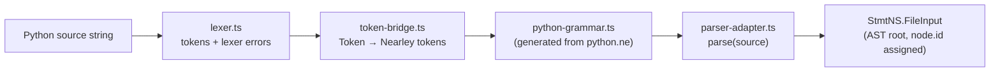
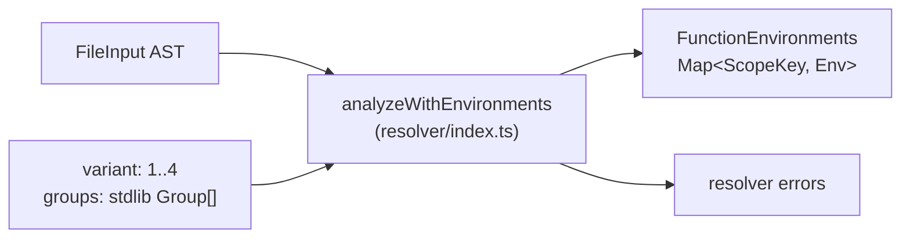
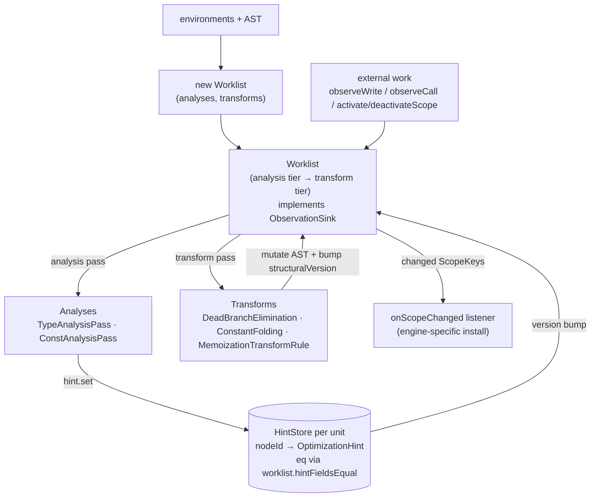
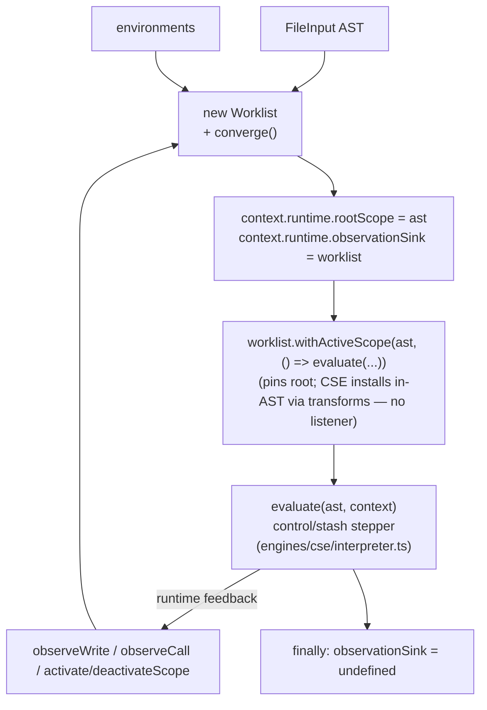
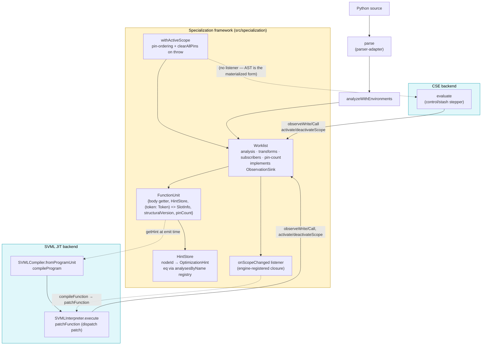

# py-slang compilation & execution flow

This document traces a Python source string from ingestion through to execution,
covering the available execution backends and the specialization framework they
share. Each phase includes a mermaid diagram of just that phase; a consolidated
end-to-end diagram sits at the end.

The goal is to make the interfaces between layers legible so the pipeline can
be dry-tested and reasoned about in isolation. For a hands-on view of what
specialization produces, run:

```
npx tsx scripts/dump-ast.ts <file.py> -o out.dot
```

`dump-ast` writes a DOT graph of the AST before and after the static
optimization pipeline, and prints a per-unit summary of hint counts, concrete
types, and constants to stderr.

---

## Phase 1 — Frontend: source → AST

Entry points:

- `parse(source: string)` (`src/parser/parser-adapter.ts`) — wraps a
  Nearley-generated grammar (`src/parser/python-grammar.ts`) driven by a
  hand-written lexer (`src/parser/lexer.ts`) via `token-bridge.ts`.
- Produces a `StmtNS.FileInput` (root of the AST), using the class-based node
  hierarchy in `src/ast-types.ts`. Every node has a stable `id` that downstream
  stages key on.



Failure mode: syntax errors surface as thrown `SyntaxError` / `LexerError`
instances from `parse`. Callers (the evaluators) catch and route them through
the conductor error channel.

---

## Phase 2 — Resolver: AST → environments

`analyzeWithEnvironments(ast, source, variant, groups?)` in `src/resolver`
walks the AST and returns:

- `errors`: scope / binding / variant-rule violations (stdlib groups gate which
  names are visible per variant).
- `environments`: a `FunctionEnvironments` map keyed by `FileInput | FunctionDef`
  describing each scope's declarations, free variables, and nesting. This is
  the input both the specialization framework and the SVML compiler need to
  reason about slots and closures.



Evaluators stop and surface errors before proceeding to specialization or
execution.

---

## Phase 3 — Specialization framework

Shared by all backends. Located under `src/specialization/`. There is no
facade: evaluators construct `Worklist` directly and drive execution through
`worklist.withActiveScope(ast, fn)`. Engines that materialize the AST into
some external form (SVML IR) additionally register a scope-change listener
via `worklist.onScopeChanged` to patch that form when transforms fire
mid-run. This shape replaced an earlier `SpecializationEngine` facade plus
an `OSRCoordinator` / `StateDeltaStrategy` pair; both dissolved into the
worklist once the single load-bearing invariant (clear pins on throw) moved
into `withActiveScope`.

**Naming note.** This is *not* on-stack replacement. No live frame is
rebuilt; no state mapping exists. The mechanism is **dispatch patching**:
`SVMLInterpreter.CallFrame` captures IR by reference at CALL time, so
patching the program's function-table slot affects only subsequent CALLs —
live frames drain on the old IR. The literature calls this "lazy
replacement" (V8) or nmethod trampoline swap (HotSpot).

Typical shape (SVML JIT — the richest path):

```ts
const worklist = new Worklist(
  ast, environments,
  [new TypeAnalysisPass(), new ConstAnalysisPass(), new PurityEffectAnalysis()],
  [new DeadBranchEliminationRule(), new ConstantFoldingRule(), new MemoizationTransformRule()],
);
worklist.addScopePass(new CallCountScopePass());
worklist.addScopePass(new PurityScopePass());
worklist.converge(); // initial static pass

const compiler    = SVMLCompiler.fromProgramUnit(ast, environments, worklist.units);
const program     = compiler.compileProgram(ast);
const interpreter = new SVMLInterpreter(program, { observationSink: worklist });

worklist.onScopeChanged((scope, unit) => {
  if (!(scope instanceof StmtNS.FunctionDef)) return;
  const index = compiler.indexOf(scope);
  if (index === undefined) return;
  interpreter.patchFunction(index, compiler.compileFunction(unit));
});

await worklist.withActiveScope(ast, () => interpreter.execute());
```

CSE does not register a listener — its materialized form *is* the AST, so
the transforms that mutate it are the install. See Phase 4b.

The framework composes:

- **FunctionUnits** (`framework/function-unit.ts`): per-scope container owning
  the scope's body reference, a `HintStore`, a slot lookup, a
  `structuralVersion` that transforms bump when they mutate the body, and a
  `pinCount` that the worklist's `activateScope`/`deactivateScope` maintain
  as the single owner of pin-set state.
- **Worklist** (`framework/worklist.ts`): priority-scheduled
  fixpoint driver. Tier 1 is analysis over CFG blocks (type before const). Tier
  2 is transforms, which run only after local analysis fixpoint. The worklist
  directly implements `ObservationSink` — interpreters call `observeWrite` /
  `observeCall` / `activateScope` / `deactivateScope` on it during execution.
  `onScopeChanged(cb)` / `subscribe(cb)` publish scope-set notifications to
  engine-side dispatch patchers.
- **ObservationSink** (`framework/observation-sink.ts`): nominal interface
  giving the four push-side methods their own name, so test mocks and
  interpreter typing don't have to structurally subtype the whole worklist.
  `Worklist implements ObservationSink`.
- **HintStore** (`framework/hint.ts`): `Map<nodeId, OptimizationHint>` with an
  injected `eq` callback. The worklist passes a closure over its private
  `hintFieldsEqual`, which walks each field of the hint record and dispatches
  to the registered `AnalysisPass.latticeEquals` via `analysesByName`. Test
  merge-collectors that never double-write a node pass `() => false`
  directly.
- **Analyses** (`type-analysis/`, `const-analysis/`): dataflow modules producing
  lattice values at named hint fields.
- **Transforms** (`transforms/`): `DeadBranchEliminationRule`,
  `ConstantFoldingRule`, `MemoizationTransformRule`. Mutate the AST and bump
  `structuralVersion`, which invalidates downstream analysis for that unit.
- **`Worklist.onScopeChanged(cb)`** (`framework/worklist.ts`): pre-unpacked
  convenience over `subscribe`. Receives each changed scope with its
  `FunctionUnit`. By construction (see the pin-set gate in
  `processTransform`), a scope only enters the `changed` set if a transform
  rule actually mutated it and passed its `safeOnStack` gate — so listeners
  can install unconditionally, without re-checking pin state.
- **`Worklist.withActiveScope(scope, fn)`**: pins the root scope for the
  duration of `fn`, ticks once on success to drain parked transforms, and —
  critically — calls `clearAllPins()` if `fn` throws. CSE does not pop envs
  on JS-stack unwind, so an exception leaves pins dirty; `clearAllPins`
  resets on throw.



### Specialization lifecycle (pin-set gate + direct-IR-ref invariant)

The worklist's pin-count and the rule-level `safeOnStack` flag jointly
enforce: **a transform rule only mutates a pinned scope if it has
explicitly declared its mutation safe against live frames; downstream
dispatch patching relies on the engine's direct-IR-ref invariant to make
the resulting install observable only to future CALLs.** Mechanics:

1. Interpreter calls `worklist.activateScope(scope)` on call entry
   (`FunctionUnit.pinCount += 1`).
2. A transform enqueued against a pinned scope is skipped by
   `processTransform` **unless** the rule sets `safeOnStack = true`
   (e.g. `MemoizationTransformRule`, which only splices new statements onto
   `fd.body` — future calls see them, on-stack frames already copied the
   body by reference and run to completion on the old list).
3. Interpreter calls `worklist.deactivateScope(scope)` on return
   (`pinCount -= 1`). When it hits zero, a fresh transform pass for that
   scope is re-enqueued.
4. `withActiveScope` ticks on success to drain parked transforms for the
   now-unpinned root; non-`safeOnStack` rules for nested scopes that
   became unpinned mid-run were already drained by the per-`observeCall`
   tick (`worklist.ts` — `if (this.hasSafeOnStackScopeRule) this.tick()`).
5. Any scope mutated during drain appears in the `changed` set passed to
   `notify`. Listeners registered via `onScopeChanged` recompile and
   install. For SVML: `interpreter.patchFunction(index, newIR)` — a direct
   reassignment of `this.program`, which new CALLs read fresh while live
   frames continue on the IR captured in their `CallFrame.ir` field.

The install step is single-use in production: the `onScopeChanged` closure
registered in `PySvmlJitEvaluator` (whole-function recompile → dispatch
slot patch). CSE does not register a listener because its materialized
form is the AST itself and transforms mutate it during `tick`.

Rationale for this shape (five AST-mutation failure classes and why pin-set
mitigates them) lives in `optimization-roadmap.md` under "Why the pin-set exists."

### Public surface (from `src/specialization/index.ts`)

- `Worklist`, `ObservationSink`, `WorklistStats`, `ScopeChangeListener`.
- `FunctionUnit`, `buildFunctionUnits`.
- `HintStore`, `OptimizationHint`.
- `AnalysisPass`, `ScopePass`, `TransformRule`.
- Analyses/lattices (`TypeAnalysisPass`, `ConstAnalysisPass`,
  `PurityEffectAnalysis`, lattice constructors).
- Transforms (`ConstantFoldingRule`, `DeadBranchEliminationRule`,
  `MemoizationTransformRule`) and scope passes (`CallCountScopePass`,
  `PurityScopePass`).
- Memoization runtime intrinsics (`memoLookup`, `memoPut`, `MEMO_MISS`,
  `MEMO_INTRINSIC_NAMES`) — re-exported from `src/runtime/memo.ts`.

Unit ownership matters: `worklist.hintsFor(node)` routes a lookup to the owning
unit's store — there is no single merged store. The SVML compiler reads hints
through per-unit nested compilers at compile time. The CSE interpreter does
not read hints at all on the hot path — visualizer consumers read them
externally via `worklist.hintsFor(node)`.

---

## Phase 4a — SVML evaluators

Three SVML evaluators live in `src/conductor/`:

| Evaluator | File | Role |
|---|---|---|
| `PySvmlEvaluator` | `PySvmlEvaluator.ts` | One-shot: converge, compile, run. No runtime recompilation. |
| `PySvmlJitEvaluator` | `PySvmlJitEvaluator.ts` | Reactive JIT: runtime observations feed the worklist; a scope-change listener recompiles + patches the function table when transforms fire. |
| `PySvmlSinterEvaluator` | `PySvmlSinterEvaluator.ts` | Compiles to SVML bytecode and executes on the Sinter WebAssembly VM. No reactive loop. |

The JIT path is the one illustrated below; the non-JIT path is identical up
through `worklist.converge()` + compile + execute, minus the
`onScopeChanged` listener and the `withActiveScope` wrapping. Flow:

1. `parse(script)` → AST.
2. `analyzeWithEnvironments(...)` → environments.
3. `worklist = new Worklist(ast, environments, analyses, transforms); worklist.converge()`.
4. `compiler = SVMLCompiler.fromProgramUnit(ast, environments, worklist.units)`
   — root compiler with nested per-unit compilers keyed by scope.
5. `program = compiler.compileProgram(ast)`. At emission time, `getHint(node)`
   reads from the owning unit's `HintStore` to choose specialized opcodes
   (e.g. `ADDF`/`NOTB` vs generic `ADDG`/`NOTG`) and to elide observation-site
   metadata for already-concrete expressions.
6. `interpreter = new SVMLInterpreter(program, { sendOutput, observationSink: worklist })`.
7. `worklist.onScopeChanged((scope, unit) => { ... interpreter.patchFunction(...) })`
   — registers the dispatch patcher. For each FunctionDef that the worklist
   mutates (e.g. memoization prelude spliced in), the closure looks up the
   compiler's stable index and hot-swaps the function-table slot.
8. `await worklist.withActiveScope(ast, () => interpreter.execute())`
   — pins the root scope, runs the interpreter, drains on exit, clears
   pins on throw.


Runtime feedback: the interpreter emits `observeWrite`/`observeCall` through
its `observationSink` (the worklist), which enqueues analysis refinements.
Scope-level facts — e.g. saturating call counts and scope-summary purity
that drive memoization — are produced by `ScopePass` implementations
(`CallCountScopePass`, `PurityScopePass`) registered via
`worklist.addScopePass`. Scope passes run once per scope per generation,
after the expression-level lattice fixpoint has converged.
When a refinement triggers a transform that actually mutates a scope, the
`onScopeChanged` listener fires and recompiles + patches the function-table
slot for that scope.

---

## Phase 4b — CSE evaluator (reactive, no code install)

File: `src/conductor/PyCseEvaluator.ts`. The CSE (control-stash-environment)
machine in `src/engines/cse/interpreter.ts` is a stepper over control and
stash stacks. Flow:

1. `parse` + `analyzeWithEnvironments` as before.
2. `worklist = new Worklist(ast, environments, analyses, transforms); worklist.converge()`.
3. `context.runtime.rootScope = ast`.
4. `context.runtime.observationSink = worklist` — the CSE interpreter emits
   observations through this during execution.
5. `await worklist.withActiveScope(ast, () => evaluate(...))` — pins the root
   scope, runs the interpreter, drains on exit. No `onScopeChanged` listener
   is registered: CSE's materialized form is the AST, which transforms
   mutate directly during `tick`, so there is no separate install step.
6. Inside `evaluate`:
   - The interpreter **does not read hints on the hot path.** The single hint
     read that used to exist (per-step visualization metadata) was removed;
     visualizer consumers read `worklist.hintsFor(node)` externally.
   - After writes / calls / return points, the interpreter calls
     `observationSink.observeWrite(...)` / `.observeCall(...)` /
     `.activateScope(...)` / `.deactivateScope(...)`, feeding the worklist.



Failure modes worth noting:

- If `evaluate` throws, `withActiveScope` catches, calls
  `worklist.clearAllPins()`, and rethrows — suppressing the post-run
  `tick()` that would otherwise let a listener try to install against a
  unit whose interpreter state has unwound.
- `observationSink` is cleared in `finally` so subsequent chunks get a clean
  runtime.

---

## Consolidated diagram



---

## Quick reference: files and interfaces

| Concern | File | Key symbols |
|---|---|---|
| Parse | `src/parser/parser-adapter.ts` | `parse` |
| Resolve | `src/resolver/index.ts` | `analyzeWithEnvironments`, `FunctionEnvironments` |
| Worklist | `src/specialization/framework/worklist.ts` | `Worklist`, `observeWrite`, `observeCall`, `activateScope`, `deactivateScope`, `withActiveScope`, `subscribe`, `onScopeChanged`, `addScopePass`, `clearAllPins` |
| Observation surface | `src/specialization/framework/observation-sink.ts` | `ObservationSink` (interface; `Worklist implements`) |
| Units | `src/specialization/framework/function-unit.ts` | `FunctionUnit`, `buildFunctionUnits` |
| Hints | `src/specialization/framework/hint.ts` | `HintStore`, `OptimizationHint` |
| SVML compile | `src/engines/svml/svml-compiler.ts` | `SVMLCompiler.fromProgramUnit`, `compileProgram`, `getHint`, `indexOf`, `compileFunction` |
| SVML run | `src/engines/svml/svml-interpreter.ts` | `SVMLInterpreter.execute`, `patchFunction`, `toJSValue` |
| SVML dispatch patch | `src/conductor/PySvmlJitEvaluator.ts` | inline `worklist.onScopeChanged(...)` closure |
| CSE run | `src/engines/cse/interpreter.ts` | `evaluate` (writes to `runtime.observationSink`; does not read hints) |
| Memo runtime | `src/runtime/memo.ts` | `memoLookup`, `memoPut`, `MEMO_MISS`, `MEMO_INTRINSIC_NAMES` |
| SVML evaluators | `src/conductor/PySvmlEvaluator.ts`, `PySvmlJitEvaluator.ts`, `PySvmlSinterEvaluator.ts` | `evaluateChunk` |
| CSE evaluator | `src/conductor/PyCseEvaluator.ts` | `PyCseEvaluator*.evaluateChunk` |
