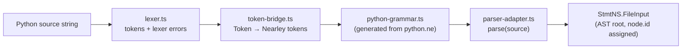
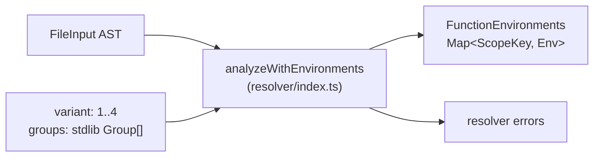
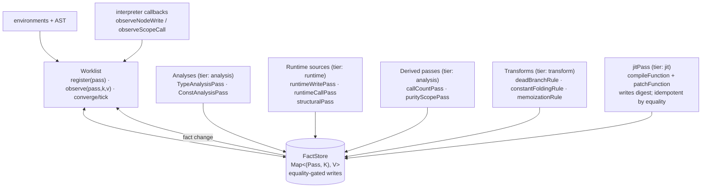
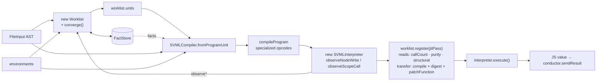
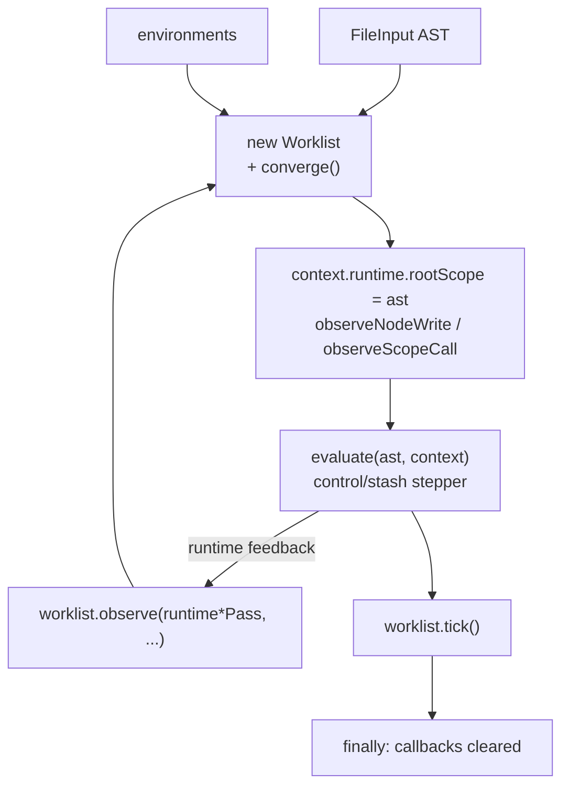
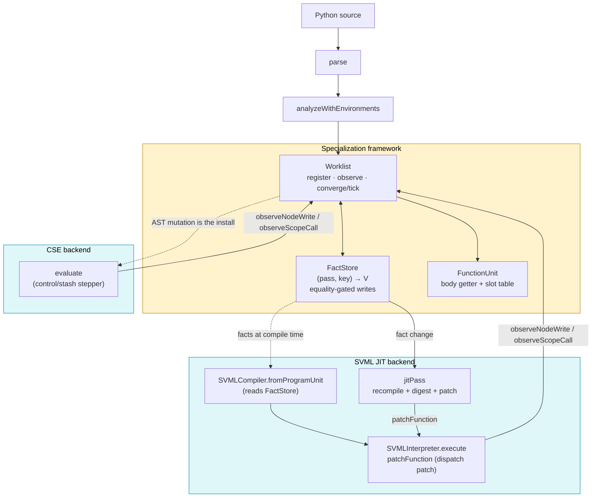

# py-slang compilation & execution flow

Traces a Python source string from ingestion to execution across the
available evaluators and the specialization framework they share. Each
phase has its own mermaid diagram; a consolidated diagram sits at the
end.

For the contract/stability view, see `docs/optimization-roadmap.md`.

For a hands-on view of what specialization produces:

```
npx tsx scripts/dump-ast.ts <file.py> -o out.dot
```

`dump-ast` writes a DOT graph of the AST before and after the static
optimization pipeline, plus per-unit summaries of pass outputs.

---

## Phase 1 — Frontend: source → AST

Entry points:

- `parse(source: string)` (`src/parser/parser-adapter.ts`) — wraps a
  Nearley-generated grammar (`src/parser/python-grammar.ts`) driven by
  a hand-written lexer (`src/parser/lexer.ts`) via `token-bridge.ts`.
- Produces a `StmtNS.FileInput` (AST root), using the class-based node
  hierarchy in `src/ast-types.ts`. Every node has a stable `id`.



Failure mode: syntax errors surface as thrown `SyntaxError` /
`LexerError` from `parse`. Evaluators route them through the conductor.

---

## Phase 2 — Resolver: AST → environments

`analyzeWithEnvironments(ast, source, variant, groups?)`
(`src/resolver`) walks the AST and returns:

- `errors`: scope / binding / variant-rule violations. Stdlib groups
  gate name visibility per variant.
- `environments`: `FunctionEnvironments` keyed by
  `FileInput | FunctionDef`. Input to both the specialization
  framework and the SVML compiler.



---

## Phase 3 — Specialization framework

Lives in `src/specialization/`. Single dispatch graph built around
three primitives:

- **`Pass<K, V>`** (`framework/pass.ts`) — one shape for every
  scheduled computation. Fields: `id`, `debugName`, `lattice: Lattice<V>`,
  `reads: Pass[]`, `tier`, optional `coarse`, `affectedKeys(ctx, triggerPass, triggerKey)`,
  `transfer(ctx, key): V | undefined`, optional `prune`.
  There is no separate `AnalysisPass` / `ScopePass` / `TransformRule` /
  `ScopeTransformRule` — granularity is encoded in `K`.
- **`FactStore`** (`framework/fact-store.ts`) — two-level map
  keyed by `(pass, key)`. `write` is equality-gated via
  `pass.lattice.equals`; an equal write is a no-op and fires no
  listener. This is the sole mechanism that suppresses redundant
  downstream work.
- **`Worklist`** (`framework/worklist.ts`) — scheduler. Constructor
  takes `(ast, environments, analyses)`; framework-wired passes
  (`structuralPass`, `runtimeWritePass`, `runtimeCallPass`,
  `callCountPass`, `purityScopePass`, `memoizationRule`,
  `deadBranchRule`, `constantFoldingRule`) self-register.
  Public surface: `converge()`, `tick()`, `register(pass)`,
  `observe(pass, key, value)`, `units`, `factStore`.

```ts
// Typical evaluator shape (SVML JIT — richest path):
const worklist = new Worklist(ast, environments, [
  new TypeAnalysisPass(),
  new ConstAnalysisPass(),
]);
worklist.converge();                                    // static fixpoint

const compiler = SVMLCompiler.fromProgramUnit(
  ast, environments, worklist.units, worklist.factStore,
);
const program     = compiler.compileProgram(ast);
const interpreter = new SVMLInterpreter(program, {
  sendOutput:       conductor.sendOutput,
  observeNodeWrite: (nodeId, v)  => worklist.observe(runtimeWritePass, nodeId, v),
  observeScopeCall: (scopeId)    => worklist.observe(runtimeCallPass, scopeId, bumpedCount),
});

worklist.register(jitPass);   // recompile + patchFunction on digest change
await interpreter.execute();
```

CSE is identical minus the compile step and minus `jitPass`: its
materialized form *is* the AST, so a transform's in-place mutation is
the install.

### How dispatch works

1. A pass's `transfer(ctx, key)` produces a `V`. Returning `undefined`
   means "no write for this key" — distinct from writing
   `lattice.bottom` (explicit reset).
2. `FactStore.write(pass, key, value)` compares against the stored
   value under `pass.lattice.equals`. Unchanged → no event.
3. On a change, every pass whose `reads` contains the writer is
   candidate work. `p.affectedKeys(ctx, writer, writtenKey)` names the
   precise subset of `p`'s keyspace to re-enqueue. Passes with no
   precise mapping set `coarse: true` to opt into "re-run every
   previously written key".
4. `tier` gives a drain-order tiebreaker: `runtime` < `analysis` <
   `transform` < `jit`. Analysis always drains before any transform
   that reads its output.
5. Side effects in `transfer` (`patchFunction`, AST mutation) must be
   idempotent under `lattice.equals`: if the returned value equals the
   stored one, the side effect must be a no-op. That is how the
   framework prevents re-fire — no `fireOnce` flag, no
   `appliedTransforms` set, no bookkeeping.



### LBD — the on-stack-safety contract

Interpreters must late-bind callee bodies at CALL time: CSE reads
`closure.node.body` fresh every call; SVML re-resolves the
function-table slot at CALL and captures the IR into `CallFrame.ir`.
Under LBD, any body-local ABI-preserving AST or IR rewrite is safe at
any time — in-flight frames drain on the pre-rewrite body; later
CALLs dispatch to the new form. The framework therefore tracks no
pin counts, no active-scope set, no `safeOnStack` flag.

### Runtime observations → transforms (fib trace)

For `def fib(n): …; fib(20)`:

1. Interpreter CALLs `fib`. Its callback fires
   `worklist.observe(runtimeCallPass, scopeId, nextCount)`.
2. `runtimeCallPass` writes `nextCount`. `callCountPass.affectedKeys`
   on that trigger returns `[scopeId]`; its `transfer` writes
   `min(sat, nextCount)` back into the store.
3. `callCountPass`'s change cascades (via `memoizationRule.reads =
   [callCountPass, purityScopePass, structuralPass]`) to
   `memoizationRule`. On call 10, `count ≥ MEMOIZATION_THRESHOLD` and
   `purityScopePass` says `true` → `transfer` invokes
   `applyMemoizationWrap(unit)`, which splices the cache prelude into
   `fd.body` (idempotent via `isAlreadyWrapped`) and returns `"fired"`.
4. The fact change on `memoizationRule` propagates to `jitPass`
   (registered by the SVML JIT evaluator). Its `transfer` recompiles
   the unit, digests the IR, and calls `patchFunction` only if the
   digest differs from the stored value.
5. Next CALL to fib dispatches the memoized IR. Intrinsics
   `__memo_has/get/put` route through `runtime/memo.ts`.

CSE: identical up through step 3. No `jitPass`; the AST mutation *is*
the install. Next CALL re-reads `closure.node.body`, sees the
prelude, routes `__memo_*` as ordinary builtin calls.

### Public surface (`src/specialization/index.ts`)

- `Worklist`, `WorklistStats`.
- `FunctionUnit`, `buildFunctionUnits`.
- `Pass`, `PassCtx`, `Lattice`, `AnalysisPass` (type alias).
- Source passes: `runtimeWritePass`, `runtimeCallPass`, `structuralPass`.
- Derived passes: `callCountPass`, `purityScopePass`, `memoizationRule`.
- Analyses: `TypeAnalysisPass`, `ConstAnalysisPass` + lattice helpers.
- Transform helper: `applyMemoizationWrap` (the in-place AST rewrite;
  the pass object is `memoizationRule`).
- Memo runtime: `memoLookup`, `memoPut`, `MEMO_MISS`,
  `MEMO_INTRINSIC_NAMES` (re-exported from `src/runtime/memo.ts`).

---

## Phase 4a — SVML evaluators

| Evaluator | File | Role |
|---|---|---|
| `PySvmlEvaluator` | `PySvmlEvaluator.ts` | One-shot: converge, compile, run. No runtime feedback. |
| `PySvmlJitEvaluator` | `PySvmlJitEvaluator.ts` | Reactive JIT: runtime callbacks push facts; `jitPass` recompiles + patches on digest change. |
| `PySvmlSinterEvaluator` | `PySvmlSinterEvaluator.ts` | Compiles to SVML bytecode and executes on the Sinter WebAssembly VM. No reactive loop. |

JIT flow:

1. `parse` → `analyzeWithEnvironments` → errors guard.
2. `worklist = new Worklist(ast, environments, [Type, Const])` +
   `worklist.converge()`.
3. `SVMLCompiler.fromProgramUnit(ast, environments, worklist.units,
   worklist.factStore)` — compiler reads facts directly from the
   store (no per-unit hint record).
4. `program = compiler.compileProgram(ast)`. At emit time, facts
   drive specialized-opcode selection (`ADDF` / `NOTB` vs
   `ADDG` / `NOTG`) and call-site observation-metadata elision.
5. `interpreter = new SVMLInterpreter(program, { sendOutput,
   observeNodeWrite, observeScopeCall })`. Callbacks close over a
   local `callCounts: Map<scopeId, number>` and call
   `worklist.observe(...)`.
6. `jitPass: Pass<FunctionUnit, number>` is defined inline and
   registered: `reads: [callCountPass, purityScopePass, structuralPass]`;
   lattice values are SVMLIR digests; `affectedKeys` fans out to every
   unit to prime first-round dispatch. Transfer recompiles the unit,
   digests the new IR, and calls `patchFunction(index, ir)` only
   when the digest differs from the stored value.
7. `await interpreter.execute()`. Runtime observations flow back
   through the callbacks; `callCountPass` / `memoizationRule` /
   `jitPass` cascade mid-run, and `patchFunction` swaps the
   function-table slot. Live frames continue on the IR captured in
   `CallFrame.ir` (LBD).



---

## Phase 4b — CSE evaluator

File: `src/conductor/PyCseEvaluator.ts`. The CSE
(control-stash-environment) machine in `src/engines/cse/interpreter.ts`
is a stepper. Flow:

1. `parse` + `analyzeWithEnvironments`.
2. `worklist = new Worklist(ast, environments, [Type, Const])` +
   `converge()`.
3. `context.runtime.rootScope = ast`.
4. `context.runtime.observeNodeWrite` / `observeScopeCall` wired as
   plain closures over a local `callCounts` map; each closure calls
   `worklist.observe(runtimeWritePass | runtimeCallPass, …)`.
5. `await evaluate(...)`, then `worklist.tick()` to drain residual
   work. No `jitPass`; the AST mutation performed by
   `memoizationRule`'s transfer is the install. Callbacks cleared in
   `finally`.
6. Inside `evaluate`: the interpreter reads no facts on the hot path.
   It pushes observations on each APPLICATION instruction and each
   relevant assign. The next CALL re-reads `closure.node.body`, which
   now includes any injected prelude.



---

## Consolidated diagram



---

## Quick reference: files and interfaces

| Concern | File | Key symbols |
|---|---|---|
| Parse | `src/parser/parser-adapter.ts` | `parse` |
| Resolve | `src/resolver/index.ts` | `analyzeWithEnvironments`, `FunctionEnvironments` |
| Worklist | `src/specialization/framework/worklist.ts` | `Worklist`, `converge`, `tick`, `register`, `observe`, `units`, `factStore` |
| Pass shape | `src/specialization/framework/pass.ts` | `Pass<K,V>`, `PassCtx`, `Lattice<V>` |
| Fact store | `src/specialization/framework/fact-store.ts` | `FactStore.read/write/readAll/onChange` |
| Units | `src/specialization/framework/function-unit.ts` | `FunctionUnit`, `buildFunctionUnits` |
| Runtime sources | `src/specialization/framework/runtime-passes.ts` | `runtimeWritePass`, `runtimeCallPass` |
| Structural source | `src/specialization/framework/structural-pass.ts` | `structuralPass` |
| Derived passes | `src/specialization/framework/migrated-passes.ts` | `callCountPass`, `purityScopePass`, `memoizationRule`, `deadBranchRule`, `constantFoldingRule` |
| Memoization rewrite | `src/specialization/transforms/memoization.ts` | `applyMemoizationWrap`, `isAlreadyWrapped` |
| SVML compile | `src/engines/svml/svml-compiler.ts` | `SVMLCompiler.fromProgramUnit`, `compileProgram`, `compileFunction`, `indexOf` |
| SVML run | `src/engines/svml/svml-interpreter.ts` | `SVMLInterpreter.execute`, `patchFunction`, `toJSValue` |
| JIT pass registration | `src/conductor/PySvmlJitEvaluator.ts` | inline `jitPass` literal + `worklist.register(jitPass)` |
| CSE run | `src/engines/cse/interpreter.ts` | `evaluate` (calls `context.runtime.observe*`) |
| Memo runtime | `src/runtime/memo.ts` | `memoLookup`, `memoPut`, `MEMO_MISS`, `MEMO_INTRINSIC_NAMES` |
| Evaluators | `src/conductor/Py*Evaluator.ts` | `evaluateChunk` |
