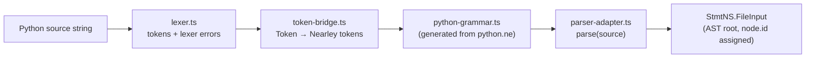
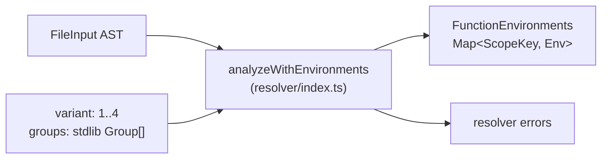
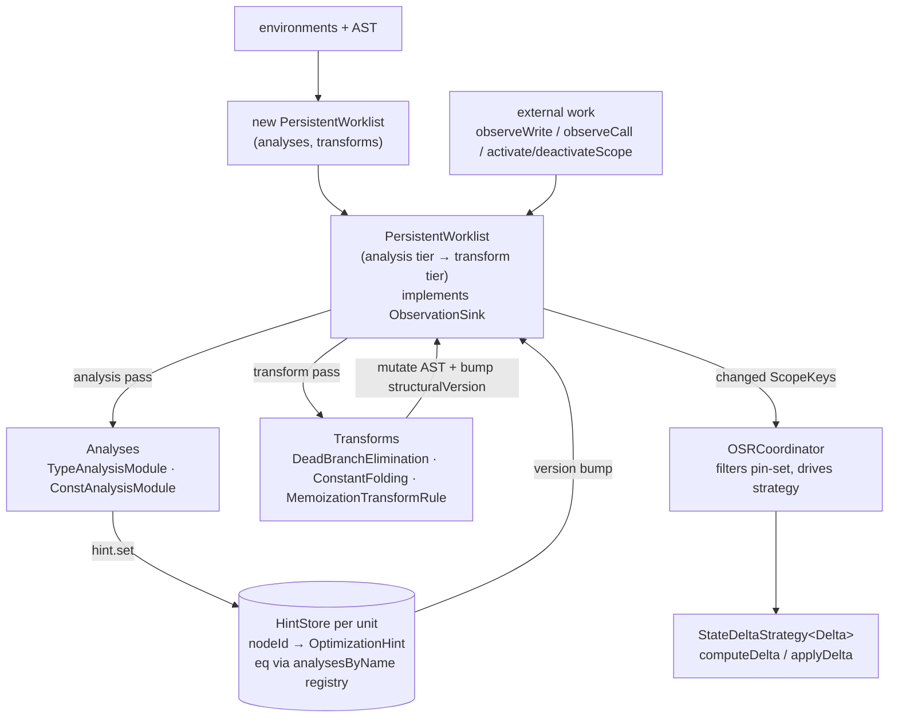
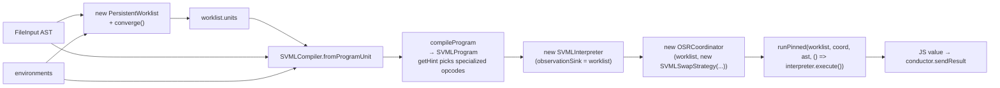
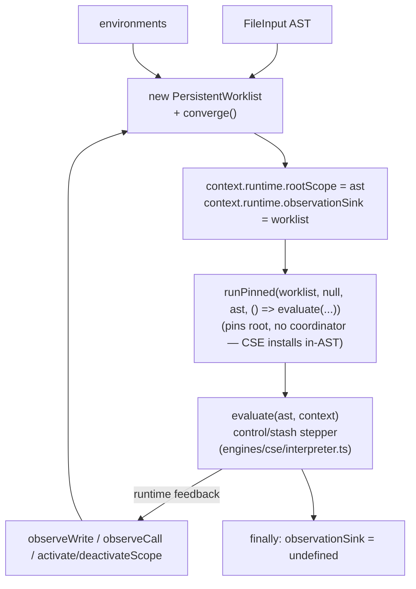
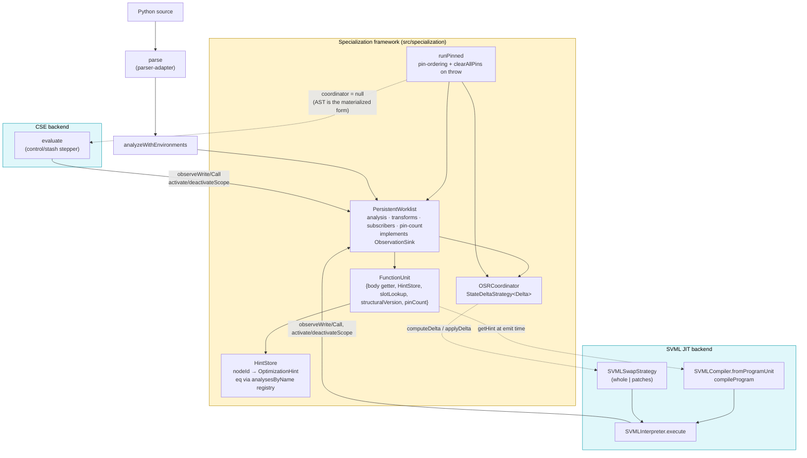

# py-slang compilation & execution flow

This document traces a Python source string from ingestion through to execution,
covering the available execution backends and the specialization framework they
share. Each phase includes a mermaid diagram of just that phase; a consolidated
end-to-end diagram sits at the end.

The goal is to make the interfaces between layers legible so the pipeline can
be dry-tested and reasoned about in isolation. For a hands-on view of what
specialization produces, run:

```
npx tsx scripts/dump-ast.ts <file.py> -o out.dot
```

`dump-ast` writes a DOT graph of the AST before and after the static
optimization pipeline, and prints a per-unit summary of hint counts, concrete
types, and constants to stderr.

---

## Phase 1 — Frontend: source → AST

Entry points:

- `parse(source: string)` (`src/parser/parser-adapter.ts`) — wraps a
  Nearley-generated grammar (`src/parser/python-grammar.ts`) driven by a
  hand-written lexer (`src/parser/lexer.ts`) via `token-bridge.ts`.
- Produces a `StmtNS.FileInput` (root of the AST), using the class-based node
  hierarchy in `src/ast-types.ts`. Every node has a stable `id` that downstream
  stages key on.



Failure mode: syntax errors surface as thrown `SyntaxError` / `LexerError`
instances from `parse`. Callers (the evaluators) catch and route them through
the conductor error channel.

---

## Phase 2 — Resolver: AST → environments

`analyzeWithEnvironments(ast, source, variant, groups?)` in `src/resolver`
walks the AST and returns:

- `errors`: scope / binding / variant-rule violations (stdlib groups gate which
  names are visible per variant).
- `environments`: a `FunctionEnvironments` map keyed by `FileInput | FunctionDef`
  describing each scope's declarations, free variables, and nesting. This is
  the input both the specialization framework and the SVML compiler need to
  reason about slots and closures.



Evaluators stop and surface errors before proceeding to specialization or
execution.

---

## Phase 3 — Specialization framework

Shared by all backends. Located under `src/specialization/`. There is no
facade: evaluators construct `PersistentWorklist` directly, optionally pair
it with an `OSRCoordinator`, and drive execution through the free helper
`runPinned`. This shape replaced the earlier `SpecializationEngine` facade
— the engine's one load-bearing invariant (clear pins on throw) became
`runPinned`; every other responsibility dissolved into the worklist or the
evaluator.

Typical shape (SVML JIT — the richest path):

```ts
const worklist = new PersistentWorklist(
  ast, environments,
  [new TypeAnalysisModule(), new ConstAnalysisModule()],
  [new DeadBranchEliminationRule(), new ConstantFoldingRule(), new MemoizationTransformRule()],
);
worklist.addCallObserver(new CallCountObserver());
worklist.converge(); // initial static pass

const compiler    = SVMLCompiler.fromProgramUnit(ast, environments, worklist.units);
const program     = compiler.compileProgram(ast);
const interpreter = new SVMLInterpreter(program, { observationSink: worklist });
const coordinator = new OSRCoordinator(worklist, new SVMLSwapStrategy(compiler, interpreter));

await runPinned(worklist, coordinator, ast, () => interpreter.execute());
```

CSE passes `coordinator: null` — its materialized form is the AST itself, so
the OSR loop has nothing to install. See Phase 4b.

The framework composes:

- **FunctionUnits** (`framework/function-unit.ts`): per-scope container owning
  the scope's body reference, a `HintStore`, a slot lookup, a
  `structuralVersion` that transforms bump when they mutate the body, and a
  `pinCount` that the worklist's `activateScope`/`deactivateScope` maintain
  as the single owner of pin-set state.
- **PersistentWorklist** (`framework/persistent-worklist.ts`): priority-scheduled
  fixpoint driver. Tier 1 is analysis over CFG blocks (type before const). Tier
  2 is transforms, which run only after local analysis fixpoint. The worklist
  directly implements `ObservationSink` — interpreters call `observeWrite` /
  `observeCall` / `activateScope` / `deactivateScope` on it during execution,
  and `subscribe` publishes scope-set notifications to the OSR coordinator.
- **ObservationSink** (`framework/observation-sink.ts`): nominal interface
  giving the four push-side methods their own name, so test mocks and
  interpreter typing don't have to structurally subtype the whole worklist.
  `PersistentWorklist implements ObservationSink`.
- **HintStore** (`framework/hint.ts`): `Map<nodeId, OptimizationHint>` with an
  injected `eq` callback. Production callers pass `(a, b) => hintEquals(a, b,
  worklist.analysesByName)`, which dispatches each field's lattice equality
  through the registered `AnalysisModule.latticeEquals`. Test merge-collectors
  pass `HINT_EQ_NEVER` since they never double-write a node.
- **Analyses** (`type-analysis/`, `const-analysis/`): dataflow modules producing
  lattice values at named hint fields.
- **Transforms** (`transforms/`): `DeadBranchEliminationRule`,
  `ConstantFoldingRule`, `MemoizationTransformRule`. Mutate the AST and bump
  `structuralVersion`, which invalidates downstream analysis for that unit.
- **OSRCoordinator** (`framework/osr.ts`): subscribes to the worklist and, for
  each changed unit whose scope is not pinned (and where the strategy's
  optional `canInstall`/`canInstallOnStack` predicates allow), invokes the
  installed `StateDeltaStrategy` to compute + apply a delta.
- **runPinned** (`run-pinned.ts`): pins the root scope for the duration of
  `fn`, starts/stops the coordinator, and — critically — calls
  `worklist.clearAllPins()` if `fn` throws. CSE does not pop envs on JS-stack
  unwind, so an exception leaves pins dirty; `clearAllPins` resets on throw.



### Specialization lifecycle (safepoint contract)

The OSR coordinator and the worklist's pin-count jointly implement a safepoint
contract: **a transform's materialized form is never installed while a frame
of the target scope is on the stack.** Mechanics:

1. Interpreter calls `worklist.activateScope(scope)` on call entry
   (`FunctionUnit.pinCount` += 1).
2. Any transform enqueued against a pinned scope stays parked in the worklist
   (`hasProcessableTransform` / `processTransform` skip it).
3. Interpreter calls `worklist.deactivateScope(scope)` on return (pinCount −1).
   When it hits zero, a fresh transform pass for that scope is re-enqueued.
4. The surrounding `runPinned(worklist, coord, scope, fn)` → `withActiveScope`
   finally block calls `tick()`, which drains parked transforms whose scopes
   are now unpinned, mutates AST / hints, and synchronously `notify()`s
   subscribers.
5. `OSRCoordinator.onChange` re-checks `isScopeActive` (defence in depth),
   calls `strategy.computeDelta(unit)`, then `strategy.applyDelta(scopeKey, delta)`.

`StateDeltaStrategy<Delta>` is currently single-use in production:
`SVMLSwapStrategy` for the SVML JIT path. It emits `Delta = { kind: 'whole',
ir: SVMLIR }` (interpreter's `patchFunction` swaps the function-table slot)
or `Delta = { kind: 'patches', patches: OperandPatch[] }` (interpreter
`applyOperandPatches` mutates typed arrays in place). CSE does not install a
strategy — it passes `coordinator: null` to `runPinned` — because its
materialized form is the AST itself and transforms mutate it during `tick`.

Rationale for this shape (five AST-mutation failure classes and why pin-set
mitigates them) lives in `optimization-roadmap.md` under "Why the pin-set exists."

### Public surface (from `src/specialization/index.ts`)

- `runPinned` — pin-ordering wrapper used by every evaluator.
- `PersistentWorklist`, `ObservationSink`, `WorklistStats`.
- `FunctionUnit`, `buildFunctionUnits`.
- `HintStore`, `OptimizationHint`, `hintEquals`, `HINT_EQ_NEVER`.
- `OSRCoordinator`, `StateDeltaStrategy`.
- `AnalysisModule`, `TransformRule`, `CallObserver`.
- Analyses/lattices (`TypeAnalysisModule`, `ConstAnalysisModule`, lattice
  constructors).
- Transforms (`ConstantFoldingRule`, `DeadBranchEliminationRule`,
  `MemoizationTransformRule`) and `CallCountObserver`.
- Memoization runtime intrinsics (`memoLookup`, `memoPut`, `MEMO_MISS`,
  `MEMO_INTRINSIC_NAMES`) — re-exported from `src/runtime/memo.ts`.

Unit ownership matters: `worklist.hintsFor(node)` routes a lookup to the owning
unit's store — there is no single merged store. The SVML compiler reads hints
through per-unit nested compilers at compile time. The CSE interpreter does
not read hints at all on the hot path — visualizer consumers read them
externally via `worklist.hintsFor(node)`.

---

## Phase 4a — SVML evaluators

Three SVML evaluators live in `src/conductor/`:

| Evaluator | File | Role |
|---|---|---|
| `PySvmlEvaluator` | `PySvmlEvaluator.ts` | One-shot: converge, compile, run. No OSR. |
| `PySvmlJitEvaluator` | `PySvmlJitEvaluator.ts` | Reactive JIT: runtime observations feed the worklist; OSR swaps IR between safepoints. |
| `PySvmlSinterEvaluator` | `PySvmlSinterEvaluator.ts` | Compiles to SVML bytecode and executes on the Sinter WebAssembly VM. No reactive loop. |

The JIT path is the one illustrated below; the non-JIT path is identical up
through `worklist.converge()` + compile + execute, minus the `OSRCoordinator`
and the post-execution OSR loop. Flow:

1. `parse(script)` → AST.
2. `analyzeWithEnvironments(...)` → environments.
3. `worklist = new PersistentWorklist(ast, environments, analyses, transforms); worklist.converge()`.
4. `compiler = SVMLCompiler.fromProgramUnit(ast, environments, worklist.units)`
   — root compiler with nested per-unit compilers keyed by scope.
5. `program = compiler.compileProgram(ast)`. At emission time, `getHint(node)`
   reads from the owning unit's `HintStore` to choose specialized opcodes
   (e.g. `ADDF`/`NOTB` vs generic `ADDG`/`NOTG`) and to elide observation-site
   metadata for already-concrete expressions.
6. `interpreter = new SVMLInterpreter(program, { sendOutput, observationSink: worklist })`.
7. `coordinator = new OSRCoordinator(worklist, new SVMLSwapStrategy(compiler, interpreter))`
   — the strategy captures both because its `computeDelta` may recompile the
   unit and its `applyDelta` calls `interpreter.patchFunction` or
   `interpreter.applyOperandPatches`.
8. `await runPinned(worklist, coordinator, ast, () => interpreter.execute())`
   — pins the root scope, starts the coordinator, runs the interpreter,
   drains on exit, clears pins on throw.



Runtime feedback: the interpreter emits `observeWrite`/`observeCall` through
its `observationSink` (the worklist), which enqueues analysis refinements.
Profile-style facts — e.g. saturating call counts that drive memoization —
are produced by `CallCountObserver` registered via `worklist.addCallObserver`.
When a refinement triggers a transform on an unpinned scope, the coordinator
fires `SVMLSwapStrategy.computeDelta`/`applyDelta` at the next safepoint.

---

## Phase 4b — CSE evaluator (reactive, no code install)

File: `src/conductor/PyCseEvaluator.ts`. The CSE (control-stash-environment)
machine in `src/engines/cse/interpreter.ts` is a stepper over control and
stash stacks. Flow:

1. `parse` + `analyzeWithEnvironments` as before.
2. `worklist = new PersistentWorklist(ast, environments, analyses, transforms); worklist.converge()`.
3. `context.runtime.rootScope = ast`.
4. `context.runtime.observationSink = worklist` — the CSE interpreter emits
   observations through this during execution.
5. `await runPinned(worklist, null, ast, () => evaluate(...))` — pins the root
   scope, runs the interpreter, drains on exit. The coordinator argument is
   `null`: CSE's materialized form is the AST, which transforms mutate
   directly during `tick`, so there is no install step to sequence.
6. Inside `evaluate`:
   - The interpreter **does not read hints on the hot path.** The single hint
     read that used to exist (per-step visualization metadata) was removed;
     visualizer consumers read `worklist.hintsFor(node)` externally.
   - After writes / calls / return points, the interpreter calls
     `observationSink.observeWrite(...)` / `.observeCall(...)` /
     `.activateScope(...)` / `.deactivateScope(...)`, feeding the worklist.



Failure modes worth noting:

- If `evaluate` throws, `runPinned` catches, calls
  `worklist.clearAllPins()`, and rethrows. `withActiveScope`'s finally
  suppresses the post-run `tick()` on throw — otherwise a subscriber could
  try to install against a unit whose interpreter state has unwound.
- `observationSink` is cleared in `finally` so subsequent chunks get a clean
  runtime.

---

## Consolidated diagram



---

## Quick reference: files and interfaces

| Concern | File | Key symbols |
|---|---|---|
| Parse | `src/parser/parser-adapter.ts` | `parse` |
| Resolve | `src/resolver/index.ts` | `analyzeWithEnvironments`, `FunctionEnvironments` |
| Pin-ordering wrapper | `src/specialization/run-pinned.ts` | `runPinned(worklist, coord\|null, scope, fn)` |
| Worklist | `src/specialization/framework/persistent-worklist.ts` | `PersistentWorklist`, `observeWrite`, `observeCall`, `activateScope`, `deactivateScope`, `withActiveScope`, `subscribe`, `addCallObserver`, `clearAllPins` |
| Observation surface | `src/specialization/framework/observation-sink.ts` | `ObservationSink` (interface; `PersistentWorklist implements`) |
| Units | `src/specialization/framework/function-unit.ts` | `FunctionUnit`, `buildFunctionUnits` |
| Hints | `src/specialization/framework/hint.ts` | `HintStore`, `OptimizationHint`, `hintEquals`, `HINT_EQ_NEVER` |
| OSR | `src/specialization/framework/osr.ts` | `OSRCoordinator`, `StateDeltaStrategy` |
| SVML compile | `src/engines/svml/svml-compiler.ts` | `SVMLCompiler.fromProgramUnit`, `compileProgram`, `getHint` |
| SVML run | `src/engines/svml/svml-interpreter.ts` | `SVMLInterpreter.execute`, `patchFunction`, `applyOperandPatches`, `toJSValue` |
| SVML swap | `src/conductor/svml-swap-strategy.ts` | `SVMLSwapStrategy` (`computeDelta`, `applyDelta`, `canInstallOnStack`) |
| CSE run | `src/engines/cse/interpreter.ts` | `evaluate` (writes to `runtime.observationSink`; does not read hints) |
| Memo runtime | `src/runtime/memo.ts` | `memoLookup`, `memoPut`, `MEMO_MISS`, `MEMO_INTRINSIC_NAMES` |
| SVML evaluators | `src/conductor/PySvmlEvaluator.ts`, `PySvmlJitEvaluator.ts`, `PySvmlSinterEvaluator.ts` | `evaluateChunk` |
| CSE evaluator | `src/conductor/PyCseEvaluator.ts` | `PyCseEvaluator*.evaluateChunk` |
