# DFA → this framework: a pedagogical walk-through

This tutorial starts from **classical dataflow analysis (DFA)** on a small
Python program, builds up the ingredients — CFG, lattice, transfer, worklist
— and then shows how the framework in `src/specialization/framework/`
generalizes them to run many analyses over a shared fact store.

---

## 0. The four core components (map of the engine)

Before the example: the whole engine is four pieces. Everything else is a
specialization or a wiring detail.

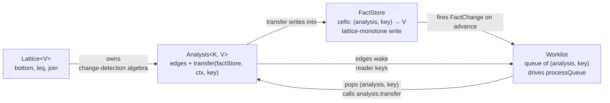

Their contracts, and what each one is *not*:

| Component | Owns | Does **not** own |
|---|---|---|
| **`Lattice<V>`** | `bottom`, `leq` (partial order), `join` (lub). Change detection is derived from `leq` alone. | Equality (no `latticeEquals`), iteration, storage. |
| **`Analysis<K, V>`** | `lattice`, `edges`, `tier`, `transfer(factStore, ctx, key)`. One transfer per `(analysis, key)` cell. | Storage (writes go to `FactStore`); scheduling (lives in `Worklist`). |
| **`FactStore`** | Cell map `(analysis, key) → V`. `write` joins monotonically and fires events only on real advance. `onChange` pub/sub. | Enqueueing (the worklist's listener does that); deciding *which* keys to wake (edges do that). |
| **`Worklist`** | Queue of `(analysis, key)`. Subscribes to `FactStore.onChange`; on an event, looks up every edge into `change.analysis` and calls `edge.wake` to project the changed key onto reader keys. Drains with tier priority. | The transfer logic; the lattice algebra; the cell storage. |

The **one-way information flow** is the key invariant:

```
Analysis.transfer → FactStore.write → FactChange event →
Worklist reads edges → Worklist.enqueue → (later) Analysis.transfer ...
```

A analysis never enqueues directly, never writes to another analysis's cell, and
never sees the worklist. A lattice never sees keys. The `FactStore` never
decides what to wake. Each responsibility is in exactly one place, which is
why the engine is ~200 lines despite running 11+ interacting analyses.

Two ways analyses react to upstream change, both mediated by `edges`
(`analysis.ts`):

- **`FactEdge`** (`on: "fact"`) — "when upstream analysis `P` writes key `k`,
  call `wake(ctx, k)` and enqueue every key it yields into *my* key-space."
  The self-edge is a `FactEdge` whose `wake` returns `block.successors` —
  that one line is Kildall's "push successors on change."
- **`LifecycleEdge`** (`on: "mint" | "rebuild" | "retire"`) — "when a
  `FunctionUnit` is created / its CFG rebuilt / it's retired, call
  `wake(ctx, unit)` or run `effect(factStore, ctx, unit)`." Used for
  seeding entry blocks and evicting stale cells.

Both shapes carry a mandatory `on` discriminant. "Depends on, doesn't
react" is *not* an edge — read the upstream in `transfer` via
`factStore.read(upstream, ...)` without declaring one.

A sibling protocol handles imperative rewrites:

- **`TransformRule`** — no lattice, no transfer, no cell. It has
  `edges: FactEdge<FunctionUnit>[]` (unified with analysis edges) plus
  `autoDirtyOn: ("mint" | "rebuild")[]` (default `["mint", "rebuild"]`).
  The worklist dirties the rule on those triggers and on fact-edge writes;
  `sweep(unit, factStore, ctx)` runs once per dirty unit *after*
  `processQueue` drains, and a return of `true` schedules a CFG rebuild.
  Transforms sit outside the monotone fixpoint on purpose — rewriting is
  not a data-flow.

With that skeleton in hand, the rest of the tutorial shows the pieces
doing work.

---

## 1. A running example

```python
def f(n):
    x = 10          # S1
    y = 20          # S2
    if n > 0:       # S3
        x = 5       # S4
    return x + y    # S5
```

We'll compute *constant propagation*: at every program point, what do we
know about each variable? Expected result:

- `y` is always `20` at the return.
- `x` is either `10` or `5` at the return — not a single constant.
- `n` is unknown (a parameter).

---

## 2. Draw the CFG

A **basic block** is a straight-line chunk of statements with one entry and
one exit. The CFG of `f`:

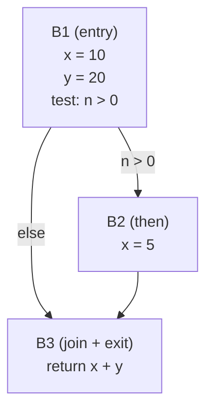

Built by `buildCFG` in `src/specialization/framework/cfg.ts` and stored
inside a `FunctionUnit`.

---

## 3. Pick a lattice

A **lattice** is the set of "facts" we track plus two operations:

- **join (⊔)** — combine facts from two incoming edges into one.
- **leq (⊑)** — the partial order: "did this fact climb?"

For constant propagation, per variable:

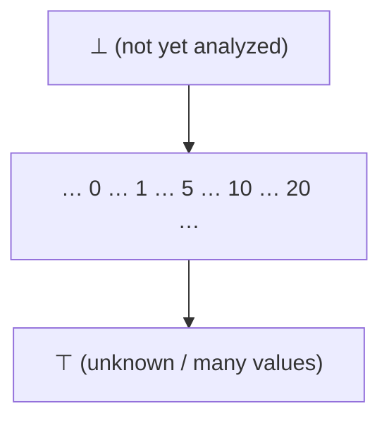

Rules: `⊥ ⊔ x = x`; `c ⊔ c = c`; `c ⊔ c' = ⊤` for `c ≠ c'`; `⊤ ⊔ x = ⊤`.

The full analysis state at a program point is an **environment**
`slot → lattice value`, e.g. `{ x: 10, y: 20, n: ⊤ }`.

The framework captures this algebra in `analysis.ts`:

```ts
interface Lattice<V> {
  readonly bottom: V;
  leq(a: V, b: V): boolean;   // partial order a ⊑ b
  join(a: V, b: V): V;        // least upper bound
}
```

`leq` is the only primitive for change detection. `FactStore.write` uses
it as a fast-path: if `leq(value, prev)` then the join can't advance and
the write is a no-op. There is no separate `equals` — anti-symmetry plus
monotone writes make it unnecessary.

---

## 4. Transfer function

The **transfer function** `f_B` says: given the fact at block `B`'s entry,
what holds at its exit? Compute it by walking the statements inside.

| Block | Entry | Walk | Exit |
|---|---|---|---|
| B1 | `{x:⊥, y:⊥, n:⊤}` | `x=10`, `y=20` | `{x:10, y:20, n:⊤}` |
| B2 | `{x:10, y:20, n:⊤}` | `x=5` | `{x:5, y:20, n:⊤}` |
| B3 | `⊔` of B1, B2 exits | reads `x+y` | `{x:⊤, y:20, n:⊤}` |

Key property: transfer is **monotone** — more information in never yields
less information out. That plus a finite-height lattice makes the worklist
terminate.

---

## 5. The classical worklist


Trace on our example:

| Iter | Pop | in | out | Changed? | Enqueue |
|---|---|---|---|---|---|
| 1 | B1 | `⊥` | `{x:10, y:20, n:⊤}` | yes | B2, B3 |
| 2 | B2 | `{x:10, y:20, n:⊤}` | `{x:5, y:20, n:⊤}` | yes | B3 |
| 3 | B3 | `⊔(B1.out, B2.out) = {x:⊤, y:20, n:⊤}` | same | yes | — |
| 4 | — | — | — | — | done |

At B3: `x = ⊤`, `y = 20` — the answer we expected.

---

## 6. Many analyses, one engine

Real optimizers don't run just one DFA. They run many — constant
propagation, types, purity, reaching defs — and each wants to consume the
others' results. Classical DFA has no story for this.

This framework generalizes the worklist:

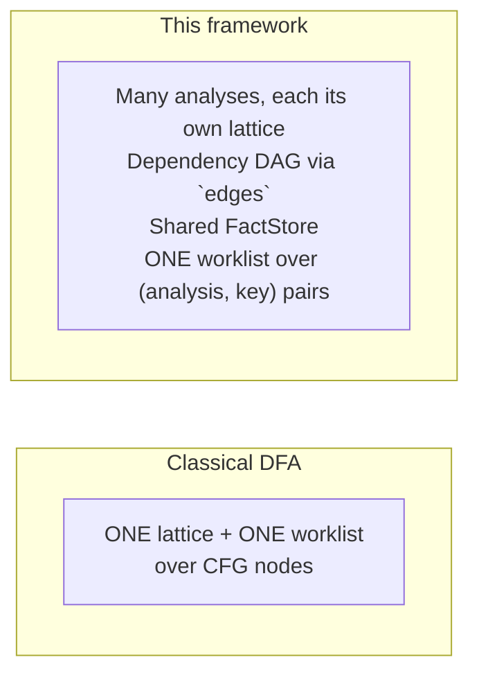

The core abstraction is `Analysis<K, V>`:

```ts
interface Analysis<K, V> {
  readonly lattice: Lattice<V>;
  readonly edges: ReadonlyArray<EdgeSpec<K>>;
  readonly tier: "runtime" | "analysis";
  transfer(factStore: FactStore, ctx: AnalysisCtx, key: K): V | undefined;
}
```

`factStore` is threaded explicitly rather than being hung off `ctx`, so
every transfer's store dependency is visible in its signature and
`AnalysisCtx` stays narrow (unit-topology lookups only).

- **`V`** — the facts this analysis computes.
- **`K`** — what those facts are indexed by.
- **`edges`** — upstream analyses and lifecycle events this analysis reacts to.
- **`tier`** — priority class: `"runtime"` settles before `"analysis"`
  within a single worklist drain.
- **`transfer(factStore, ctx, key)`** — recompute the fact at `key`. Returning
  `undefined` means "no write" (see §8).

The one-to-one mapping:

| Classical DFA | Framework |
|---|---|
| CFG node / basic block | a key `K` |
| Environment at that point | the value `V` (a lattice element) |
| `⊔` at merge points | `lattice.join` |
| Fixed-point test | `!leq(joined, prev)` (in `FactStore.write`) |
| Transfer function `f_B` | `Analysis.transfer(factStore, ctx, key)` |
| "Push successors on change" | a `wake` projector on a self-edge |
| One analysis | One analysis among many in the DAG |

---

## 7. Following the flow through the example

There is **one** analysis in the DAG for constant analysis on `f`, not two.
`constAnalysisModule` (in `const-analysis/analysis.ts`) is a **descriptor**
— a lattice + expression visitor — handed to the block-fixpoint factory
`makeBlockFixpointAnalysis`. The factory returns a single block-keyed `Analysis`.
Per-expression facts live inside that analysis's value type
(`DfaBlockFact<L>.exprFacts: Map<nodeId, L>`) and are read back via
`readExprFact` — a projection, not a second analysis.

### Why block-keyed, not node-keyed?

A natural question: consumers want per-expression facts — why not key on
`nodeId` directly?

1. **The unit of dataflow *is* the block.** Inside a block, statements
   run sequentially — no fixpoint work to do. Fixpoints arise at merges
   (B3 joining B1 and B2). Node-keying would spread a block-level
   computation across `|nodes|` worklist items with no precision gain.
2. **Joins are on environments, not single values.** The lattice element
   merged at a merge point is `slot → ConstLattice` — a whole env.
3. **Cell count.** Blocks ~ tens; expression nodes ~ thousands.
4. **Per-node facts are a byproduct of the block walk.** While
   `transferBlock` visits each statement it already has the live env;
   recording the `ConstLattice` into `exprFacts` is free.

### Mapping each analysis's keys onto the Python program

Each analysis's `K` carves the same source along a different axis:

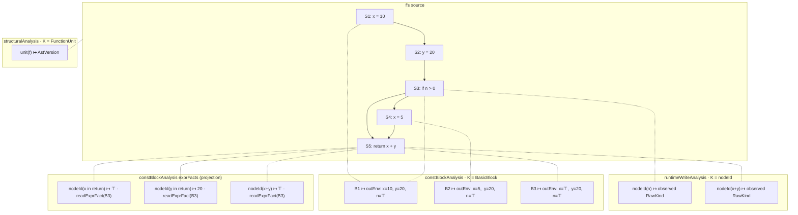

- **`runtimeWriteAnalysis`** attaches a fact to expression nodes the runtime
  happened to execute.
- **`constBlockAnalysis`** attaches a fact to each block: the slot env at
  the block's exit. Classical DFA lives here.
- **`exprFacts`** is not a separate analysis — it's a map inside the block
  analysis's `V`, populated during the block walk.
- **`structuralAnalysis`** attaches one cell per unit, bumped when the
  unit's AST/CFG is rebuilt. Everything else reads it to re-seed on
  structural change.

### Dependency DAG

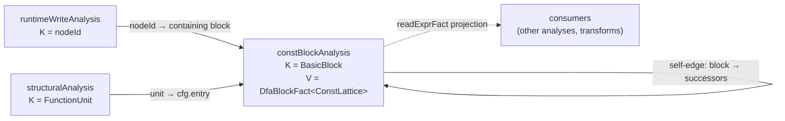

Only three analyses. The dotted line is a read-side projection, not a DAG
edge: consumers query `exprFacts` inside the block analysis's `V` directly —
there's no separate node-keyed analysis to wake.

### Walking the worklist (cold start)

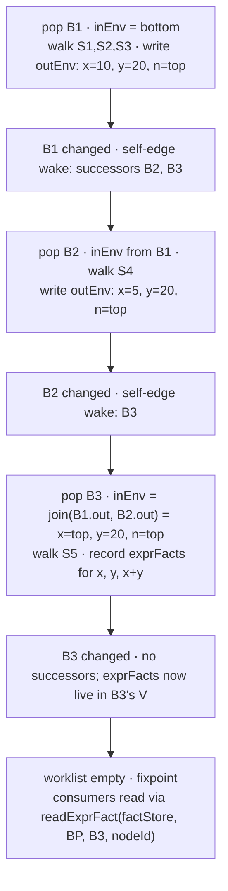

Two things made this work without hand-wiring a classical worklist:

- The **self-edge wake** (`dfa-factory.ts`) is literally "when block b's
  OUT changes, enqueue b.successors." Classical successor-push as one
  projector.
- **No separate node-keyed analysis.** Per-expression facts are computed
  during the block walk and recorded into `exprFacts`. Consumers reach
  them via `readExprFact` — which resolves the containing block and
  indexes the map.

### Adding runtime evidence

Suppose at runtime we observe `n = 3`. A cell is written at
`runtimeWriteAnalysis[nodeId(n)]`. The same machinery re-enters:

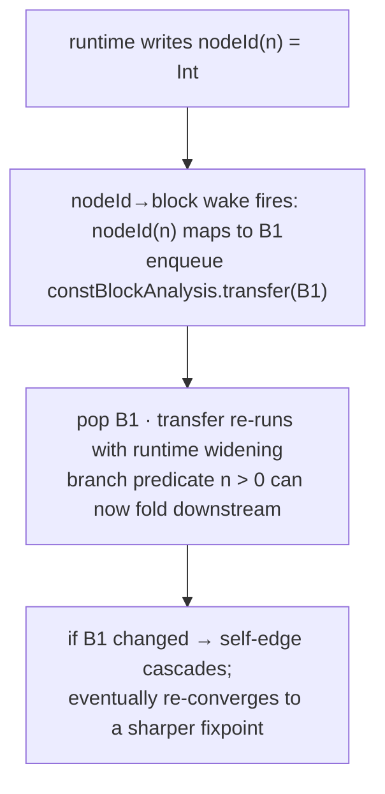

Runtime observations enter the same fixpoint as static analysis, through
declared edges. Classical DFA has nowhere to put that evidence; here it's
just another upstream analysis with a `wake` projector.

---

## 8. Four granularities: node, block, unit, scope

The framework uses several key-spaces depending on what an analysis is
reasoning about. Biggest → smallest:

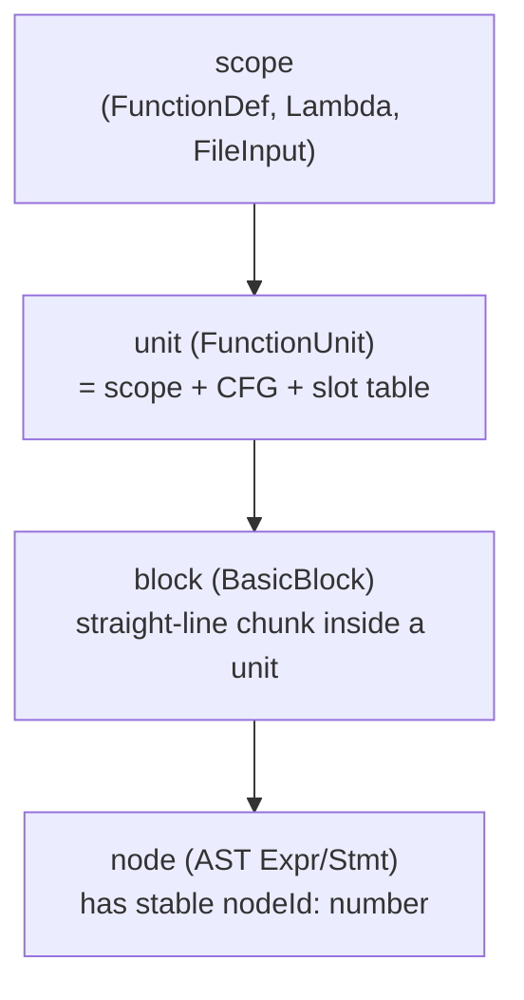

- **node** — a single AST node, stable `nodeId: number`. Finest grain.
- **block** — a `BasicBlock` inside a unit's CFG. `unit.blockOfNode`
  goes from node to containing block.
- **scope** — a Python lexical scope. Defines name binding; managed by
  the resolver.
- **unit** — `FunctionUnit`, the optimizer's physical container for a
  non-lambda scope: AST + CFG + slot table + generation + call count.
  One per non-lambda scope. Lambdas have scopes but no units.

On `f`: ~dozens of nodes, 3 blocks, 2 scopes (module + `f`), 2 units
(module-unit + `f`-unit).

Analyses in the codebase, by role and key:

| Analysis | Tier | K | V | Role |
|---|---|---|---|---|
| `runtimeWriteAnalysis` | runtime | nodeId | `RawKind` | source — runtime value observations |
| `runtimeCallAnalysis` | runtime | nodeId | `number` | source — saturating call counter |
| `callCountAnalysis` | analysis | fdId | `number` | fold over runtime counter |
| `constBlockAnalysis` | analysis | `BasicBlock` | `DfaBlockFact<ConstLattice>` | classical DFA |
| `typeBlockAnalysis` | analysis | `BasicBlock` | `DfaBlockFact<TypeLattice>` | classical DFA |
| `purityScopeAnalysis` | analysis | fdId | `boolean \| undefined` | summary projection from unit's purity DFA |
| `structuralAnalysis` | analysis | `FunctionUnit` | `AstVersion` | CFG-rebuild version tag |

Transforms are not analyses. They live in a parallel protocol
(`TransformRule`) — see §9.

Reading the table: **runtime sources feed analyses feed transforms.** The
three tiers of work.

---

## 9. Design notes

### Direction — does the same transfer work backward?

Yes. Direction is a one-line config on the DFA factory
(`dfa-factory.ts`): `"forward"` reads IN from predecessors and wakes
successors; `"backward"` reads IN from successors and wakes predecessors.
The transfer function you write is the same shape either way.

### Why `transfer` returns `V | undefined`

`undefined` means **"no write"**, distinct from "write ⊥":

- **Guard clauses** — the analysis decides the key is not its responsibility.
- **Don't pollute the store with bottoms** — `undefined` keeps `tryRead`
  returning `undefined`, which consumers can branch on to distinguish
  "analyzed, result is ⊥" from "not applicable."
- **Retryability** — returning `undefined` leaves the cell absent so the
  analysis is re-run cleanly next time an upstream changes.

### `EdgeSpec`: fact edges and lifecycle edges in one protocol

Naively `edges: Analysis<any, any>[]` — a dependency list — would be enough.
It isn't: different analyses key on different things, and a node-keyed
upstream can't say *which block* of a block-keyed downstream needs waking
without a projection.

The type (`analysis.ts`):

```ts
type EdgeSpec<K> = FactEdge<K> | LifecycleEdge<K>;

interface FactEdge<K> {
  readonly on: "fact";
  readonly analysis: Analysis<any, any>;
  wake(ctx: AnalysisCtx, key: unknown): Iterable<K>;
}

interface LifecycleEdge<K> {
  readonly on: "mint" | "rebuild" | "retire";
  wake?(ctx: AnalysisCtx, unit: FunctionUnit): Iterable<K>;
  effect?(factStore: FactStore, ctx: AnalysisCtx, unit: FunctionUnit): void;
}
```

Two shapes, one mandatory discriminant `on`:

- **Fact edge** — wake when the upstream analysis writes. `wake` projects
  upstream key into my key-space. Both `on` and `wake` are required:
  "depends on, doesn't react" is not an auto-reactive edge — express
  that by reading `factStore.read(upstream, ...)` inside `transfer`
  without declaring an edge.
- **Lifecycle edge** — wake or run `effect` when a unit is minted,
  rebuilt, or retired. For seeding entry blocks, evicting stale cells,
  etc. At least one of `wake` / `effect` must be defined.

A worked example: `runtimeWriteAnalysis` is keyed by `nodeId`; `constBlockAnalysis`
is keyed by `BasicBlock`. When runtime observes `n = 3`, only B1 (the
block containing `n`) should re-transfer. The projector is exported from
`dfa-factory.ts`:

```ts
export const nodeIdToBlock = (ctx: AnalysisCtx, key: unknown): Iterable<BasicBlock> => {
  if (typeof key !== "number") return [];
  const u = ctx.unitForNode(key);
  const block = u?.blockOfNode.get(key);
  return block === undefined ? [] : [block];
};
```

...and each upstream node-keyed source is wired in by the DFA config as
a `FactEdge` with that projector:

```ts
for (const upstream of upstreams) {
  edges.push({ on: "fact", analysis: upstream, wake: nodeIdToBlock });
}
```

The block DFA declares four edges total:

| Edge | Kind | Source | `wake` output | Classical analogue |
|---|---|---|---|---|
| upstream fact edges | fact | runtime / node-keyed analyses | `[containing block]` | — |
| self-edge | fact | block analysis itself | `successors` / `predecessors` | **push successors on change** |
| `"mint"` | lifecycle | unit created | `[entry block]` | seed on creation |
| `"rebuild"` | lifecycle | unit's CFG rebuilt | `[entry block]` + `effect` evicts stale block cells | re-seed |
| `"retire"` | lifecycle | unit destroyed | — (just `effect` to evict) | teardown |

The middle row is the punchline: **"when a block's OUT changes,
recompute its successors" is one `wake` on a self-edge.** The classical
worklist's core behavior is an edge, not hardcoded.

---

## 10. How the worklist actually gets woken

Earlier diagrams hand-wave "B1 changed, so the worklist enqueues its
successors." What mediates that:

### The two data structures, side by side

The **FactStore** is a map keyed by `(analysis, key)`. Drawn with the analysis as
the outer axis, each analysis owns a sub-map `key → V`. The **Worklist** is a
priority queue of `(analysis, key)` items; `analysis.tier` gives the priority —
`runtime` (0) drains before `analysis` (1) within a single `processQueue`.
**TransformRule** sweeps are not enqueued items; they run once each after
the PQ empties.

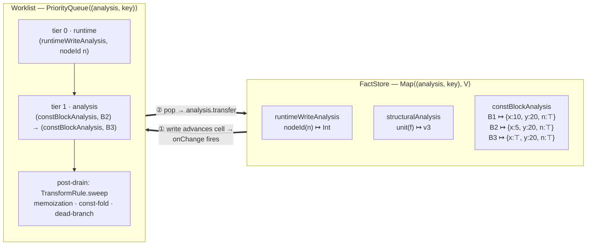

Outer axis of the store is the analysis; inner is its own `K → V`. The
worklist drains tier 0 before tier 1; `TransformRule` sweeps run once
after the PQ empties and may schedule a CFG rebuild.

The cycle in one line: **write → onChange → edge.wake → enqueue → pop →
transfer → write**. Analyses never see the worklist; the worklist never
touches cell values; the store never decides which readers to wake —
that's what `edges` are for.

### Pub/sub via `FactStore.onChange`

The worklist subscribes once at construction:

```ts
this.factStore.onChange(c => this.handleFactChange(c));
```

A change event (`fact-store.ts`):

```ts
interface FactChange<K, V> {
  readonly analysis: Analysis<K, V>;
  readonly key: K;
  readonly oldValue: V | undefined;
  readonly newValue: V;
}
```

Events fire only on **value-changing writes**. `FactStore.write` is
lattice-aware:

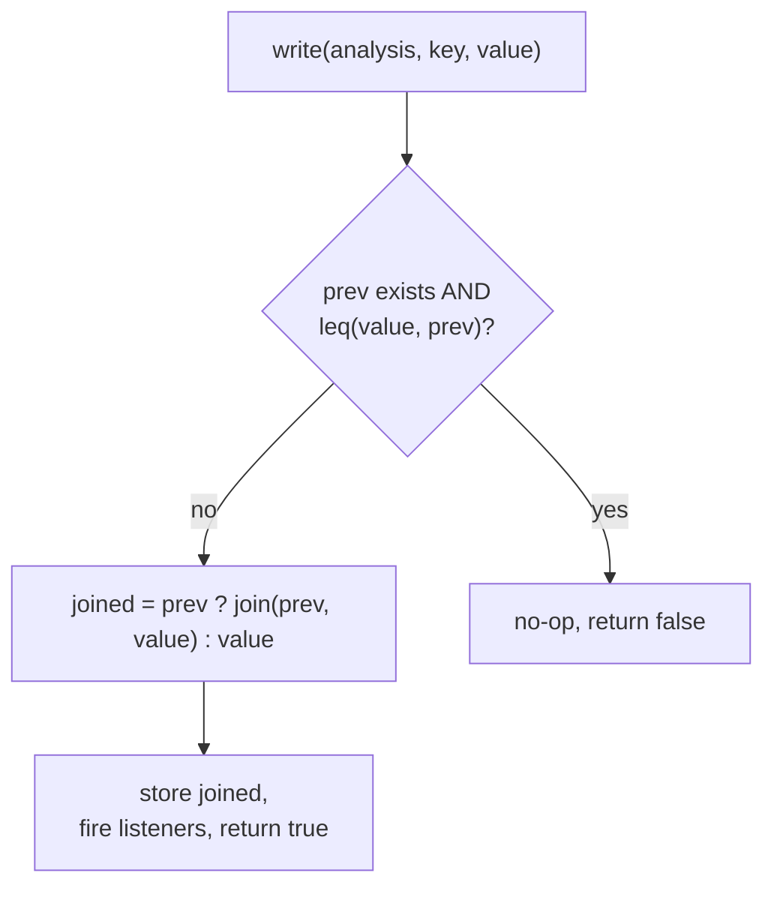

One suppression: if `leq(value, prev)` the join can't advance, so the
write is a no-op and no event fires. Otherwise we join and store
unconditionally — a second `leq(joined, prev)` check would only trigger
for non-idempotent joins, which is a lattice-law violation, not something
the store should paper over.

This turns the lattice's monotonicity promise into a framework
invariant: every event corresponds to a real advance. A buggy `transfer`
that returns a regressive value collapses to a no-op — `transfer` can
return raw values without hand-joining.

### What the worklist does on an event

`handleFactChange` does *not* write. It enqueues:


Writes from the event happen later, when `processQueue` pops the
enqueued `(reader, key)` and calls `reader.transfer(...)`. At that point
we're outside the listener frame and the nested write fires cleanly.

### Transforms: imperative rewrites, not analyses

Transforms (memoization, constant-folding, dead-branch) are not
`Analysis<K, V>`. They have no lattice, no `transfer`, no cell in the
fact store. Their interface (`analysis.ts`):

```ts
interface TransformRule {
  readonly id: symbol;
  readonly debugName: string;
  readonly edges?: ReadonlyArray<FactEdge<FunctionUnit>>;
  readonly autoDirtyOn?: ReadonlyArray<"mint" | "rebuild">;  // default ["mint", "rebuild"]
  sweep(unit: FunctionUnit, factStore: FactStore, ctx: AnalysisCtx): boolean;  // true = mutated
}
```

Transform edges reuse `FactEdge<FunctionUnit>` — same dispatch shape as
analysis edges, `wake` yields the units to dirty. `autoDirtyOn` controls
which lifecycle events also dirty every unit; rules driven purely by
fact edges can opt out with `[]`.

The worklist dirties a rule on its `autoDirtyOn` events and on writes to
any analysis declared in `edges`. The rule's `sweep` runs after
`processQueue` drains. If `sweep` returns `true`, the unit is scheduled
for CFG rebuild, which re-fires lifecycle edges and restarts the
fixpoint.

Keeping transforms out of the analysis protocol removes the pretense that
imperative rewriting is a monotone data-flow: it isn't, and encoding it
as one (with a `"fired"` sentinel lattice) was strictly ceremony.

### Putting it together on the example

Cold start, enqueue B1:

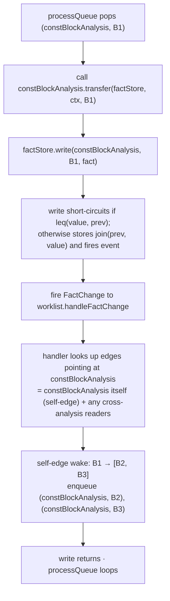

Pub/sub, monotone writes, edge-owned projection — that's the whole
engine. No polling, no re-entrancy, no double-counting.

---

## 11. Summary cheat-sheet

- **Classical DFA** = one lattice + CFG + worklist over program points.
- **This framework** = many `Analysis<K, V>` in a DAG + one worklist over
  `(analysis, key)` pairs, sharing a `FactStore`.
- **`K`** = *"what entity is this fact about?"* (node / block / unit /
  fdId …). **`V`** = *"what do we know?"* (a lattice element).
- **Tiers**: `runtime` sources → `analysis` analyses → `TransformRule`s.
- **Edges**: `FactEdge` (wake on upstream write, `wake` projects keys)
  and `LifecycleEdge` (wake / `effect` on unit mint / rebuild / retire).
- **Change detection**: `leq` only; equality is derived. `FactStore.write`
  joins monotonically and fires events only on real advances.
- **Transforms** (`TransformRule`) live outside the analysis protocol — they
  are imperative sweeps gated on analyses, not monotone data-flows.
- **Block-keyed DFA** (`makeBlockFixpointAnalysis`) is the specialized
  helper for Kildall-style analyses; per-expression facts ride inside
  the block fact's `exprFacts` map and are queried via `readExprFact`.
