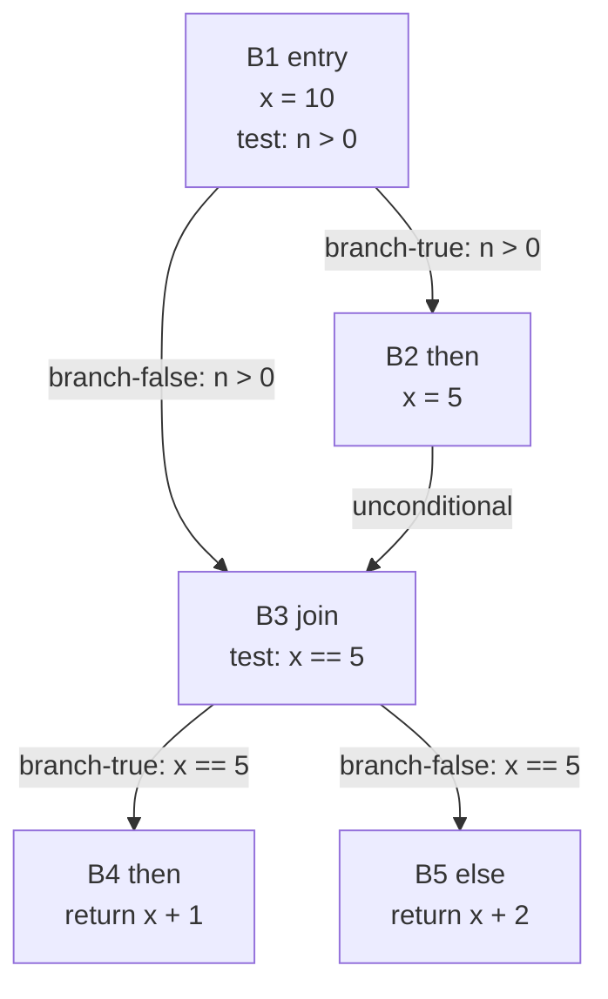
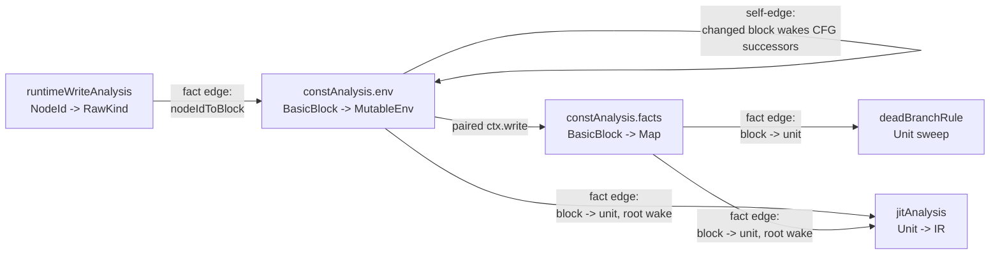
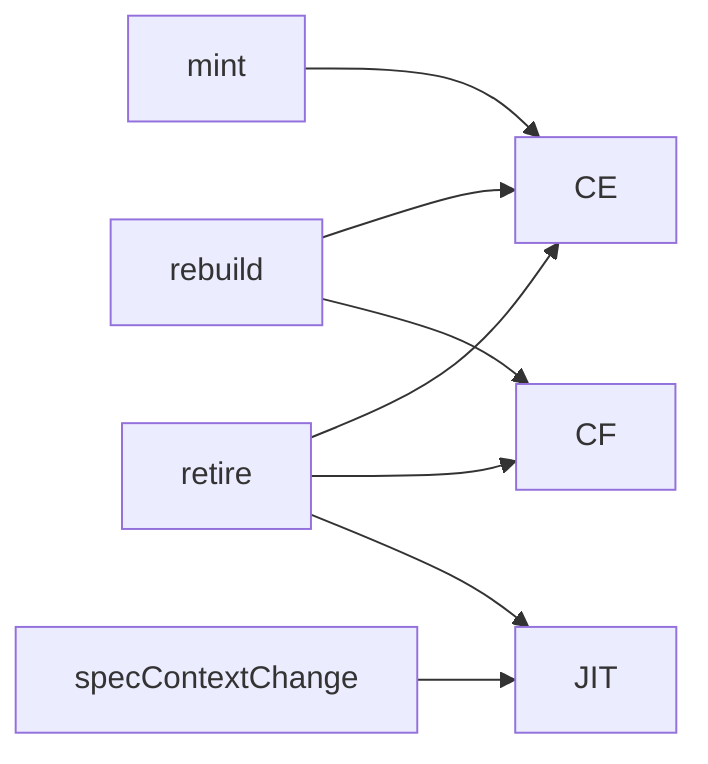
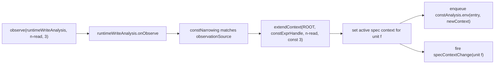

# DFA in this framework: one example, end to end

This tutorial explains the framework by following one analysis graph through
one Python function.

The goal is not to catalogue every type. The goal is to show:

1. what runs;
2. who wakes whom;
3. why the graph needs both fact edges and lifecycle edges;
4. why the framework is split into analyses, assumption handles, narrowings,
   and transforms.

For the soundness boundary between ROOT facts, speculative facts, runtime
observations, and profitability signals, see
`docs/fact-surfaces-and-speculation.md`.

For the role-specific tutorial set, see `docs/specialization-author-guides.md`.

---

## 0. The running example

We will use one function for the whole tutorial:

```python
def f(n):
    x = 10
    if n > 0:
        x = 5
    if x == 5:
        return x + 1
    return x + 2
```

This is a good framework example because it exercises all the important parts:

- **CFG dataflow**: `x` has to flow through a branch and a join.
- **Per-expression facts**: the condition `x == 5` and the returns are facts
  attached to AST nodes, not just blocks.
- **Transforms**: root-level constant folding / dead-branch elimination can use
  the result when it is sound.
- **Speculation**: a runtime observation such as `n = 3` can justify a
  narrower, non-ROOT re-run.
- **Lifecycle**: a speculative context change can require recompilation even
  when no ROOT fact changed.

At **ROOT**:

- `x` is `10` on one path and `5` on the other.
- after the join, `x` is **not a single constant**.
- therefore `if x == 5:` is not removable at ROOT.

Under the speculative assumption **`n == 3`**:

- only the `n > 0` branch is feasible;
- `x == 5` becomes true;
- `return x + 1` becomes `return 6`;
- that specialization is useful for a JIT, but not for a sound ROOT rewrite.

That one function is enough to explain the engine.

---

## 1. The three graphs in play

The framework uses three different graph notions.

### 1.1 CFG edges: how control can flow inside the Python function



These are `CFGEdge`s. They are local to one unit's control flow.

### 1.2 Fact edges: analysis-DAG dependencies

For this example, the interesting dependency graph is:



This is the DAG you should keep in your head when reading the framework.

### 1.3 Lifecycle edges: unit events

Some important events are not "a fact cell advanced". They are unit events:



Why this matters:

- `mint` seeds a block DFA.
- `rebuild` clears stale block keys and re-seeds the fresh CFG.
- `retire` evicts dead unit-owned data.
- `specContextChange` wakes consumers whose output depends on the active
  speculation context even if no stored fact changed.

That last one is the lifecycle edge people usually miss.

---

## 2. The framework objects, only in the roles they play here

We only need four first-class objects to explain the example.

| Object | Role in the example |
|---|---|
| `Analysis<K,V>` | scheduled worklist computation with a store |
| `AssumptionHandle<K,V>` | names a speculation dimension such as “const fact for node N” |
| `Narrowing<K,V>` | says how a runtime observation can extend the active context and which block DFA must be re-seeded |
| `TransformRule` | root-only AST sweep, run after analyses quiesce |

Concrete instances from this example:

- `runtimeWriteAnalysis`: runtime observations keyed by `NodeId`.
- `constAnalysis.env`: block OUT environments.
- `constAnalysis.facts`: per-expression constant facts.
- `deadBranchRule`: transform that reads ROOT constant facts.
- `constNarrowing`: observation-driven extension from `runtimeWriteAnalysis`
  into a speculative `Context` for `constAnalysis`.
- `jitAnalysis`: unit-level artifact selection / recompilation.

---

## 3. The two lattice interfaces

The code uses these interfaces:

- `JoinSemiLattice<V>` = `bottom`, `leq`, `join`, `eq`
- `Lattice<V>` = `JoinSemiLattice<V>` plus `top`, `meet`

| Interface | Mathematical shape |
|---|---|
| `JoinSemiLattice<V>` | bounded join-semilattice with equality |
| `Lattice<V>` | bounded lattice with `top` and `meet` |

This tutorial will use the **code names when referring to interfaces in the
repo**, and the **mathematical names when explaining why an operation is
needed**.

The important operational point is simple:

- ordinary advancing writes only need `bottom`, `join`, and equality;
- must-merge DFAs additionally need `top` and `meet`.

---

## 4. Step 1: ROOT constant propagation on the CFG

At ROOT, `constAnalysis.env` runs a standard block worklist.

A useful mental model is:

- key space = `BasicBlock`
- stored value = block OUT environment
- merge = pointwise join of slot values
- self fact-edge = “if my OUT changed, wake successor blocks”

### 4.1 Initial seed

On unit `mint`, the DFA's lifecycle edge wakes the seed block:

```text
mint(unit f)
  -> constAnalysis.env wake(entry block)
```

### 4.2 ROOT run, as a terminal-style log

```text
enqueue constAnalysis.env(B1, ROOT)     because mint seeded the entry block
pop     constAnalysis.env(B1, ROOT)
read    predecessor OUT envs            none, so use seedEnv
transfer B1                             x = 10; evaluate n > 0 as unknown
write   constAnalysis.facts(B1, ROOT)   per-expression facts for B1
write   constAnalysis.env(B1, ROOT)     OUT = { x: 10, n: top }
dispatch env fact change
  -> self-edge wakes B2 and B3          because B1's successors may see new IN facts
  -> jitAnalysis may wake unit f        because JIT tracks DFA cells that shape artifacts

enqueue constAnalysis.env(B2, ROOT)
enqueue constAnalysis.env(B3, ROOT)

pop     constAnalysis.env(B2, ROOT)
read    predecessor OUT envs            from B1 true edge
transfer B2                             x = 5
write   constAnalysis.facts(B2, ROOT)
write   constAnalysis.env(B2, ROOT)     OUT = { x: 5, n: top }
dispatch env fact change
  -> self-edge wakes B3                 because B2 flows into B3
  -> jitAnalysis may wake unit f

pop     constAnalysis.env(B3, ROOT)
read    predecessor OUT envs            from B1 false edge and B2
merge   x: join(10, 5) = top
transfer B3                             evaluate x == 5 as unknown
write   constAnalysis.facts(B3, ROOT)
write   constAnalysis.env(B3, ROOT)     OUT = { x: top, n: top }
dispatch facts/env changes
  -> deadBranchRule wakes unit f        because transforms subscribe to constAnalysis.facts
  -> self-edge wakes B4 and B5          because B3 branches to both returns
  -> jitAnalysis may wake unit f

pop     constAnalysis.env(B4, ROOT)
transfer B4                             x + 1 is unknown because x is top
write   facts/env

pop     constAnalysis.env(B5, ROOT)
transfer B5                             x + 2 is unknown because x is top
write   facts/env

queue empty
```

### 4.3 What did ROOT learn?

At the important points:

- after `x = 10`, `x` is constant `10`;
- after `x = 5`, `x` is constant `5`;
- after the join, `x` is `top`;
- therefore `x == 5` is not a ROOT constant;
- therefore neither dead-branch elimination nor speculative code generation is
  justified from ROOT facts alone.

This is the first reason the engine exists: it lets many analyses share one
scheduler without hardcoding "successor push" as a special case.

---

## 5. Step 2: why `.env` and `.facts` are split

A block DFA in this framework is not one store cell. It is a pair:

| Analysis | Stores | Why |
|---|---|---|
| `.env` | block OUT environment | drives the fixpoint |
| `.facts` | per-expression facts in that block | lets node-level consumers subscribe precisely |

For our example:

- `constAnalysis.env(B3)` stores the whole block environment after the join.
- `constAnalysis.facts(B3)` stores facts for expressions like `x == 5` inside
  that block.

Why split them?

Because these two changes mean different things.

1. **Env changed**
   - successors may need recomputation;
   - CFG propagation should happen.

2. **Only an expression fact changed**
   - a transform or a node-level consumer may care;
   - CFG successors usually do **not** need to be pushed just because some
     interior expression fact sharpened.

The split prevents unnecessary ripples.

---

## 6. Step 3: canonical transforms read ROOT facts only

After the queue drains, transform rules sweep dirty units.

For this example, `deadBranchRule` subscribes to `constAnalysis.facts` with a
block-to-unit projector:

```text
constAnalysis.facts(block changed)
  -> wake unit = block.unit
  -> mark deadBranchRule dirty on that unit
```

Then, after analysis convergence:

```text
sweep deadBranchRule(unit f)
  read ROOT const facts for each condition
  condition x == 5 is not constant at ROOT
  => no rewrite
```

This is deliberate.

A transform mutates the shared AST, so it must be sound at ROOT. Even if a
speculative context proves `x == 5`, the transform cannot rewrite the source as
though that were universally true.

This is the second reason the engine exists: it separates

- root-only source-to-source rewrites (canonical AST, permanent), and
- speculative per-context optimization artifacts (ephemeral, retractable).

**Scope note:** a later addition, `speculative-clone.ts`, introduced a third
lane: ephemeral clone bodies that apply similar dead-branch pruning but read
non-ROOT facts. Clones are compilation artifacts discarded on deopt — never
inserted into the shared program topology. That lane uses the same
`TransformFactView` type but binds it to a speculative context rather than ROOT.
`deadBranchRule` itself still operates at ROOT only. See
`docs/evaluator-authoring-tutorial.md` for the clone lane's role in JIT
compilation.

---

## 7. Step 4: a runtime observation creates a speculative context

Suppose execution later observes the node for `n` with value `3`.

That goes through `worklist.observe(runtimeWriteAnalysis, nodeId, RawKind)`.

The flow is:



Two things happen here, and they are distinct.

### 7.1 The DFA is re-seeded under the new context

The narrowing says:

- which observations it listens to (`runtimeWriteAnalysis`),
- how to lift them into the analysis domain (`liftConst`),
- which block DFA must be rerun (`constAnalysis`).

So the worklist seeds `constAnalysis.env` at the entry block under the new
`Context`.

### 7.2 `specContextChange` fires

This matters because some consumers depend on the **active context itself**,
not just on a newly advanced fact cell.

`jitAnalysis` is the canonical example.

---

## 8. Step 5: the speculative re-run

Now run the same block DFA again, but in the speculative context where the read
of `n` is assumed to be constant `3`.

A terminal-style mental trace:

```text
observe runtimeWriteAnalysis(n-read, 3)
  -> extend speculative context for unit f
  -> enqueue constAnalysis.env(B1, ctx[n-read = 3])
  -> fire specContextChange(unit f)

pop     constAnalysis.env(B1, ctx[n-read = 3])
transfer B1
  refine condition n > 0 using ctx assumption
  false edge becomes infeasible
write   constAnalysis.facts/env in speculative context
  -> self-edge wakes only reachable successor path

pop     constAnalysis.env(B2, ctx[n-read = 3])
transfer B2
  x = 5
write   facts/env
  -> wake B3

pop     constAnalysis.env(B3, ctx[n-read = 3])
merge   only feasible predecessor contributes
transfer B3
  x == 5 becomes true
write   constAnalysis.facts(B3, ctx[...])

pop     constAnalysis.env(B4, ctx[n-read = 3])
transfer B4
  x + 1 becomes 6
write   speculative facts/env

queue empty
```

Now the framework knows something stronger, but only in that context:

- `x == 5` is true;
- the taken return computes `6`;
- that result is useful to a speculative backend.

This is the third reason the engine exists: it can run the same dataflow again
under a different assumption chain without corrupting ROOT facts.

---

## 9. Step 6: why `specContextChange` is a lifecycle edge, not a fact edge

Imagine that the JIT has already compiled code for unit `f` under one
speculative context.

If the active speculation context changes, the chosen artifact may need to
change **even if no ROOT store cell advanced**.

That is why `jitAnalysis` subscribes to both:

1. **fact edges** from relevant DFA cells, and
2. **the `specContextChange` lifecycle edge**.

A concrete call chain:

```text
runtime observation arrives
  -> active spec context for unit f changes
  -> worklist fires specContextChange(unit f)
  -> jitAnalysis wakes on unit f
  -> jitAnalysis.transfer reads specContextFor(unit f)
  -> selects / reuses / recompiles IR for that context
```

Without the lifecycle edge, a pure context switch could leave the JIT pointing
at an artifact compiled for the wrong assumptions.

That is why lifecycle edges are not optional decoration. They carry information
that fact edges do not.

---

## 10. Step 7: deopt and widening

Suppose the backend emitted code specialized to the assumption chain and then a
runtime guard fails.

The relevant flow is:

```text
backend had registered guard provenance
  -> widenGuard(guardNodeId)
  -> prune one assumption or widen full chain
  -> active spec context changes
  -> fire specContextChange(unit f)
  -> jitAnalysis wakes and recompiles / repatches
```

Again, note what does **not** have to happen first:

- no ROOT fact needs to change;
- no transform needs to run;
- no ad-hoc "please recompile" call has to be threaded through backend code.

That is the value of making context shifts declarative lifecycle events.

---

## 11. Why this framework shape is earned

Using the example above, each major design choice has a concrete payoff.

### 11.1 Analyses are separate store-owning nodes

Because `runtimeWriteAnalysis`, `constAnalysis.env`, `constAnalysis.facts`, and
`jitAnalysis` are different analyses, they can:

- have different key spaces;
- have different stored domains;
- wake different downstream consumers;
- run in different contexts;
- share one scheduler.

### 11.2 The block DFA is split into `.env` and `.facts`

Because successor propagation and per-expression consumers are different
problems.

### 11.3 Fact edges are explicit projectors

Because "upstream key changed" and "which of my keys should rerun?" is where
most cross-analysis complexity actually lives:

- `NodeId -> BasicBlock` via `nodeIdToBlock`
- `BasicBlock -> Unit` for transforms and JIT
- `BasicBlock -> CFG successors` for the classical DFA push rule

The projector is the dependency.

### 11.4 Lifecycle edges are explicit too

Because `mint`, `rebuild`, `retire`, and `specContextChange` are real causes of
work, and none of them is reducible to "some cell joined to a new value".

### 11.5 Context is a partition key, not a hidden global mode

Because ROOT and speculative runs of the same analysis must coexist without
smearing facts into one another.

---

## 12. Minimal cheat sheet

If you only want the operational picture, keep this:

```text
mint/rebuild seed block analyses
block env changes wake CFG neighbors
block env transfer side-writes block expr facts
block expr facts wake transforms and other node-level consumers
runtime observations can extend a speculative Context
extending/pruning the active Context fires specContextChange
JIT-like consumers listen to both fact changes and specContextChange
canonical transforms read ROOT only; speculative clone bodies (speculative-clone.ts) read non-ROOT; other speculative consumers read non-ROOT too
```

And for this tutorial's example specifically:

```text
runtimeWriteAnalysis(node n)
  -> constNarrowing
  -> constAnalysis.env(entry, speculative ctx)
  -> constAnalysis.facts(..., speculative ctx)
  -> jitAnalysis(unit f)

constAnalysis.facts(..., ROOT)
  -> deadBranchRule(unit f)
```

That is the framework in one picture: a dataflow DAG over multiple key spaces,
plus lifecycle events for the things that are not fact advances.
