# DFA → this framework: a pedagogical walk-through

This tutorial starts from **classical dataflow analysis (DFA)** on a small
Python program, builds up the ingredients — CFG, lattice, transfer, worklist
— and then shows how the framework in `src/specialization/framework/`
generalizes them to run many analyses over a shared fact store.

---

## 0. The running example

```python
def f(n):
    x = 10          # S1
    y = 20          # S2
    if n > 0:       # S3
        x = 5       # S4
    return x + y    # S5
```

We'll compute *constant propagation*: at every program point, what do we
know about each variable? Expected result:

- `y` is always `20` at the return.
- `x` is either `10` or `5` at the return — not a single constant.
- `n` is unknown (a parameter).

---

## 1. Draw the CFG

A **basic block** is a straight-line chunk of statements with one entry and
one exit. The CFG of `f`:

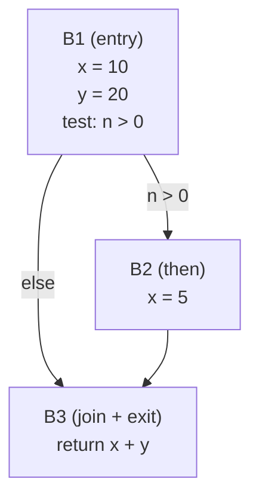

Built by `buildCFG` in `src/specialization/framework/cfg.ts` and stored
inside a `FunctionUnit`.

---

## 2. Pick a lattice

A **lattice** is the set of "facts" we track plus two operations:

- **join (⊔)** — combine facts from two incoming edges into one.
- **leq (⊑)** — the partial order: "did this fact climb?"

For constant propagation, per variable:

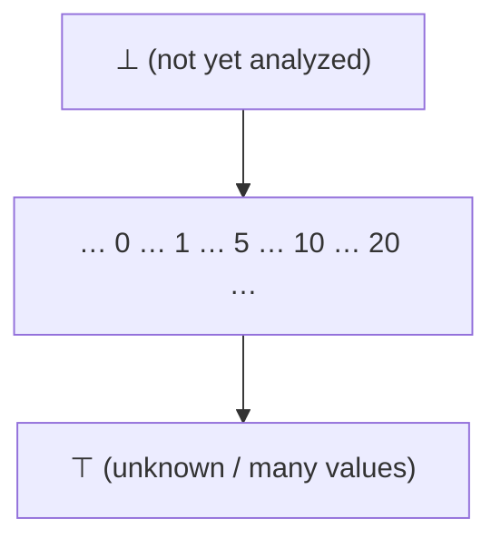

Rules: `⊥ ⊔ x = x`; `c ⊔ c = c`; `c ⊔ c' = ⊤` for `c ≠ c'`; `⊤ ⊔ x = ⊤`.

The full analysis state at a program point is an **environment**
`slot → lattice value`, e.g. `{ x: 10, y: 20, n: ⊤ }`.

The framework captures this algebra in `pass.ts`:

```ts
interface Lattice<V> {
  readonly bottom: V;
  leq(a: V, b: V): boolean;   // partial order a ⊑ b
  join(a: V, b: V): V;        // least upper bound
}

function latticeEquals<V>(l: Lattice<V>, a: V, b: V): boolean {
  return l.leq(a, b) && l.leq(b, a);   // anti-symmetric equality, derived
}
```

`leq` is the only primitive for change detection. Equality is derived, not
overridable — so the partial order is the single source of truth.

---

## 3. Transfer function

The **transfer function** `f_B` says: given the fact at block `B`'s entry,
what holds at its exit? Compute it by walking the statements inside.

| Block | Entry | Walk | Exit |
|---|---|---|---|
| B1 | `{x:⊥, y:⊥, n:⊤}` | `x=10`, `y=20` | `{x:10, y:20, n:⊤}` |
| B2 | `{x:10, y:20, n:⊤}` | `x=5` | `{x:5, y:20, n:⊤}` |
| B3 | `⊔` of B1, B2 exits | reads `x+y` | `{x:⊤, y:20, n:⊤}` |

Key property: transfer is **monotone** — more information in never yields
less information out. That plus a finite-height lattice makes the worklist
terminate.

---

## 4. The classical worklist

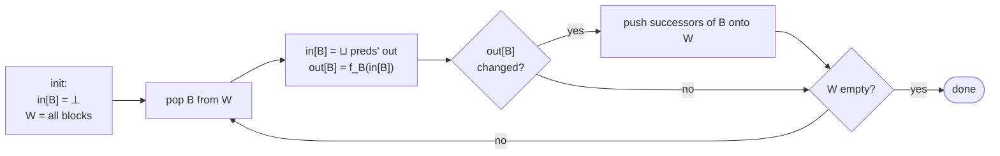

Trace on our example:

| Iter | Pop | in | out | Changed? | Enqueue |
|---|---|---|---|---|---|
| 1 | B1 | `⊥` | `{x:10, y:20, n:⊤}` | yes | B2, B3 |
| 2 | B2 | `{x:10, y:20, n:⊤}` | `{x:5, y:20, n:⊤}` | yes | B3 |
| 3 | B3 | `⊔(B1.out, B2.out) = {x:⊤, y:20, n:⊤}` | same | yes | — |
| 4 | — | — | — | — | done |

At B3: `x = ⊤`, `y = 20` — the answer we expected.

---

## 5. Many analyses, one engine

Real optimizers don't run just one DFA. They run many — constant
propagation, types, purity, reaching defs — and each wants to consume the
others' results. Classical DFA has no story for this.

This framework generalizes the worklist:

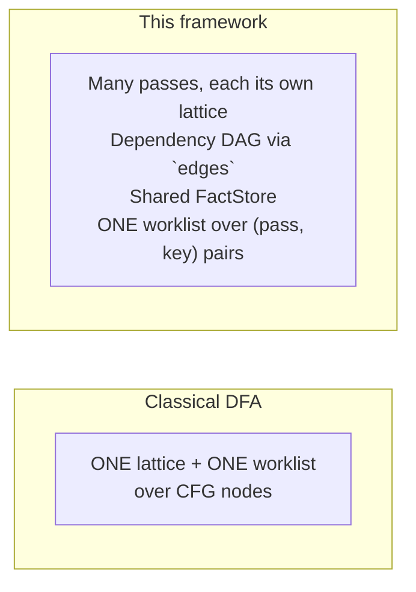

The core abstraction is `Pass<K, V>`:

```ts
interface Pass<K, V> {
  readonly lattice: Lattice<V>;
  readonly edges: ReadonlyArray<EdgeSpec<K>>;
  readonly tier: "runtime" | "analysis";
  transfer(ctx: PassCtx, key: K): V | undefined;
}
```

- **`V`** — the facts this pass computes.
- **`K`** — what those facts are indexed by.
- **`edges`** — upstream passes and lifecycle events this pass reacts to.
- **`tier`** — priority class: `"runtime"` settles before `"analysis"`
  within a single worklist drain.
- **`transfer(ctx, key)`** — recompute the fact at `key`. Returning
  `undefined` means "no write" (see §8).

The one-to-one mapping:

| Classical DFA | Framework |
|---|---|
| CFG node / basic block | a key `K` |
| Environment at that point | the value `V` (a lattice element) |
| `⊔` at merge points | `lattice.join` |
| Fixed-point test | `!latticeEquals(l, joined, old)` |
| Transfer function `f_B` | `Pass.transfer(ctx, key)` |
| "Push successors on change" | a `wake` projector on a self-edge |
| One analysis | One pass among many in the DAG |

---

## 6. Following the flow through the example

There is **one** pass in the DAG for constant analysis on `f`, not two.
`constAnalysisModule` (in `const-analysis/analysis.ts`) is a **descriptor**
— a lattice + expression visitor — handed to the block-fixpoint factory
`makeBlockFixpointPass`. The factory returns a single block-keyed `Pass`.
Per-expression facts live inside that pass's value type
(`DfaBlockFact<L>.exprFacts: Map<nodeId, L>`) and are read back via
`readExprFact` — a projection, not a second pass.

### Why block-keyed, not node-keyed?

A natural question: consumers want per-expression facts — why not key on
`nodeId` directly?

1. **The unit of dataflow *is* the block.** Inside a block, statements
   run sequentially — no fixpoint work to do. Fixpoints arise at merges
   (B3 joining B1 and B2). Node-keying would spread a block-level
   computation across `|nodes|` worklist items with no precision gain.
2. **Joins are on environments, not single values.** The lattice element
   merged at a merge point is `slot → ConstLattice` — a whole env.
3. **Cell count.** Blocks ~ tens; expression nodes ~ thousands.
4. **Per-node facts are a byproduct of the block walk.** While
   `transferBlock` visits each statement it already has the live env;
   recording the `ConstLattice` into `exprFacts` is free.

### Mapping each pass's keys onto the Python program

Each pass's `K` carves the same source along a different axis:

```mermaid
flowchart TB
    subgraph SRC["f's source"]
      direction TB
      s1["S1: x = 10"]
      s2["S2: y = 20"]
      s3["S3: if n &gt; 0"]
      s4["S4: x = 5"]
      s5["S5: return x + y"]
      s1 --> s2 --> s3 --> s4
      s3 --> s5
      s4 --> s5
    end

    subgraph RW["runtimeWritePass · K = nodeId"]
      r_n["nodeId(n) ↦ observed RawKind"]
      r_xy["nodeId(x+y) ↦ observed RawKind"]
    end

    subgraph CBP["constBlockPass · K = BasicBlock"]
      b1["B1 ↦ outEnv: x=10, y=20, n=⊤"]
      b2["B2 ↦ outEnv: x=5,  y=20, n=⊤"]
      b3["B3 ↦ outEnv: x=⊤,  y=20, n=⊤"]
    end

    subgraph EF["constBlockPass exprFacts (projection)"]
      e_x["nodeId(x in return) ↦ ⊤ · readExprFact(B3)"]
      e_y["nodeId(y in return) ↦ 20 · readExprFact(B3)"]
      e_sum["nodeId(x+y) ↦ ⊤ · readExprFact(B3)"]
    end

    subgraph UNIT["structuralPass · K = FunctionUnit"]
      u_f["unit(f) ↦ AstVersion"]
    end

    s3 -.- r_n
    s5 -.- r_xy
    s1 -.- b1
    s3 -.- b1
    s4 -.- b2
    s5 -.- b3
    s5 -.- e_x
    s5 -.- e_y
    s5 -.- e_sum
    SRC -.- u_f
```

- **`runtimeWritePass`** attaches a fact to expression nodes the runtime
  happened to execute.
- **`constBlockPass`** attaches a fact to each block: the slot env at
  the block's exit. Classical DFA lives here.
- **`exprFacts`** is not a separate pass — it's a map inside the block
  pass's `V`, populated during the block walk.
- **`structuralPass`** attaches one cell per unit, bumped when the
  unit's AST/CFG is rebuilt. Everything else reads it to re-seed on
  structural change.

### Dependency DAG

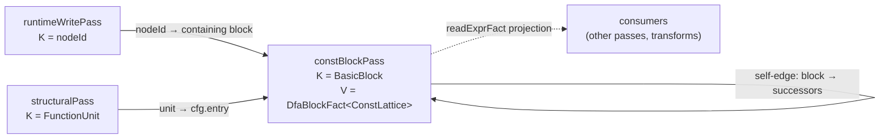

Only three passes. The dotted line is a read-side projection, not a DAG
edge: consumers query `exprFacts` inside the block pass's `V` directly —
there's no separate node-keyed pass to wake.

### Walking the worklist (cold start)

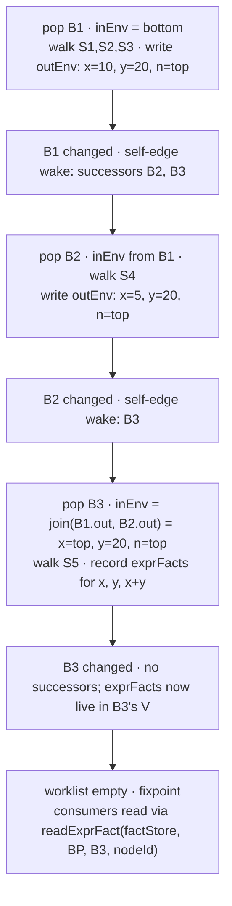

Two things made this work without hand-wiring a classical worklist:

- The **self-edge wake** (`dfa-factory.ts`) is literally "when block b's
  OUT changes, enqueue b.successors." Classical successor-push as one
  projector.
- **No separate node-keyed pass.** Per-expression facts are computed
  during the block walk and recorded into `exprFacts`. Consumers reach
  them via `readExprFact` — which resolves the containing block and
  indexes the map.

### Adding runtime evidence

Suppose at runtime we observe `n = 3`. A cell is written at
`runtimeWritePass[nodeId(n)]`. The same machinery re-enters:

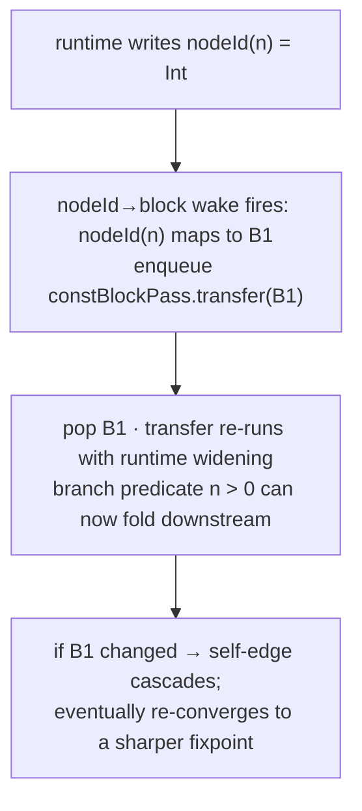

Runtime observations enter the same fixpoint as static analysis, through
declared edges. Classical DFA has nowhere to put that evidence; here it's
just another upstream pass with a `wake` projector.

---

## 7. Four granularities: node, block, unit, scope

The framework uses several key-spaces depending on what a pass is
reasoning about. Biggest → smallest:

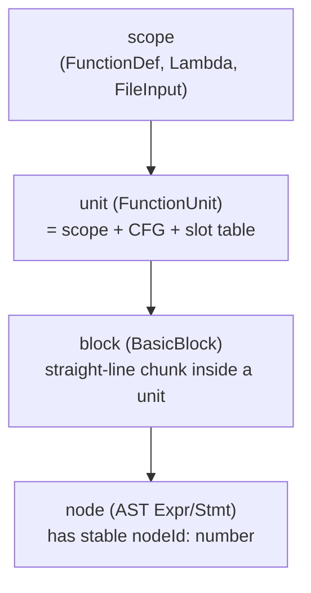

- **node** — a single AST node, stable `nodeId: number`. Finest grain.
- **block** — a `BasicBlock` inside a unit's CFG. `unit.blockOfNode`
  goes from node to containing block.
- **scope** — a Python lexical scope. Defines name binding; managed by
  the resolver.
- **unit** — `FunctionUnit`, the optimizer's physical container for a
  non-lambda scope: AST + CFG + slot table + generation + call count.
  One per non-lambda scope. Lambdas have scopes but no units.

On `f`: ~dozens of nodes, 3 blocks, 2 scopes (module + `f`), 2 units
(module-unit + `f`-unit).

Passes in the codebase, by role and key:

| Pass | Tier | K | V | Role |
|---|---|---|---|---|
| `runtimeWritePass` | runtime | nodeId | `RawKind` | source — runtime value observations |
| `runtimeCallPass` | runtime | nodeId | `number` | source — saturating call counter |
| `callCountPass` | analysis | fdId | `number` | fold over runtime counter |
| `constBlockPass` | analysis | `BasicBlock` | `DfaBlockFact<ConstLattice>` | classical DFA |
| `typeBlockPass` | analysis | `BasicBlock` | `DfaBlockFact<TypeLattice>` | classical DFA |
| `purityScopePass` | analysis | fdId | `boolean \| undefined` | summary projection from unit's purity DFA |
| `structuralPass` | analysis | `FunctionUnit` | `AstVersion` | CFG-rebuild version tag |

Transforms are not passes. They live in a parallel protocol
(`TransformRule`) — see §9.

Reading the table: **runtime sources feed analyses feed transforms.** The
three tiers of work.

---

## 8. Design notes

### Direction — does the same transfer work backward?

Yes. Direction is a one-line config on the DFA factory
(`dfa-factory.ts`): `"forward"` reads IN from predecessors and wakes
successors; `"backward"` reads IN from successors and wakes predecessors.
The transfer function you write is the same shape either way.

### Why `transfer` returns `V | undefined`

`undefined` means **"no write"**, distinct from "write ⊥":

- **Guard clauses** — the pass decides the key is not its responsibility.
- **Don't pollute the store with bottoms** — `undefined` keeps `tryRead`
  returning `undefined`, which consumers can branch on to distinguish
  "analyzed, result is ⊥" from "not applicable."
- **Retryability** — returning `undefined` leaves the cell absent so the
  pass is re-run cleanly next time an upstream changes.

### `EdgeSpec`: fact edges and lifecycle edges in one protocol

Naively `edges: Pass<any, any>[]` — a dependency list — would be enough.
It isn't: different passes key on different things, and a node-keyed
upstream can't say *which block* of a block-keyed downstream needs waking
without a projection.

The type (`pass.ts`):

```ts
type EdgeSpec<K> = FactEdge<K> | LifecycleEdge<K>;

interface FactEdge<K> {
  readonly on?: "fact";
  readonly pass: Pass<any, any>;
  wake?(ctx: PassCtx, key: unknown): Iterable<K>;
}

interface LifecycleEdge<K> {
  readonly on: "mint" | "rebuild" | "retire";
  wake?(ctx: PassCtx, unit: FunctionUnit): Iterable<K>;
  effect?(ctx: PassCtx, unit: FunctionUnit): void;
}
```

Two shapes, one discriminant `on`:

- **Fact edge** — wake when the upstream pass writes. `wake` projects
  upstream key into my key-space. `wake` omitted = dependency-only
  (reads the upstream in `transfer` but doesn't auto-react).
- **Lifecycle edge** — wake or run `effect` when a unit is minted,
  rebuilt, or retired. For seeding entry blocks, evicting stale cells,
  etc.

A worked example: `runtimeWritePass` is keyed by `nodeId`; `constBlockPass`
is keyed by `BasicBlock`. When runtime observes `n = 3`, only B1 (the
block containing `n`) should re-transfer. The projector
(`dfa-factory.ts`):

```ts
const nodeIdToBlock = (ctx, key) => {
  if (typeof key !== "number") return [];
  const u = ctx.unitForNode(key);
  const block = u?.blockOfNode.get(key);
  return block === undefined ? [] : [block];
};
```

...and the edge:

```ts
const configEdges = config.reads.map(p => ({ pass: p, wake: nodeIdToBlock }));
```

The block DFA declares four edges total:

| Edge | Kind | Source | `wake` output | Classical analogue |
|---|---|---|---|---|
| upstream fact edges | fact | runtime / node-keyed passes | `[containing block]` | — |
| self-edge | fact | block pass itself | `successors` / `predecessors` | **push successors on change** |
| `"mint"` | lifecycle | unit created | `[entry block]` | seed on creation |
| `"rebuild"` | lifecycle | unit's CFG rebuilt | `[entry block]` + `effect` evicts stale block cells | re-seed |
| `"retire"` | lifecycle | unit destroyed | — (just `effect` to evict) | teardown |

The middle row is the punchline: **"when a block's OUT changes,
recompute its successors" is one `wake` on a self-edge.** The classical
worklist's core behavior is an edge, not hardcoded.

---

## 9. How the worklist actually gets woken

Earlier diagrams hand-wave "B1 changed, so the worklist enqueues its
successors." What mediates that:

### Pub/sub via `FactStore.onChange`

The worklist subscribes once at construction:

```ts
this.factStore.onChange(c => this.handleFactChange(c));
```

A change event (`fact-store.ts`):

```ts
interface FactChange<K, V> {
  readonly pass: Pass<K, V>;
  readonly key: K;
  readonly oldValue: V | undefined;
  readonly newValue: V;
}
```

Events fire only on **value-changing writes**. `FactStore.write` is
lattice-aware:

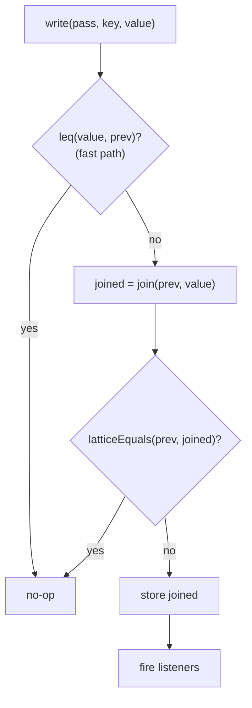

Two suppressions collapse to no-ops (no event):

- **Fast path**: if `leq(value, prev)`, the join can't advance.
- **Slow path**: if after joining we're still equal to `prev`.

This turns the lattice's monotonicity promise into a framework
invariant: every event corresponds to a real advance. A buggy `transfer`
that returns a regressive value collapses to a no-op — `transfer` can
return raw values without hand-joining.

### What the worklist does on an event

`handleFactChange` does *not* write. It enqueues:

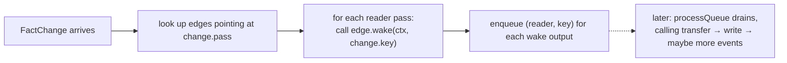

Writes from the event happen later, when `processQueue` pops the
enqueued `(reader, key)` and calls `reader.transfer(...)`. At that point
we're outside the listener frame and the nested write fires cleanly.

### Transforms: imperative rewrites, not passes

Transforms (memoization, constant-folding, dead-branch) are not
`Pass<K, V>`. They have no lattice, no `transfer`, no cell in the
fact store. Their interface (`pass.ts`):

```ts
interface TransformRule {
  readonly id: symbol;
  readonly debugName: string;
  readonly edges?: ReadonlyArray<TransformEdge<any>>;
  sweep(unit: FunctionUnit, ctx: PassCtx): boolean;  // true = mutated
}

interface TransformEdge<K> {
  readonly pass: Pass<K, any>;
  wake(ctx: PassCtx, key: K): Iterable<FunctionUnit>;
}
```

The worklist dirties a rule on unit mint/rebuild and on writes to any
pass declared in `edges`. The rule's `sweep` runs after `processQueue`
drains. If `sweep` returns `true`, the unit is scheduled for CFG
rebuild, which re-fires lifecycle edges and (for fact-driven passes)
restarts the fixpoint.

Keeping transforms out of the pass protocol removes the pretense that
imperative rewriting is a monotone data-flow: it isn't, and encoding it
as one (with a `"fired"` sentinel lattice) was strictly ceremony.

### Putting it together on the example

Cold start, enqueue B1:

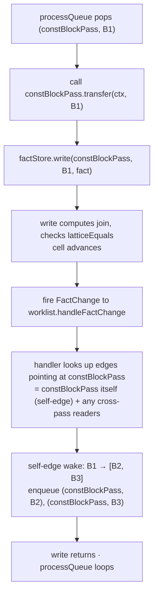

Pub/sub, monotone writes, edge-owned projection — that's the whole
engine. No polling, no re-entrancy, no double-counting.

---

## 10. Summary cheat-sheet

- **Classical DFA** = one lattice + CFG + worklist over program points.
- **This framework** = many `Pass<K, V>` in a DAG + one worklist over
  `(pass, key)` pairs, sharing a `FactStore`.
- **`K`** = *"what entity is this fact about?"* (node / block / unit /
  fdId …). **`V`** = *"what do we know?"* (a lattice element).
- **Tiers**: `runtime` sources → `analysis` passes → `TransformRule`s.
- **Edges**: `FactEdge` (wake on upstream write, `wake` projects keys)
  and `LifecycleEdge` (wake / `effect` on unit mint / rebuild / retire).
- **Change detection**: `leq` only; equality is derived. `FactStore.write`
  joins monotonically and fires events only on real advances.
- **Transforms** (`TransformRule`) live outside the pass protocol — they
  are imperative sweeps gated on analyses, not monotone data-flows.
- **Block-keyed DFA** (`makeBlockFixpointPass`) is the specialized
  helper for Kildall-style analyses; per-expression facts ride inside
  the block fact's `exprFacts` map and are queried via `readExprFact`.
