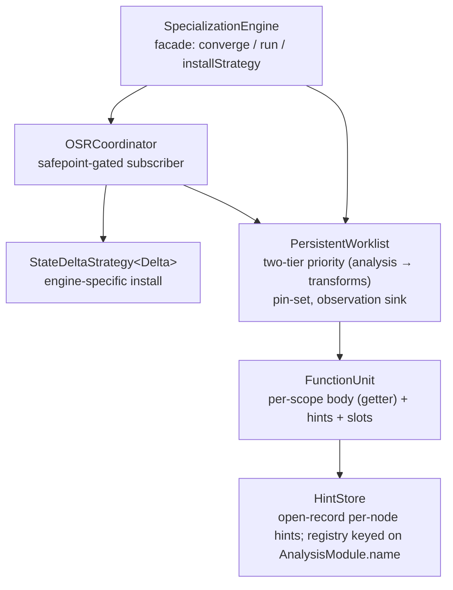

# Optimization Architecture: Spec and Walkthrough

Point of reference for the py-slang specialization engine.

**Above the evolving-work divider is intended to be stable**: numbered
`SPEC-NN` claims describe the contracts that code and reviews can cite,
followed by the architecture walkthrough that grounds them and the
principles that shaped them. **Below the divider is forward-looking**:
consumer strategies, experiments, open gaps, and the changelog of
resolved work.

For step-by-step pipeline walk-through see `docs/compilation-flow.md`.

---

## Spec claims (stable reference)

Cite these as `SPEC-NN` in PR discussions, code comments, and reviewer
rebuttals. Each claim names the contract, points at where it lives, and
flags the guarding principle (see "Principles" section below) that keeps
it from being eroded.

### SPEC-01 — One facade per evaluator

Every evaluator constructs exactly one `SpecializationEngine` and uses it
for all specialization work. Evaluators **must not** construct
`PersistentWorklist`, `OSRCoordinator`, or `HintStore` directly.
*Location*: `src/specialization/engine.ts`.
*Principle*: P-01 (Abstract over what's shared, not what differs).

### SPEC-02 — HintStore is an open record

`OptimizationHint` is an open record keyed on `AnalysisModule.name`. A
new analysis slots in by adding an optional field to the hint record and
shipping a module whose `name` matches. Equality is delegated to the
module's `latticeEquals`. No separate key sub-object, no `hintGet` /
`hintSet` helpers.
*Location*: `src/specialization/framework/hint.ts`.
*Principle*: P-02 (Extension shape follows the extension point).

### SPEC-03 — `FunctionUnit.body` is a read-through getter

The unit never caches its body array. Consumers reading `unit.body` see
the current `funcAst.statements` / `funcAst.body` on every access,
eliminating the latent aliasing invariant between a unit field and an
AST field.
*Location*: `src/specialization/framework/function-unit.ts`.
*Principle*: P-03 (Don't cache what a getter can read).

### SPEC-04 — Two-tier worklist priority

`PersistentWorklist` drains all pending analysis blocks before any
transforms. Within analysis, earlier modules complete before later
(type before const). Transforms fire only at local analysis fixpoint.
Monotonicity is preserved within each tier; non-monotone transforms
(Class 6) are out of scope until the first such transform lands.
*Location*: `src/specialization/framework/persistent-worklist.ts`
(`findActiveQueue`, `hasProcessableTransform`).
*Principle*: P-04 (Order matters; fixpoint before mutation).

### SPEC-05 — `ObservationSink` is a `Pick<>` alias, not an interface

The push-side interpreter-facing surface is
`Pick<PersistentWorklist, "observeWrite" | "observeCall" |
"activateScope" | "deactivateScope">`. There is exactly one implementer
by design. Do not introduce a separate interface file until a second
non-worklist implementer actually lands.
*Location*: `src/specialization/framework/persistent-worklist.ts` (type
alias + `assertSyncObservationSink`).
*Principle*: P-05 (Don't coin nouns ahead of implementers).

### SPEC-06 — Observation methods are synchronous (void return)

All four `ObservationSink` methods return `void`, never
`Promise<void>`. The OSR safepoint contract rests on observation being
a synchronous sub-call of the interpreter step that emits it. The
construction-time tripwire `assertSyncObservationSink` rejects
`async`-declared methods; hand-rolled `Promise.resolve()` returns and
transpiled async are out of scope — the declared `void` type is the
contract.
*Location*: `src/specialization/framework/persistent-worklist.ts`
(`assertSyncObservationSink`, called from the worklist constructor).
*Principle*: P-06 (Convert accidentally-correct orderings into
structural ones).

### SPEC-07 — Pin-set gates transform installation

`PersistentWorklist.activateScope(key)` / `deactivateScope(key)` bracket
every interpreter frame on the target scope. While pinned, transforms
for that scope park in the worklist; the worklist re-fires them after
the pin count drops to zero and the surrounding `engine.run()` finally
block calls `tick()`. **`StateDeltaStrategy.applyDelta` is never called
while a frame of the target scope is on the stack.**
This is stronger than "no mid-execution mutation" — it is per-scope,
so a transform can install on function F while G is mid-execution, as
long as F is not on the current stack.
*Location*: `src/specialization/framework/persistent-worklist.ts`
(`activeScopes`, `hasProcessableTransform`, `withActiveScope`);
`src/specialization/framework/osr.ts` (`onChange` skip-when-pinned).
*Principle*: P-06 (structural ordering) + P-07 (Gates live where the
gated condition is tracked).

### SPEC-08 — `StateDeltaStrategy<Delta>` is the unified install primitive

Both engines install through the same seam. `Delta` is opaque to the
framework: CSE uses `Delta = void` (`InPlaceASTStrategy`), SVML uses
`Delta = { kind: 'whole' | 'patches' }` (`SVMLSwapStrategy`). The
coordinator sequences `computeDelta` → `applyDelta` inside the pin-set
gate.
*Location*: `src/specialization/framework/osr.ts`.
*Principle*: P-01 (Share the contract, vary the instantiation).

### SPEC-09 — `needsInstall = false` short-circuits the coordinator

Strategies whose materialized form is updated at the transform call
site (currently `InPlaceASTStrategy`: the AST mutation during `tick`
IS the install) set `needsInstall = false`. The coordinator's
`onChange` early-exits — no iteration, no stats increments, no delta
calls. This is the explicit contract for "install already happened" vs.
the default `needsInstall = true` path that drives `computeDelta` +
`applyDelta`.
*Location*: `src/specialization/framework/osr.ts` (`OSRCoordinator.onChange`).
*Principle*: P-08 (Express "nothing to do" as data on the strategy,
not as absence of plumbing on the caller).

### SPEC-10 — Notifications carry scope sets, not diffs

`PersistentWorklist.subscribe(cb: (changed: ReadonlySet<Scope>) =>
void)` delivers a set of scope keys synchronously at the end of
`tick()`. Subscribers re-read current state via `engine.units` /
`engine.hintsFor`. The pin-set is the temporal gate that makes re-read
safe. Do not add diff/version plumbing unless a consumer with a
demonstrated need for it exists.
*Location*: `src/specialization/framework/persistent-worklist.ts`
(`subscribe`, `notify`).
*Principle*: P-09 (Shape persistence APIs against actual consumers).

### SPEC-11 — AST dispatch uses `kind` discriminants

Every AST dispatch site uses the `kind` discriminant field (or
`instanceof` on the `StmtNS` / `ExprNS` class hierarchy).
`constructor.name` is never used for dispatch; minification (rollup)
rewrites it to unstable short names.
*Location*: grep for `constructor.name` should return zero dispatch
sites. Positive examples in `src/specialization/framework/transform.ts`.
*Principle*: P-10 (Use identifiers under your control; avoid runtime
representation leaks).

### SPEC-12 — Function-unit discovery via `StmtNS.Visitor<void>`

`buildFunctionUnits` walks the AST through a
`StmtNS.Visitor<void>`. New statement kinds added to the visitor
interface fail the build here until scope semantics are resolved —
no silent drop of block-introducing forms (future `Try`/`With`/class/
method). Hand-rolled `instanceof` chains for AST traversal are out.
*Location*: `src/specialization/framework/function-unit.ts`
(`ScopeDiscoveryVisitor`).
*Principle*: P-11 (Let the type system carry the completeness check).

### SPEC-13 — Analyze and compile are two passes

Analysis runs to fixpoint before any compile pass begins. Single-pass
interleaving (analyze some, compile that, analyze more) is out — it is
incompatible with loop-body revisits during fixpoint iteration. The
order is permanent: parse → resolve → specialize → compile → execute.
*Location*: observed flow in `PySvmlJitEvaluator.ts` /
`PySvmlEvaluator.ts` / `PyCseEvaluator.ts`.
*Principle*: P-04 (Order matters).

### SPEC-14 — Interpreters have zero hint reads on hot paths

No interpreter (CSE, SVML, Sinter) queries `engine.hintsFor` during
execution. SVML bakes hints at compile time; CSE expresses
specialization as AST-level transforms. Visualizers and debuggers
consume `HintStore` externally.
*Location*: grep `hintsFor` in `src/engines/**/*.ts` — only the
compiler reads at compile time; interpreters do not.
*Principle*: P-12 (Specialization flows through compile-time or
transform, not runtime query).

### SPEC-15 — `engine.run()` owns the `deactivateScope → tick` ordering

The pin-release-then-tick sequence is not a caller responsibility.
`engine.run(rootScope, fn)` internally calls
`withActiveScope(rootScope, fn)`, whose `finally` block runs
`deactivateScope` before `tick()`. Callers do not hand-roll the
finally block.
*Location*: `src/specialization/engine.ts` (`run`);
`src/specialization/framework/persistent-worklist.ts`
(`withActiveScope`).
*Principle*: P-06 (Structural ordering).

### SPEC-16 — New transforms land as `AnalysisModule` + `TransformRule`

Memoization, inlining, and any future optimization land through the
existing extension points: an `AnalysisModule<L>` for the analysis side
(if one is needed) and a `TransformRule` for the rewrite. Purity
checks, syntactic gates, etc., that have no lattice to accumulate stay
as standalone walkers (see Decision 4 in the narrative below).
*Location*: `src/specialization/framework/interfaces.ts`;
existing transforms in `src/specialization/transforms/`.
*Principle*: P-02 (Extension shape follows the extension point).

---

## Architecture walkthrough

Five layers. The facade contains the coordinator, which contains the
worklist, which owns the units and hints. Dependency points downward;
composition points upward.

### `HintStore` (SPEC-02)

Open-record map from `node.id` to `OptimizationHint`. Analyses read and
write named fields (`hint.type`, `hint.constVal`, …). The constructor
accepts a module list (`LatticeEquality[]`); defaults to the built-in
two. Equality-on-write consults the registry keyed by module name;
unregistered fields fall back to strict equality (conservative
over-invalidation).

### `FunctionUnit` (SPEC-03)

Per-scope container: `funcAst` reference, `HintStore`, `SlotLookup`,
`structuralVersion`. The unit is the scope's identity; `body` is a
getter onto `funcAst`, never a cached field. Units are built by
`buildFunctionUnits` via `ScopeDiscoveryVisitor` (SPEC-12).

### `PersistentWorklist` (SPEC-04, SPEC-05, SPEC-06, SPEC-07, SPEC-10)

The scheduler. Two-tier priority; pin-set; the `ObservationSink`
surface interpreters call into. `subscribe(cb)` publishes scope-set
notifications. The sink synchrony tripwire
(`assertSyncObservationSink`) runs from the constructor.

Compaction helper `compactQueue` unifies the analysis and transform
FIFO compaction with a single threshold (64). No two parallel
ring-buffer implementations.

### `OSRCoordinator` (SPEC-07, SPEC-09)

Subscribes to the worklist. For each changed scope that is not pinned
and passes `strategy.canInstall`, drives `computeDelta` → `applyDelta`.
Short-circuits entirely when `strategy.needsInstall === false`.

### `StateDeltaStrategy<Delta>` (SPEC-08, SPEC-09)

Engine-specific install seam. Current instances:

| Engine | Strategy | `Delta` | `needsInstall` |
|---|---|---|---|
| CSE | `InPlaceASTStrategy` | `void` | `false` |
| SVML | `SVMLSwapStrategy` | `{ kind: 'whole', ir } \| { kind: 'patches', patches }` | `true` (default) |

`SVMLSwapStrategy` supports both granularities; operand-diff emission
from `computeDelta` is pending (see open gaps).

### `SpecializationEngine` (SPEC-01, SPEC-15)

Evaluator-facing facade. Owns worklist + coordinator; exposes
`converge()`, `units`, `hintsFor`, `observationSink`,
`installStrategy`, `run`. Two-phase construction accommodates
`SVMLSwapStrategy(compiler, interpreter)` — the strategy captures
engine-specific objects that are themselves constructed from
`engine.units`, so the engine is built first, then the strategy, then
installed.

### `ObservationSink` (SPEC-05)

Structural alias. Four methods: `observeWrite`, `observeCall`,
`activateScope`, `deactivateScope`. Interpreters declare their
dependency on this surface without importing the full scheduler API.

---

## Why the pin-set exists (hazard catalogue)

The AST is a shared mutable structure. Transforms mutate it in place.
The safepoint contract (SPEC-07) prevents consumers from observing
partially-applied mutations. Five failure classes motivate it:

**Class 1 — Structural shift.** `stmts.splice()` while a consumer
iterates the same array. Dead-branch elimination replaces an `If` with
its taken branch; if the CSE machine is iterating the parent
`StatementSequence.body`, it skips statements or visits the same one
twice. Silent wrong behavior.

**Class 2 — Identity orphaning.** A node replaced via
`parent[field] = newNode` breaks maps keyed on node identity (e.g.
`functionEnvironments`). Current transforms don't replace `FunctionDef`
nodes, but this is latent the moment function inlining or dead-function
elimination lands.

**Class 3 — Dangling reference.** The CSE machine stores persistent
references: `Closure.node` is re-read on every call,
`WhileInstr.test`/`body` re-read on every iteration,
`BoolOpInstr.srcNode.right` is a deferred read. If a transform splices
the referenced subtree, these references are stale.

**Class 4 — Mid-expression mutation.** Constant folding overwrites
`expr.right` between the creation of a `BoolOpInstr` (from `expr.left`)
and the handler reading `srcNode.right`. Short-circuit evaluation uses
the wrong operand.

**Class 5 — Annotation flicker.** A node is replaced, loses its hint,
and is re-annotated on a later pass. Consumers may see inconsistent
hints across an expression. Low severity because hints are
monotonically refined and conservative fallbacks are safe.

**Resolution.** The pin-set (SPEC-07) covers Classes 1–4 completely:
while a scope is pinned, transforms targeting that scope's unit stay
parked. They fire after `deactivateScope` reduces the pin count and
the `engine.run` finally block calls `tick()` (SPEC-15). Class 5 is
handled conservatively.

**Class 6 — Non-monotone transforms — open.** A transform that
introduces new nodes at lattice ⊥ (memoization wrapping) creates a
temporary precision dip before re-analysis propagates upward. The
current two-tier scheduler doesn't special-case this. Until
memoization lands, shelved. See open gaps.

---

## Principles

What we're reaching for, and the kinds of drift that pull us away from
it. These ground the `SPEC-NN` claims above and also frame why certain
past proposals didn't land.

### P-01 — Abstract over what's shared, not over what differs

The install seam is shared (`StateDeltaStrategy<Delta>`); the install
implementation differs per engine. That's the right cut. A past
`Backend` interface tried to abstract over the *implementation* —
dissolved because the leaks were larger than the shared surface.
When tempted to unify two things, ask what's actually common; often
the answer is "a contract with two instantiations," not "a class with
two subclasses."

### P-02 — Extension shape follows the extension point

A new analysis is an `AnalysisModule` + a named hint field. The module
carries the name; the name doubles as the hint-record field key and
the equality-registry key. No auxiliary `AnalysisKey<L>` sub-object
— adding one would double the nouns for the same data. When designing
an extension surface, make the extension artifact be the registry
entry.

### P-03 — Don't cache what a getter can read

`FunctionUnit.body` used to be a cached array field that had to be
kept in sync with `funcAst`. It's now a getter. The invariant "unit
field matches AST field" evaporates when the unit field doesn't
exist. Applies whenever "these two things must stay equal" is a
candidate comment.

### P-04 — Order matters; fixpoint before mutation

Analysis to fixpoint, *then* transforms. Analyze-compile
interleaving was considered and rejected — while-loop fixpoint
iteration revisits loop bodies multiple times, and locality arguments
don't outweigh the correctness cost. Two-tier within the worklist
reflects the same principle at finer grain.

### P-05 — Don't coin nouns ahead of implementers

`ObservationSink` used to be a 75-line interface file with one
implementer and a tripwire the compiler couldn't structurally enforce.
Collapsed into `Pick<PersistentWorklist, …>`. If a second non-worklist
implementer appears, re-introduce the interface then — not before.
The question to ask any new interface is "what's the second
implementer, and when does it land?"

### P-06 — Convert accidentally-correct orderings into structural ones

Three orderings in this codebase were previously only textually
enforced: `converge→execute`, `deactivate→tick`,
observe-is-synchronous. Each was found through explicit
async-lifecycle review. Remediation:
`engine.run()` owns the finally (SPEC-15); the sink tripwire rejects
`async` declarations (SPEC-06). When you see "this works because the
statements happen to be in this order," ask whether a wrapper or a
type-level check can make it structural.

### P-07 — Gates live where the gated condition is tracked

The pin-set lives on `PersistentWorklist` because the worklist is
what schedules transforms. Earlier drafts considered a separate
`SafepointManager`; rejected because the pin data was already in the
worklist and splitting it just created a synchronization problem.
When a gate needs to reference state, put the gate next to the state.

### P-08 — Express "nothing to do" as data on the strategy

`needsInstall = false` on `InPlaceASTStrategy` is a data-level
statement that short-circuits the coordinator. The earlier shape —
"don't install a strategy, and the coordinator won't exist" — pushed
engine-specific knowledge into the evaluator. When two paths differ
only in "we need/don't need this step," prefer a flag on the
participant over a branch in the caller.

### P-09 — Shape persistence APIs against actual consumers

`HintStore.version`, `changesSince`, `mergeInto`, and
`hintStoreVersion` were built for a hypothetical incremental-pull
consumer (LSP) that never materialized. Decision 5 settled the pull
interface as "notification set + re-read," which doesn't need any of
them. Stripped. Don't build change-log / version plumbing on
speculation; wait for the consumer and shape the API around what they
actually query.

### P-10 — Use identifiers under your control

AST dispatch uses the `kind` discriminant, never `constructor.name`,
because rollup / minification rewrites runtime names. Applies broadly:
anything you key on should be something you set explicitly, not a
name the runtime happens to expose.

### P-11 — Let the type system carry the completeness check

`ScopeDiscoveryVisitor implements StmtNS.Visitor<void>` means any new
`visitXStmt` method added to the visitor interface forces a compile
error here until the scope-discovery decision for that form is made.
The earlier `instanceof` chain silently dropped unknown forms. When
enumerating a closed set, ask whether the type system can enforce the
enumeration rather than the enumeration being by code review.

### P-12 — Specialization flows through compile-time or transform, not runtime query

The interpreter is specialization-agnostic on the hot path.
SVML bakes hints at compile time into opcode selection; CSE expresses
specialization as AST-level rewrites. Runtime hint queries are a
coupling that ties interpreter evolution to framework evolution, and
they're expensive (per-step lookup). If you find yourself wanting to
read a hint from the interpreter, first ask whether the same effect
can be achieved by a transform that rewrites the operation into its
specialized form.

---

## Narrative history of decisions

The numbered decisions below are the original design-decision log.
They remain accurate but are now secondary to the `SPEC-NN` claims
above; they stay here for context and rationale.

### Decision 1: Persistent worklist — unified scheduling primitive

The worklist is the single scheduling primitive for all work:

| Work item            | Producer                    | Effect                                                    |
|----------------------|-----------------------------|-----------------------------------------------------------|
| Analysis fact        | DFA transfer function       | Compute block OUT, propagate to successors                |
| Runtime observation  | Interpreter (via sink)      | Write to HintStore, enqueue affected blocks               |
| Transform            | Analysis crossing threshold | Mutate AST, bump `structuralVersion`, enqueue neighbours  |

Two-tier priority (SPEC-04). The worklist is a long-lived mailbox:
`tick()` processes available items and returns when idle. `converge()`
is an initial drain before execution begins. After-execution ticks are
driven by the `withActiveScope` finally block (SPEC-15).

### Decision 2: Non-coupled evaluators

Four evaluators in `src/conductor/`, each `BasicEvaluator`:

- `PySvmlEvaluator` — one-shot: converge, compile, execute. No OSR loop.
- `PySvmlJitEvaluator` — reactive JIT: runtime observations feed the
  worklist; OSR swaps IR between safepoints.
- `PySvmlSinterEvaluator` — compiles to SVML bytecode and executes on
  the Sinter WebAssembly VM. No reactive loop.
- `PyCseEvaluator` — tree-walking CSE machine.

All four construct a `SpecializationEngine`; only `PySvmlJitEvaluator`
calls `installStrategy`. Shared code is the specialization phase;
engines diverge in compile + execute.

### Decision 3: Safepoint-gated mutation

`StateDeltaStrategy.applyDelta` is never called while a frame of the
target scope is on the stack. The pin-set is the gate (SPEC-07). This
is a stronger statement than "no mid-execution mutation": it is
per-scope rather than per-program, so a transform can install on
function F while G is mid-execution, as long as F is not on the current
stack.

Install mechanisms available:

- **CSE**: AST is the materialized form; transforms mutate it during
  `tick`; `InPlaceASTStrategy.applyDelta` is a no-op.
- **SVML whole-function**: `SVMLProgram.withSpecializedFunction` +
  `interpreter.patchFunction(index, newIR)`.
- **SVML operand-level**: `interpreter.applyOperandPatches(index,
  patches)` mutates the function's typed arrays in place. Pin-set
  re-check via `assertFunctionNotLive` as belt-and-suspenders.

### Decision 4: Memoization is an AnalysisModule + TransformRule

Memoization detection is not an external profiler signal (SPEC-16). It
is:

- A `MemoizationAnalysisModule` that reads runtime call-count hints
  (via `observeCall` → worklist) and detects overlapping-subproblem
  patterns above a configurable threshold.
- A `MemoizationTransformRule` that wraps the flagged `FunctionDef`
  with cache logic.

Open: this transform is non-monotone (new nodes at ⊥), the canonical
Class 6 case. Mitigation strategy is part of the memoization landing,
not a prerequisite. Gap 5 describes what the infrastructure changes
here already enabled to make that landing cheap.

**Footnote — purity is a standalone syntactic check, not a DFA
module.** The landing implements the purity gate as a one-shot walker
(`memoization-analysis/purity.ts::isPureFunctionDef`) consulted by
`MemoizationTransformRule.matches`. Rationale: purity here has no
amortization benefit (asked at most once per function per tick) and
no lattice to accumulate. Upgrading to a module stays straightforward
if cross-function purity summaries later become useful.

### Decision 5: Subscription + pin-set (not event log)

An earlier iteration chose "Option D: event log with batch delivery."
The actual implementation is **Option B: subscriptions** with
**scope-level granularity** and **Approach 5: deferred structural
transforms** (SPEC-10). Notifications carry a `ReadonlySet<Scope>`,
not a diff. Subscribers re-read current state.

`ObservationSink` (SPEC-05) is not a separate interface file — it is a
structural `Pick` alias over `PersistentWorklist`'s four push-side
methods. Synchrony (SPEC-06) is enforced at worklist construction.

---

# Evolving work — below this line is not spec

Forward-looking. Experiments, open gaps, resolved changelog. This
section is expected to shift; do not cite lines below this divider as
contract.

---

## Consumer strategies

### Compiled backends (SVML)

- **Recompilation is expensive.** SVML does not recompile after every
  lattice refinement. The coordinator fires only when a transform
  *actually* fires on an unpinned scope — analyses alone (hint
  refinements without a transform) do not trigger install. This is the
  batching.
- **Two granularities.** `SVMLSwapStrategy` supports both whole-function
  swap (`{ kind: 'whole', ir: SVMLIR }` via `patchFunction`) and
  operand-level patch (`{ kind: 'patches', patches: OperandPatch[] }`
  via `applyOperandPatches`). The seam is live; automatic operand-diff
  emission is a follow-up (currently emits `{ kind: 'whole' }`
  unconditionally).

### Tree-walking consumers (CSE)

- **No code install.** CSE's materialized form is the AST.
  `InPlaceASTStrategy` with `needsInstall = false` (SPEC-09) short-
  circuits the coordinator.
- **No interpreter hint reads** (SPEC-14). Visualizer consumers read
  `engine.hintsFor(node)` externally.

### Future consumers

- **LSP / IDE integration.** Wants annotations-as-diagnostics with fast
  incremental updates after edits. Would subscribe at file granularity.
- **REPL autocompletion.** Wants annotations at cursor position with
  low latency — must read best-effort analysis, not wait for
  convergence.

---

## Experiments worth running

### Experiment 1: measure worklist convergence cost

How many worklist iterations does a typical program take? Is
re-analyzing the full program fast enough that incremental CFG mutation
is unnecessary for programs under 1000 LOC? If batch re-analysis takes
<10ms, Gap 4 stays deferred indefinitely.

### Experiment 2: function-level dirty-bit false-positive rate

When a transform fires inside function F, how often does F's compiled
output actually change? If false-positive rate is low, coarse
function-level invalidation suffices and we can skip operand-diff
emission.

### Experiment 3: OBSERVE opcode profiling quality

The SVML observation sites currently record type tags for write + call
sites. After execution, does the feedback loop produce useful hint
refinements beyond the static pass? Requires end-to-end benchmark with
shaped inputs.

### Experiment 4: live annotation visualization in CSE stepper

Wire the stepper UI to read `engine.hintsFor(node)` externally (the
non-coupling path per SPEC-14) and display type/const info. Tests the
pedagogical hypothesis ("students watch the optimizer think") before
building more reactive infrastructure for it.

### Experiment 5: operand-patch savings vs whole-function recompile

Measure wall-clock cost of `patchFunction` (whole-function) vs
`applyOperandPatches` on realistic specialization events. Determines
whether automatic operand-diff emission in
`SVMLSwapStrategy.computeDelta` is worth implementing.

---

## Open gaps

- **Gap 4 — CFG mutation API.** `buildCFG` still produces a fresh CFG
  per transform round. Only becomes a bottleneck if Experiment 1 shows
  batch re-analysis is too slow. Mitigation: incremental `addEdge` /
  `removeEdge` / `splitBlock` on a mutable CFG.
- **Gap 5 — `buildFunctionUnits` rebuild for new scopes.** Groundwork
  landed: `FunctionUnit.body` is a getter (SPEC-03); scope discovery
  is visitor-based (SPEC-12). With those in place, registering new
  scopes after memoization wraps a `FunctionDef` is additive: run the
  same visitor over the new subtree, call `addScope(key, new
  FunctionUnit(...))` per newly-found `FunctionDef`, enqueue analysis
  + transforms. No cross-module contract renegotiation. Still
  deferred: wiring the actual
  `PersistentWorklist.registerScopeSubtree(root)` method, which
  should ride with the memoization landing (Decision 4) rather than
  sit unused.
- **Class 6 — non-monotone transform handling.** See hazard catalogue.
  Blocked on memoization landing. Mitigations on the table:
  - Epoch the transform: finish all pending analysis, apply the
    transform, re-seed affected blocks, notify once.
  - Accept the dip and document that consumers only read at idle points.
- **Operand-diff emission in `SVMLSwapStrategy.computeDelta`.** The seam
  supports both `{ kind: 'whole' }` and `{ kind: 'patches' }`, but the
  strategy emits `whole` unconditionally. Automatic diff emission
  (detecting type-specialization `ADDG → ADDF` and similar) is gated
  on Experiment 5.

---

## Resolved gaps (changelog)

- **Gap 1 — `FunctionDef → functionIndex` mapping.** Resolved by
  `ScopeIndexMap` (populated during `SVMLCompiler.fromProgramUnit` /
  `fromFunctionNode` in DFS order).
- **Gap 2 — Interpreter program swap.** Resolved by
  `SVMLInterpreter.patchFunction` (whole-function) and
  `SVMLInterpreter.applyOperandPatches` (operand-level).
  `SVMLSwapStrategy` drives both.
- **Gap 3 — Persistent worklist.** Resolved by `PersistentWorklist`
  with external `enqueue` (via `ObservationSink`), `tick`,
  `subscribe`, pin-set.
- **Dead-infra review items.** Resolved by framework tightening
  (`SpecializationEngine` facade, `StateDeltaStrategy` rename,
  open-record hint store, `needsInstall` flag).
- **Interpreter-hint coupling.** Resolved by removing CSE's per-step
  `runtime.hintsFor` read; visualizer consumes `engine.hintsFor`
  externally (SPEC-14).
- **`AnalysisKey<L>` as a separate type.** Folded into
  `AnalysisModule<L>`. The module's own `name` doubles as the
  hint-record field name and the equality-registry key;
  `latticeEquals` replaces `key.equals`. `hintGet` / `hintSet`
  helpers and `TYPE_ANALYSIS_KEY` / `CONST_ANALYSIS_KEY` constants
  deleted. Analyses read named fields directly (SPEC-02).
- **`ObservationSink` as a separate interface file.** Replaced with a
  `Pick<PersistentWorklist, …>` alias exported from the worklist
  module. The construction-time synchrony tripwire is preserved and
  runs from the worklist constructor (SPEC-05, SPEC-06).
- **`HintStore` speculative surface.** `version`, `changesSince`,
  `mergeInto`, `HintChangeRecord`, and
  `PersistentWorklist.hintStoreVersion` were preparation for an
  incremental subscriber that Decision 5 showed was unnecessary.
  Stripped.
- **`Scope` type alias duplicated across 7 files.** Inlined at all
  sites as `StmtNS.FileInput | StmtNS.FunctionDef`.
- **`FunctionUnit.body` cached field.** Replaced by read-through
  getter (SPEC-03).
- **`unitBody` free helper.** Folded into `FunctionUnit.body` getter.
- **Dual ring-buffer compaction with drifting thresholds.** Unified as
  `compactQueue` helper with single threshold (64).
- **`hint.ts` registry double-state.** Module-level `DEFAULT_REGISTRY`
  Map eliminated; `buildRegistry` helper + lazy default.
- **Hand-rolled AST walk in `buildFunctionUnits`.** Replaced by
  `ScopeDiscoveryVisitor implements StmtNS.Visitor<void>` (SPEC-12).
