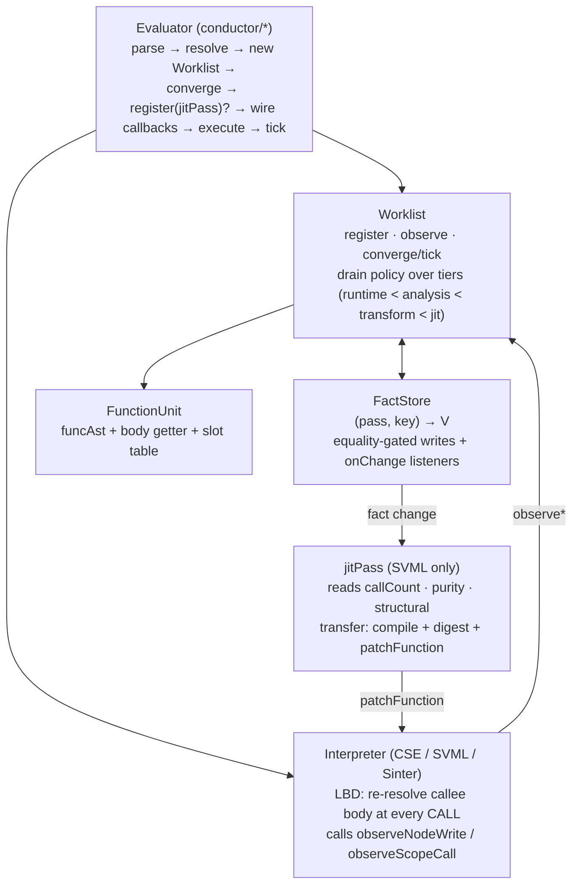

# Optimization Architecture: Spec and Walkthrough

Point of reference for the py-slang specialization framework.

**Above the evolving-work divider is intended to be stable**: numbered
`SPEC-NN` claims name contracts that code and reviews can cite, plus
the principles that shape them. **Below the divider is
forward-looking**: open gaps and the changelog of resolved work.

For the pipeline walkthrough, see `docs/compilation-flow.md`.

---

## Spec claims (stable reference)

Cite as `SPEC-NN` in PR discussions, code comments, and reviews.

### SPEC-01 — No facade; evaluators wire the framework directly

Every evaluator: (1) constructs one `Worklist` with its static
analyses, (2) calls `worklist.converge()` for the static fixpoint,
(3) wires the interpreter with `observeNodeWrite` / `observeScopeCall`
callbacks that call `worklist.observe(pass, key, value)`, (4) runs
execution, (5) calls `worklist.tick()` afterwards. SVML-family
engines additionally register a `jitPass` via `worklist.register(...)`
before execution; that pass is the install seam. Evaluators must not
introduce a facade between themselves and the worklist.
*Location*: `src/specialization/framework/worklist.ts` (`converge`,
`tick`, `register`, `observe`); construction sites in
`src/conductor/PyCseEvaluator.ts`, `PySvmlEvaluator.ts`,
`PySvmlJitEvaluator.ts`, `PySvmlSinterEvaluator.ts`.
*Principle*: P-01, P-05.

### SPEC-02 — `Pass<K, V>` is the single extension shape

Every scheduled computation is a `Pass<K, V>` with `id`, `debugName`,
`lattice: Lattice<V>`, `reads: Pass[]`, optional `tier`, optional
`coarse`, `transfer(ctx, key): V | undefined`, and optional
`affectedKeys(ctx, triggerPass, triggerKey) → Iterable<K>`. There are
no separate `AnalysisPass` / `ScopePass` / `TransformRule` /
`ScopeTransformRule` interfaces; granularity is expressed through
`K` (`BlockId`, `NodeId`, `FunctionUnit`, …). A follow-up may promote
`reads` to a tuple for typed reads; today `PassCtx.read` is
unchecked.
*Location*: `src/specialization/framework/pass.ts`.
*Principle*: P-02, P-05.

### SPEC-03 — `FactStore` is the single source of truth

All pass outputs live in one `FactStore`: a two-level map keyed by
`(pass, key)`. `FactStore.write` is equality-gated under
`pass.lattice.equals`; an equal write is a no-op and fires no
listener. This one primitive replaces every ad-hoc dirty flag,
version counter, and subscriber list. `worklist.factStore` exposes
the store for compile-time readers (SVML compiler reads facts here
at emit time).
*Location*: `src/specialization/framework/fact-store.ts`,
`src/specialization/framework/worklist.ts` (`factStore` field).
*Principle*: P-02, P-03.

### SPEC-04 — Dispatch is fact-driven; tiers are a tiebreaker

When a pass's write changes a cell, consumers — passes whose `reads`
contains the writer — are candidate work. `affectedKeys` supplies
the precise subset of the consumer's keyspace that needs re-transfer;
`coarse: true` opts into "re-run previously written keys" when no
precise map is available. `tier` (`runtime` < `analysis` < `transform`
< `jit`) is only a tiebreaker for drain order; analyses always
complete before any transform that reads them.
*Location*: `src/specialization/framework/worklist.ts` (drain policy,
`processPass`).
*Principle*: P-04.

### SPEC-05 — Side effects in `transfer` must be idempotent under `lattice.equals`

Passes whose transfer has observable side effects (AST mutation,
`patchFunction`) must arrange that *equal writes are no-ops*. Two
working patterns: (a) return a `"fired" | undefined` marker and guard
the effect with a shape check of the target (e.g. `isAlreadyWrapped`
in memoization); (b) return a structural digest of the effect's
output and compare it to the previously-stored value before
committing the effect (the JIT pattern). The framework's
equality-gated write is what makes this discipline sufficient; there
is no `fireOnce` flag, no `appliedTransforms` set, no
`firedOneShotRules` map.
*Location*: `src/specialization/transforms/memoization.ts`
(`isAlreadyWrapped` gate); `src/conductor/PySvmlJitEvaluator.ts`
(`digestSVMLIR` gate).
*Principle*: P-06.

### SPEC-06 — Interpreter feedback is two plain callbacks

The interpreter-facing surface is two synchronous callbacks:

```ts
observeNodeWrite(nodeId: number, rawValue: unknown): void
observeScopeCall(scopeId: number): void
```

Evaluators close over a local per-callee counter map and translate
into `worklist.observe(runtimeWritePass, nodeId, value)` and
`worklist.observe(runtimeCallPass, scopeId, nextCount)` respectively.
No `ObservationSink` interface, no sink object typed through to
the interpreter. `observe` must complete synchronously: the runtime
call that produced it can mutate AST state that the interpreter's
next CALL step will re-read under LBD.
*Location*: `src/conductor/PySvmlJitEvaluator.ts`,
`src/conductor/PyCseEvaluator.ts` (wiring sites);
`src/engines/cse/interpreter.ts`,
`src/engines/svml/svml-interpreter.ts` (call sites).
*Principle*: P-05, P-06.

### SPEC-07 — Late-Binding Dispatch is the on-stack-safety contract

Interpreters must late-bind callee bodies at CALL time: CSE reads
`closure.node.body` fresh on every call; SVML re-resolves the
function-table slot at CALL and captures the IR into `CallFrame.ir`
by reference. Under LBD, any body-local ABI-preserving AST or IR
rewrite is safe at any time — in-flight frames drain on the
pre-rewrite body; later CALLs dispatch to the new form. The
framework therefore tracks no pin counts, no active-scope set, no
`safeOnStack` flag. New engines must uphold LBD or document why
their dispatch shape is different.
*Location*: `src/engines/cse/interpreter.ts` (closure body re-read);
`src/engines/svml/svml-interpreter.ts` (`CallFrame.ir` +
`patchFunction`).
*Principle*: P-07.

### SPEC-08 — The JIT install seam is a registered `Pass`

SVML JIT registration is a regular `worklist.register(jitPass)` with
`reads: [callCountPass, purityScopePass, structuralPass]`, `tier:
"jit"`, and `lattice` of `number` (IR digest). Transfer recompiles
the unit via `compiler.compileFunction(unit)`, digests the new IR,
and calls `interpreter.patchFunction(index, ir)` only when the
digest differs from the stored value. Patching is **dispatch
patching** (V8 "lazy replacement" / HotSpot nmethod trampoline
swap), not OSR — no state mapping, no frame rebuild. CSE registers
no install pass: its materialized form is the AST, which transforms
mutate in place.
*Location*: `src/conductor/PySvmlJitEvaluator.ts` (inline `jitPass`
literal); `src/engines/svml/svml-interpreter.ts` (`patchFunction`).
*Principle*: P-01, P-08.

### SPEC-09 — Runtime observation sources are explicit passes

Three framework-level "source passes" expose externally-supplied
facts into the dispatch graph:

- `runtimeWritePass: Pass<NodeId, unknown>` — raw RHS values from
  `observeNodeWrite`.
- `runtimeCallPass: Pass<ScopeId, number>` — per-callee call count
  from `observeScopeCall`. The evaluator owns the counter state;
  the pass just carries its lattice point.
- `structuralPass: Pass<FunctionUnit, AstVersion>` — monotonic
  integer bumped by the worklist when a unit's CFG is rebuilt.

All three have `tier: "runtime"` and a no-op `transfer`; they are
written externally (the first two by `Worklist.observe`, the third
by `Worklist.rebuildStructural`). Every derived pass declares what
source(s) it reads.
*Location*: `src/specialization/framework/runtime-passes.ts`,
`src/specialization/framework/structural-pass.ts`.
*Principle*: P-02.

### SPEC-10 — AST dispatch uses `kind` discriminants

Every AST dispatch site uses the `kind` discriminant or `instanceof`
on the `StmtNS` / `ExprNS` hierarchy. `constructor.name` is never
used for dispatch; rollup / minification rewrites it to unstable
names.
*Location*: grep for `constructor.name` should return zero dispatch
sites.
*Principle*: P-10.

### SPEC-11 — Function-unit discovery via `StmtNS.Visitor<void>`

`buildFunctionUnits` walks the AST through a
`StmtNS.Visitor<void>`. New statement kinds added to the visitor
interface fail the build here until scope semantics are resolved —
no silent drop of block-introducing forms.
*Location*: `src/specialization/framework/function-unit.ts`
(`ScopeDiscoveryVisitor`).
*Principle*: P-11.

### SPEC-12 — Analyze and compile are two phases

Analysis runs to fixpoint before any compile pass. Single-pass
interleaving (analyze-some, compile-that, analyze-more) is out —
incompatible with loop-body revisits during fixpoint iteration.
Order: parse → resolve → specialize → compile → execute.
*Location*: flow in all four `Py*Evaluator.evaluateChunk`.
*Principle*: P-04.

### SPEC-13 — Interpreters do zero fact reads on hot paths

No interpreter queries the fact store during execution. SVML bakes
facts into opcode selection at emit time; CSE expresses
specialization as AST-level transforms. Visualizers and debuggers
consume `worklist.factStore` externally.
*Location*: grep for `factStore` in `src/engines/**/*.ts` — only the
compiler reads at compile time.
*Principle*: P-12.

### SPEC-14 — Memoization runtime lives under `src/runtime`

Memo side-table and intrinsic helpers (`memoLookup`, `memoPut`,
`MEMO_MISS`, `MEMO_INTRINSIC_NAMES`) live in `src/runtime/memo.ts`.
Resolver, stdlib, and SVML builtins import the single module; the
intrinsic names are destructured as
`[MEMO_HAS_NAME, MEMO_GET_NAME, MEMO_PUT_NAME] = MEMO_INTRINSIC_NAMES`
so name-to-opcode cannot drift.
*Location*: `src/runtime/memo.ts`; consumers in `src/stdlib.ts`,
`src/engines/svml/builtins.ts`, `src/resolver/resolver.ts`,
`src/specialization/transforms/memoization.ts`.
*Principle*: P-14.

---

## Principles

### P-01 — Abstract over what's shared, not over what differs

The scheduler, fact store, and pass shape are shared; the passes
registered per engine differ. That's the right cut. Prior
abstractions over *what each engine does* (`Backend`,
`StateDeltaStrategy<Delta>`, `OSRCoordinator`, `SpecializationEngine`)
all leaked more than they shared, and all dissolved.

### P-02 — Extension shape follows the extension point

A new analysis, profile counter, or transform is a `Pass<K, V>`
with declared `reads`. Its output lives in the same `FactStore` as
every other pass; consumers declare `reads: [newPass]`. No
auxiliary registry, no parallel interface, no side table.

### P-03 — Don't cache what a getter can read

`FunctionUnit.body` is a getter onto `funcAst`, not a cached array.
`unit.factStore` is the worklist's store, not a per-unit copy. The
invariant "these two things must stay equal" evaporates when the
duplicate doesn't exist.

### P-04 — Order matters; fixpoint before mutation

Analysis to fixpoint, then transforms. `tier` encodes this at the
framework level. Analyze–compile interleaving was considered and
rejected: while-loop fixpoint iteration revisits loop bodies
multiple times, and locality arguments do not outweigh correctness.

### P-05 — Don't coin nouns ahead of implementers

Dissolved over time: `Backend`, `SpecializationEngine`,
`InPlaceASTStrategy`, `AnalysisKey<L>`, `HintStore`,
`OptimizationHint`, `ObservationSink` interface, `AnalysisPass` /
`ScopePass` / `TransformRule` / `ScopeTransformRule` interfaces,
`CallCountScopePass` / `PurityScopePass` / `MemoizationTransformRule`
/ `DeadBranchEliminationRule` / `ConstantFoldingRule` classes,
`appliedTransforms`, `structuralVersion`, `fireOnce`,
`firedOneShotRules`, `hasNonMonotoneRule`, `forbiddenScopeFields`,
`onScopeChanged`, `subscribe` / `notify`. Question for any new
interface: what's the second implementer and when does it land?

### P-06 — Convert accidentally-correct orderings into structural ones

Re-fire prevention used to live in `fireOnce` flags and a
`firedOneShotRules` map. It now lives in `FactStore`'s
equality-gated write + the pass's lattice — a structural property.
Spurious re-transfers are harmless because equal writes are no-ops,
so side effects in `transfer` must be idempotent under
`lattice.equals` (SPEC-05). Similarly, "convergence before execution"
is enforced by the evaluator calling `converge()` before wiring
callbacks; the `observe` callbacks are typed `void` so an
interpreter cannot dispatch before the rewrite lands.

### P-07 — Gates live where the gated condition is tracked; prefer no gate

The earlier pin-count tried to gate "is this scope on the stack?"
to defend in-flight frames. Once LBD was identified as the actual
defender, the gate collapsed — no transform we ship violates it.
Three parallel pin-state views (`activeScopes` map,
`context.runtime.pinSet`, external `pinSet` parameter) plus
`safeOnStack` / `canInstallOnStack` dissolved together.

### P-08 — Express "nothing to do" by omission

CSE's "no code install" is *not registering* a `jitPass`. No
no-op strategy instance, no `coordinator: null`, no `needsInstall`
flag. When a component's instance is purely degenerate, omit it.

### P-10 — Use identifiers under your control

AST dispatch uses the `kind` discriminant (SPEC-10) because
rollup / minification rewrites `constructor.name`. Pass identity is
a `Symbol` owned by the pass module, not a string; fact-store lookups
key on the pass object.

### P-11 — Let the type system carry the completeness check

`ScopeDiscoveryVisitor implements StmtNS.Visitor<void>` means any
new `visitXStmt` added to the visitor interface forces a compile
error until scope semantics for the form are decided. Similarly,
`Pass.reads: Pass[]` means a typo in a read declaration is a
compile error, not a runtime missed-dispatch.

### P-12 — Specialization flows through compile-time or transform, not runtime query

Interpreters are specialization-agnostic on the hot path (SPEC-13).
SVML bakes facts into opcode selection at compile time; CSE
expresses specialization as AST-level rewrites. Runtime fact
queries couple interpreter evolution to framework evolution and are
expensive per-step. If you want to read a fact from the interpreter,
first ask whether a transform can rewrite the operation into its
specialized form.

### P-14 — Put runtime primitives under a runtime name

The memo side-table and intrinsics live under `src/runtime/memo.ts`
(SPEC-14). Directory names are documentation; keep them accurate.

---

## Architecture walkthrough

Three primitives. No facade, no coordinator, no strategy object.



### The primitives

- **`Pass<K, V>`** (SPEC-02). Declares its `lattice`, `reads`,
  `transfer`, and optionally `affectedKeys` / `coarse` / `prune`.
- **`FactStore`** (SPEC-03). Equality-gated writes are the sole
  mechanism that suppresses downstream work. Every derived value in
  the system lives here, keyed on the pass that produced it.
- **`Worklist`** (SPEC-04). Drain-order policy by `tier`,
  re-enqueue by `affectedKeys` on fact change, coarse fallback for
  passes without a precise map. Public surface: `converge`, `tick`,
  `register`, `observe`, `units`, `factStore`.

### What's built on them

Framework-level passes (auto-registered in the `Worklist`
constructor or imported from `framework/`):

- Sources: `runtimeWritePass`, `runtimeCallPass`, `structuralPass`.
- Derived: `callCountPass` (`reads: [runtimeCallPass]`, saturating
  bucket), `purityScopePass` (`reads: [structuralPass]`).
- Transforms: `deadBranchRule`, `constantFoldingRule`,
  `memoizationRule` (`reads: [callCountPass, purityScopePass,
  structuralPass]`).

Engine-specific:

- SVML JIT: `jitPass`, registered by the evaluator. Transfer
  composes `compileFunction` + digest + `patchFunction` and writes
  the digest as its fact.

### LBD — hazard class & resolution

The AST is a shared mutable structure. Transforms mutate it in
place. The five failure classes that could arise if the interpreter
held persistent references into a body it is mutating — structural
shift, identity orphaning, dangling reference, mid-expression
mutation, annotation flicker — are all foreclosed by LBD (SPEC-07).
The interpreter re-reads `closure.node.body` (CSE) or re-resolves
the function-table slot (SVML) at each CALL. A sixth class — a
non-monotone transform creating a temporary precision dip — is
handled by equality-gated writes: re-fire attempts produce no event
because the marker value (`"fired"`) is already there.

---

# Evolving work — below this line is not spec

Forward-looking. Open gaps and resolved changelog. Not citeable as
contract.

---

## Open gaps

### D1 — LBD contract is not framework-enforced

SPEC-07 rests on interpreters honoring late-binding dispatch. No
compile-time or runtime assertion enforces it. A future interpreter
could cache `closure.node.body` into a frame-local before an inner
CALL and then re-read a mutated subtree.

**Fix when it matters:** with a third engine, add a test harness
that performs a mid-execution rewrite against a running frame and
asserts the old frame sees pre-rewrite behavior.

### D2 — Non-LBD-safe rewrites need framework support

Every transform we ship is body-local and ABI-preserving, so LBD
suffices. A transform that changes a function's argument count,
closes over new variables, or renames a slot would not be LBD-safe:
the live frame's captured IR would reference a layout that no longer
matches the caller/callee contract.

**Fix when it matters:** when the first such transform appears, add
a "rebuild-queued" install mode that drains after all frames of the
scope exit. The earlier `safeOnStack` / `canInstallOnStack` names
were removed as premature; the real design needs the transform as
a requirements driver.

### D3 — Unit lookup from node-keyed triggers is O(N_functions)

`memoizationRule.affectedKeys` currently walks
`ctx.readAll(structuralPass).keys()` to map a `FunctionDef.id` back
to its owning `FunctionUnit`, because its reads
(`callCountPass` / `purityScopePass`) are scope-id-keyed. Fine for
tens of functions, visible for thousands. The code comments the
workaround explicitly.

**Fix when it matters:** add an `id → unit` index on the worklist,
or key the derived passes on `FunctionUnit` directly. Profile
before doing either.

### D4 — `buildFunctionUnits` rebuild for new scopes

Groundwork: scope discovery is visitor-based (SPEC-11);
`FunctionUnit.body` is a getter. Registering new scopes after a
transform synthesizes them is additive: rerun the visitor, call
`addScope` per new `FunctionDef`, write a `structuralPass` bump.
Still deferred: wiring `Worklist.registerScopeSubtree(root)`, which
should ride with the first transform that synthesizes new
`FunctionDef` nodes. Memoization doesn't (it wraps the body); the
method stays unused until inlining or similar lands.

### D5 — Typed `PassCtx.read` across declared reads

`PassCtx.read<K, V>(p: Pass<K, V>, key: K): V` is unchecked at the
type level today. A follow-up would promote `Pass.reads` to a tuple
type so `ctx.read(p.reads[i], key)` type-checks `key` against the
declared pass's `K`.

### D6 — Per-block incremental analysis

Analyses today re-run over the whole unit on a structural bump.
`structuralPass.coarse: true` flags the fallback. A precise mapping
(per-block dirty set on `structuralPass` write) would cut
re-analysis cost on large functions. Only worth doing after
profiling shows it matters.

---

## Resolved changelog

Most recent first.

- **`Pass<K, V>` + `FactStore`.** Landed across
  `ca01276 → 7214329` (approximate range). Unified
  `AnalysisPass<L>`, `ScopePass`, `TransformRule`,
  `ScopeTransformRule`, and the scheduler-internal one-shot latches
  into a single `Pass<K, V>` shape with equality-gated writes. Every
  pass declares `reads` at the type level; the dispatcher enqueues
  consumers on fact change via `affectedKeys`. `coarse: true` is the
  fallback for passes without a precise invalidation map.
- **Legacy analysis/transform classes deleted.** `CallCountScopePass`,
  `PurityScopePass`, `MemoizationTransformRule`,
  `DeadBranchEliminationRule`, `ConstantFoldingRule` removed; their
  behavior re-expressed as `callCountPass`, `purityScopePass`,
  `memoizationRule`, `deadBranchRule`, `constantFoldingRule`
  (object-literal passes in `framework/migrated-passes.ts`). The
  memoization AST rewrite is now the exported helper
  `applyMemoizationWrap` in `transforms/memoization.ts`, called from
  `memoizationRule.transfer`.
- **`HintStore` + `OptimizationHint` deleted.** Replaced by
  `FactStore`. Compile-time readers (SVML compiler) take
  `worklist.factStore` and read `ctx.read`-style.
- **`ObservationSink` interface deleted.** Replaced by two plain
  callbacks on the interpreter (`observeNodeWrite`,
  `observeScopeCall`), routed by the evaluator into
  `worklist.observe(pass, key, value)`. Test mocks no longer need a
  dedicated interface — they pass plain functions.
- **`onScopeChanged` / `subscribe` / `notify` deleted.** The install
  seam is a registered `jitPass` whose `reads` declare when it
  should run and whose digest fact gates side effects. No separate
  subscriber list; the dispatcher already has all the wiring.
- **`callObservations: CallRecord[]` buffer collapsed.** Per-callee
  call count is a single scalar: evaluator bumps a local counter,
  writes it through `runtimeCallPass`. No per-call allocation.
- **`structuralVersion` on `FunctionUnit` deleted.** Replaced by
  `structuralPass: Pass<FunctionUnit, AstVersion>`, a framework-level
  source. Passes that care declare `reads: [structuralPass]` and get
  invalidation through the normal dispatch path.
- **`appliedTransforms`, `fireOnce`, `hasNonMonotoneRule`,
  `firedOneShotRules`, `forbiddenScopeFields` deleted.** Re-fire
  prevention is now equality of the lattice value (SPEC-05). A
  transform returning `"fired"` again produces no event because
  `FactStore.write` elides equal writes.
- **OSR stack: `OSRCoordinator`, `StateDeltaStrategy<Delta>`,
  `SVMLSwapStrategy`, `SVMLDelta.patches`, `OperandPatch`,
  `applyOperandPatches`, `canInstallOnStack`, the `allowOnStack` arg
  on `patchFunction`.** All deleted. The mechanism is **dispatch
  patching** (V8 "lazy replacement" / HotSpot nmethod trampoline
  swap), not OSR.
- **Pin-set stack: `pinCount`, `activateScope` / `deactivateScope`,
  `withActiveScope`, `clearAllPins`, external `pinSet` parameter,
  `context.runtime.pinSet`, `safeOnStack` rule flag, `runPinned`
  wrapper, `SpecializationEngine` facade.** All dissolved once LBD
  (SPEC-07) was identified as the safety contract. Evaluators call
  `converge` + `tick` directly with no wrapper.
- **`InPlaceASTStrategy` + `needsInstall` + `OSRStats`.** Deleted —
  CSE omits `jitPass` registration entirely (P-08).
- **`MEMO_INTRINSIC_NAMES` duplicated across 5 sites.**
  Deduplicated; consumers destructure
  `[MEMO_HAS_NAME, MEMO_GET_NAME, MEMO_PUT_NAME] = MEMO_INTRINSIC_NAMES`
  so name-to-opcode cannot drift.
- **`src/specialization/memoization-analysis/runtime.ts` →
  `src/runtime/memo.ts`.** Runtime primitives under a runtime name
  (SPEC-14, P-14).
- **Interpreter-fact coupling.** Resolved by removing CSE's per-step
  hint reads; visualizer consumes `worklist.factStore` externally
  (SPEC-13).
- **`FunctionUnit.body` cached field.** Replaced by read-through
  getter (P-03).
- **Hand-rolled AST walk in `buildFunctionUnits`.** Replaced by
  `ScopeDiscoveryVisitor implements StmtNS.Visitor<void>` (SPEC-11).
- **`Scope` type alias duplicated across 7 files.** Inlined as
  `StmtNS.FileInput | StmtNS.FunctionDef`.
