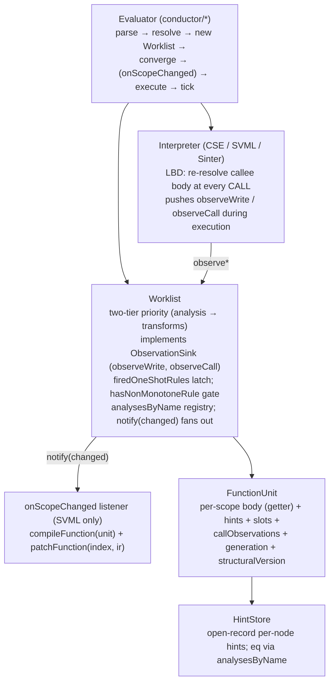

# Optimization Architecture: Spec and Walkthrough

Point of reference for the py-slang specialization framework.

**Above the evolving-work divider is intended to be stable**: numbered
`SPEC-NN` claims describe the contracts that code and reviews can cite,
followed by the architecture walkthrough that grounds them and the
principles that shaped them. **Below the divider is forward-looking**:
consumer strategies, open gaps, and the changelog of resolved work.

For step-by-step pipeline walk-through see `docs/compilation-flow.md`.

---

## Spec claims (stable reference)

Cite these as `SPEC-NN` in PR discussions, code comments, and reviewer
rebuttals. Each claim names the contract, points at where it lives, and
flags the guarding principle (see "Principles" section below) that keeps
it from being eroded.

### SPEC-01 — No facade; evaluators wire the framework directly

Every evaluator: (1) constructs one `Worklist` with its analyses /
transforms / scope passes, (2) calls `worklist.converge()` for the
static fixpoint, (3) wires `worklist` as the interpreter's
`observationSink`, (4) runs execution, (5) calls `worklist.tick()`
afterwards to drain anything the run enqueued. Engines that materialize
the AST into an external form (SVML) additionally register a
dispatch-patch closure via `worklist.onScopeChanged(cb)` before
execution. Evaluators **must not** introduce a facade between
themselves and the worklist; the prior `SpecializationEngine` /
`OSRCoordinator` / `runPinned` / `withActiveScope` layers were all
dissolved.
*Location*: `src/specialization/framework/worklist.ts` (`converge`,
`tick`, `onScopeChanged`, `observeWrite`, `observeCall`); construction
sites in `src/conductor/PyCseEvaluator.ts`, `PySvmlEvaluator.ts`,
`PySvmlJitEvaluator.ts`, `PySvmlSinterEvaluator.ts`.
*Principle*: P-01 (Abstract over what's shared, not what differs),
P-05 (Don't coin nouns ahead of implementers).

### SPEC-02 — HintStore is an open record

`OptimizationHint` is an open record keyed on `AnalysisPass.name`. A
new analysis slots in by adding an optional field to the hint record and
shipping a module whose `name` matches. Field equality is delegated to
the module's `latticeEquals`, walked by a private worklist method
(`hintFieldsEqual`) that dispatches through the per-worklist
`analysesByName` registry constructed from the analyses passed to the
worklist constructor. No separate key sub-object, no `hintGet` /
`hintSet` helpers, no exported equality helper — the walker has one
caller and lives with it.

Two algebras coexist in the record: *lattice* fields (`type`,
`constVal` — written by `AnalysisPass` during DFA, `join`-combined)
and *profile* fields (`callCount` — written by `ScopePass` /
`ProfileObserver` from runtime data, saturating semiring
increments, `===`-compared). The framework treats both as opaque
keyed values; the distinction is a property of the writing module.
*Location*: `src/specialization/framework/hint.ts` (record shape),
`src/specialization/framework/worklist.ts`
(`analysesByName`, `hintFieldsEqual`).
*Principle*: P-02 (Extension shape follows the extension point).

### SPEC-03 — `FunctionUnit.body` is a read-through getter

The unit never caches its body array. Consumers reading `unit.body` see
the current `funcAst.statements` / `funcAst.body` on every access,
eliminating the latent aliasing invariant between a unit field and an
AST field.
*Location*: `src/specialization/framework/function-unit.ts`.
*Principle*: P-03 (Don't cache what a getter can read).

### SPEC-04 — Two-tier worklist priority

`Worklist` drains all pending analysis blocks before any
transforms. Within analysis, earlier modules complete before later
(type before const). Transforms fire only at local analysis fixpoint.
Monotonicity is preserved within each tier; non-monotone transforms
(`ScopeTransformRule.fireOnce = true` — currently
`MemoizationTransformRule`) carry a framework-level one-shot latch so
they cannot re-fire without a self-invalidating hint write.
*Location*: `src/specialization/framework/worklist.ts`
(`findActiveQueue`, `hasProcessableTransform`, `firedOneShotRules`).
*Principle*: P-04 (Order matters; fixpoint before mutation).

### SPEC-05 — `ObservationSink` is a nominal two-method interface

The push-side interpreter-facing surface is a nominal interface in its
own file with exactly two methods: `observeWrite(scopeKey, rhsNode,
rawValue)` and `observeCall(scopeKey, calleeKey)`. `Worklist implements
ObservationSink`; test mocks and interpreter typings depend only on the
interface shape. The file also documents the **LBD (late-binding
dispatch) contract** that interpreters must satisfy — see SPEC-07. The
re-promotion from a prior `Pick<Worklist, …>` alias was driven by
test-mock ergonomics.
*Location*: `src/specialization/framework/observation-sink.ts`.
*Principle*: P-13 (Re-promote dissolved nouns when the dissolution
blocks something concrete).

### SPEC-06 — Observation methods are synchronous (void return)

Both `ObservationSink` methods return `void`, never `Promise<void>`.
Mid-execution firing of non-monotone transforms (SPEC-14) rests on
`observeCall` being able to run `tick()` synchronously and have every
queued transform, scope pass, and `onScopeChanged` listener complete
before the interpreter's next CALL step — an async sink would let the
interpreter dispatch before the rewrite lands. A tripwire at the end of
the `Worklist` constructor rejects `async`-declared methods
(`constructor.name === "AsyncFunction"`); hand-rolled
`Promise.resolve()` returns and transpiled async are out of scope — the
declared `void` type is the contract. The `SINK_METHODS` tuple is
pinned with `satisfies readonly (keyof ObservationSink)[]` so interface
drift is a compile error.
*Location*: `src/specialization/framework/worklist.ts`
(constructor tripwire).
*Principle*: P-06 (Convert accidentally-correct orderings into
structural ones).

### SPEC-07 — Late-Binding Dispatch is the on-stack-safety contract

Interpreters must late-bind callee bodies at CALL time: CSE reads
`closure.node.body` fresh on every call; SVML re-resolves the
function-table slot at each CALL and captures the IR into
`CallFrame.ir` by reference. Under this **LBD invariant**, any
body-local ABI-preserving AST or IR rewrite is safe at any time:
in-flight frames continue executing the pre-rewrite body they
captured, and subsequent CALLs dispatch to the new form. The worklist
therefore does **not** track scope activeness — there is no
`pinCount`, no `activateScope`/`deactivateScope`, no
`withActiveScope`, no `safeOnStack` flag. All three dissolved once LBD
was identified as the actual safety mechanism (the earlier pin-count
was redundant with LBD, and its `safeOnStack` hatch was the accidental
admission that LBD was doing the work). New engines must uphold LBD or
document why their dispatch shape is different.
*Location*: `src/specialization/framework/observation-sink.ts` (LBD
contract documentation); `src/engines/cse/interpreter.ts` (closure-body
re-read); `src/engines/svml/svml-interpreter.ts` (`CallFrame.ir` +
`patchFunction`).
*Principle*: P-07 (Gates live where the gated condition is tracked —
here, "no gate" because the invariant makes one unnecessary).

### SPEC-08 — `onScopeChanged` is the install seam

The worklist exposes `onScopeChanged((scope, unit) => void)` for
engines whose materialized form is external to the AST. The callback
runs synchronously inside the worklist's `notify()` at the end of
every `converge` / `tick` drain, once per scope whose AST was
mutated during the drain. It is responsible for any recompile +
install work. For SVML, this is `compiler.compileFunction(unit)` +
`interpreter.patchFunction(index, ir)` — **dispatch patching** via
function-table slot swap (V8's "lazy replacement" / HotSpot's nmethod
trampoline swap), not OSR (no state mapping, no frame rebuild). CSE
does not register a callback: its materialized form *is* the AST, so
the transform's in-place mutation is the install.

Safety rests entirely on LBD (SPEC-07): there is no separate strategy
object, no `Delta` type parameter, no `canInstallOnStack` per-delta
flag — the closure captures whatever it needs and runs unconditionally
whenever a scope changed.
*Location*: `src/specialization/framework/worklist.ts`
(`onScopeChanged`, `notify`); `src/conductor/PySvmlJitEvaluator.ts`
(registration site); `src/engines/svml/svml-interpreter.ts`
(`patchFunction`).
*Principle*: P-01 (Share the contract, vary the instantiation),
P-08 (Express "nothing to do" by omitting the participant, not by a
flag).

### SPEC-09 — Notifications carry scope sets, not diffs

`Worklist.subscribe(cb: (changed: ReadonlySet<Scope>) =>
void)` delivers a set of scope keys synchronously at the end of
`tick()`. Subscribers re-read current state via `worklist.units` /
`worklist.hintsFor`. The pin-count is the temporal gate that makes
re-read safe. Do not add diff/version plumbing unless a consumer with a
demonstrated need for it exists.
*Location*: `src/specialization/framework/worklist.ts`
(`subscribe`, `notify`).
*Principle*: P-09 (Shape persistence APIs against actual consumers).

### SPEC-10 — AST dispatch uses `kind` discriminants

Every AST dispatch site uses the `kind` discriminant field (or
`instanceof` on the `StmtNS` / `ExprNS` class hierarchy).
`constructor.name` is never used for dispatch; minification (rollup)
rewrites it to unstable short names.
*Location*: grep for `constructor.name` should return zero dispatch
sites. Positive examples in `src/specialization/framework/transform.ts`.
*Principle*: P-10 (Use identifiers under your control; avoid runtime
representation leaks).

### SPEC-11 — Function-unit discovery via `StmtNS.Visitor<void>`

`buildFunctionUnits` walks the AST through a
`StmtNS.Visitor<void>`. New statement kinds added to the visitor
interface fail the build here until scope semantics are resolved —
no silent drop of block-introducing forms (future `Try`/`With`/class/
method). Hand-rolled `instanceof` chains for AST traversal are out.
*Location*: `src/specialization/framework/function-unit.ts`
(`ScopeDiscoveryVisitor`).
*Principle*: P-11 (Let the type system carry the completeness check).

### SPEC-12 — Analyze and compile are two passes

Analysis runs to fixpoint before any compile pass begins. Single-pass
interleaving (analyze some, compile that, analyze more) is out — it is
incompatible with loop-body revisits during fixpoint iteration. The
order is permanent: parse → resolve → specialize → compile → execute.
*Location*: observed flow in `PySvmlJitEvaluator.ts` /
`PySvmlEvaluator.ts` / `PyCseEvaluator.ts`.
*Principle*: P-04 (Order matters).

### SPEC-13 — Interpreters have zero hint reads on hot paths

No interpreter (CSE, SVML, Sinter) queries `worklist.hintsFor` during
execution. SVML bakes hints at compile time; CSE expresses
specialization as AST-level transforms. Visualizers and debuggers
consume `HintStore` externally.
*Location*: grep `hintsFor` in `src/engines/**/*.ts` — only the
compiler reads at compile time; interpreters do not.
*Principle*: P-12 (Specialization flows through compile-time or
transform, not runtime query).

### SPEC-14 — Mid-execution tick for non-monotone transforms

`observeCall(caller, callee)` appends to
`callee.callObservations`, calls `rebuildAndReseed(callee)`, and —
iff the worklist was constructed with at least one non-monotone
scope rule (`hasNonMonotoneRule`, computed once in the constructor
as `transforms.some(r => r.level === 'scope' && r.fireOnce === true)`)
— calls `this.tick()` synchronously, mid-execution. This is what lets
memoization fire inside the running program: `CallCountScopePass`
folds the observation buffer into `callCount`, the field crosses
`MEMOIZATION_THRESHOLD`, `MemoizationTransformRule.matches` returns
true, and the AST rewrite + `onScopeChanged` install complete before
the interpreter's next CALL. Safety rests on SPEC-07 (LBD) and
SPEC-06 (sync sink). Purely monotone worklists skip the tick — no
threshold can flip, so the drain cost is wasted.

Re-fire protection for non-monotone rules is a framework concern:
the scheduler's `firedOneShotRules` (`Map<Scope, Set<Rule>>`) records
`(scope, rule)` after the first successful `apply` and short-circuits
subsequent matches. Rules themselves carry no self-latch in their
`matches` predicate.
*Location*: `src/specialization/framework/worklist.ts`
(`observeCall`, `hasNonMonotoneRule`, `processTransform`,
`firedOneShotRules`).
*Principle*: P-06 (Convert accidentally-correct orderings into
structural ones).

### SPEC-15 — New transforms land as `AnalysisPass` + `TransformRule`

Memoization, inlining, and any future optimization land through the
existing extension points: an `AnalysisPass<L>` for the analysis side
(if one is needed) and a `TransformRule` for the rewrite. Purity
checks, syntactic gates, etc., that have no lattice to accumulate stay
as standalone walkers (see Decision 4 in the narrative below).
Non-monotone transforms set `ScopeTransformRule.fireOnce = true` and
get a framework-level latch (`firedOneShotRules`); they do **not**
smuggle re-fire protection into their `matches` predicate. LBD
(SPEC-07) makes on-stack safety unconditional, so no `safeOnStack`
hatch is needed.
*Location*: `src/specialization/framework/interfaces.ts`;
existing transforms in `src/specialization/transforms/`.
*Principle*: P-02 (Extension shape follows the extension point).

### SPEC-16 — Memoization runtime lives under `src/runtime`

The memo side-table + intrinsic helpers (`memoLookup`, `memoPut`,
`MEMO_MISS`, `MEMO_INTRINSIC_NAMES`) are runtime concerns, not
dataflow-analysis concerns — the directory name reflects the
responsibility. Resolver, stdlib, and SVML builtins all import from
this single module; the intrinsic names are destructured as
`[MEMO_HAS_NAME, MEMO_GET_NAME, MEMO_PUT_NAME] = MEMO_INTRINSIC_NAMES`
at every site so the list ordering is authoritative and
name-to-opcode cannot drift.
*Location*: `src/runtime/memo.ts`; consumers in `src/stdlib.ts`,
`src/engines/svml/builtins.ts`, `src/resolver/resolver.ts`,
`src/specialization/transforms/memoization.ts`.
*Principle*: P-14 (Put runtime primitives under a runtime name).

---

## Architecture walkthrough

Three layers. No facade, no coordinator, no strategy object. The
evaluator constructs the worklist, runs converge, runs the interpreter
(wired as an observation sink), calls tick. SVML engines additionally
register an `onScopeChanged` install closure.

### `HintStore` (SPEC-02)

Open-record map from `node.id` to `OptimizationHint`. Analyses read and
write named fields (`hint.type`, `hint.constVal`, `hint.callCount`,
…). The constructor takes an `eq` callback; the worklist passes a
closure over its private `hintFieldsEqual`, which walks the union of
field names and dispatches each to the registered
`AnalysisPass.latticeEquals`. Unregistered fields default to
inequality (conservative over-invalidation). Test merge-collectors
that never double-write a node pass `() => false` directly.

"Did transform X fire on this scope?" lives on the unit, not the
hint — see `FunctionUnit.appliedTransforms`.

### `FunctionUnit` (SPEC-03)

Per-scope container: `funcAst` reference, `HintStore`,
`SlotLookup`, `cfg` / `blockMap` / `analysisOuts` for the current
generation, `callObservations` (buffer consumed by
`CallCountScopePass`), `generation`, `structuralVersion`,
`appliedTransforms`. The unit is the scope's identity; `body` is a
getter onto `funcAst`, never a cached field. Units are built by
`buildFunctionUnits` via `ScopeDiscoveryVisitor` (SPEC-11).

### `Worklist` (SPEC-04, SPEC-05, SPEC-06, SPEC-09, SPEC-14)

The scheduler. Two-tier priority (one queue per analysis, one shared
transform queue); directly implements the `ObservationSink` interface.
`converge()` drains to fixpoint once; `tick()` drains incrementally
and fires `notify(changed)` to subscribers. `observeCall` triggers a
mid-execution `tick` iff `hasNonMonotoneRule` (SPEC-14). Scope passes
(`CallCountScopePass`, `PurityScopePass`) are passed as the
constructor's 5th argument and run at the top of every
`processTransform` round, after the expression-level fixpoint has
converged and before transform rules read scope-level hints. The sink
synchrony tripwire runs at the end of the constructor.

### `ObservationSink` (SPEC-05, SPEC-07)

Nominal interface in `framework/observation-sink.ts`. Two methods:
`observeWrite(scopeKey, rhsNode, rawValue)` and
`observeCall(scopeKey, calleeKey)`. The file also documents the LBD
contract implementers must honor: **late-bind callee bodies at
CALL time**, either by re-reading them afresh (CSE) or by
snapshotting into frame-local storage (SVML `CallFrame.ir`) so that a
function-table slot swap via `patchFunction` does not affect in-flight
frames. Under LBD, body-local ABI-preserving rewrites are
unconditionally on-stack-safe.

### `onScopeChanged` (SPEC-08)

The install seam for engines whose materialized form is external to
the AST. Registered as `worklist.onScopeChanged((scope, unit) => ...)`.
The callback runs synchronously inside `notify()` at the end of every
drain that mutated the scope. SVML registers a closure that calls
`compiler.compileFunction(unit)` and `interpreter.patchFunction(index,
ir)`; CSE registers nothing.

---

## Hazard catalogue — why LBD is the safety contract

The AST is a shared mutable structure. Transforms mutate it in place.
Without care, in-flight interpreter frames could observe
partially-applied mutations. Five failure classes are the concern:

**Class 1 — Structural shift.** `stmts.splice()` while a consumer
iterates the same array. Dead-branch elimination replaces an `If` with
its taken branch; if the CSE machine is iterating the parent
`StatementSequence.body`, it skips statements or visits the same one
twice. Silent wrong behavior.

**Class 2 — Identity orphaning.** A node replaced via
`parent[field] = newNode` breaks maps keyed on node identity (e.g.
`functionEnvironments`). Current transforms don't replace `FunctionDef`
nodes, but this is latent the moment function inlining or dead-function
elimination lands.

**Class 3 — Dangling reference.** The CSE machine stores persistent
references: `Closure.node` is re-read on every call,
`WhileInstr.test`/`body` re-read on every iteration,
`BoolOpInstr.srcNode.right` is a deferred read. If a transform splices
the referenced subtree, these references are stale.

**Class 4 — Mid-expression mutation.** Constant folding overwrites
`expr.right` between the creation of a `BoolOpInstr` (from `expr.left`)
and the handler reading `srcNode.right`. Short-circuit evaluation uses
the wrong operand.

**Class 5 — Annotation flicker.** A node is replaced, loses its hint,
and is re-annotated on a later pass. Consumers may see inconsistent
hints across an expression. Low severity because hints are
monotonically refined and conservative fallbacks are safe.

**Resolution — LBD (SPEC-07).** The interpreter never holds a
persistent reference into the body array it is mutating. CSE walks
`closure.node.body` fresh at every CALL; its step functions never
cache `body`, `right`, or any subtree across the operation that could
mutate it (the old CSE "persistent references" class was retired when
CSE's dispatch was made strictly body-local). SVML snapshots the IR
into `CallFrame.ir` at CALL time; `patchFunction` replaces the
function-table entry, leaving the live frame's captured IR
untouched. Under LBD, Classes 1–4 cannot occur for body-local,
ABI-preserving rewrites — which covers every transform we ship.
Class 5 is handled conservatively (monotone hint refinement).

**Class 6 — Non-monotone transforms.** A transform that introduces
new nodes at lattice ⊥ (memoization wrapping) creates a temporary
precision dip before re-analysis propagates upward. Handled by
`fireOnce` (framework-level one-shot latch in `firedOneShotRules`) so
the rule cannot fire repeatedly, plus the mid-execution tick gate
(SPEC-14) so threshold-driven rules fire promptly. LBD makes the
rewrite itself on-stack-safe without a per-rule opt-in.

---

## Principles

What we're reaching for, and the kinds of drift that pull us away from
it. These ground the `SPEC-NN` claims above and also frame why certain
past proposals didn't land.

### P-01 — Abstract over what's shared, not over what differs

The install seam is shared (`onScopeChanged((scope, unit) => void)`);
the install closure differs per engine. That's the right cut.
Prior attempts abstracted over the *implementation* — a `Backend`
interface, a `StateDeltaStrategy<Delta>` with a `Delta` type
parameter, an `OSRCoordinator` orchestrator — all dissolved because
the leaks were larger than the shared surface. The
`SpecializationEngine` facade dissolved for the same reason: it
abstracted over "what every evaluator does to drive specialization,"
which turned out to be a handful of lines, not a layer.

### P-02 — Extension shape follows the extension point

A new analysis is an `AnalysisPass` + a named hint field. The module
carries the name; the name doubles as the hint-record field key and
the equality-registry key. The registry itself is built once in the
worklist constructor from the analyses array — no auxiliary
`AnalysisKey<L>` sub-object, no separate registration call. When
designing an extension surface, make the extension artifact be the
registry entry.

### P-03 — Don't cache what a getter can read

`FunctionUnit.body` used to be a cached array field that had to be
kept in sync with `funcAst`. It's now a getter. The invariant "unit
field matches AST field" evaporates when the unit field doesn't
exist. Applies whenever "these two things must stay equal" is a
candidate comment.

### P-04 — Order matters; fixpoint before mutation

Analysis to fixpoint, *then* transforms. Analyze-compile
interleaving was considered and rejected — while-loop fixpoint
iteration revisits loop bodies multiple times, and locality arguments
don't outweigh the correctness cost. Two-tier within the worklist
reflects the same principle at finer grain.

### P-05 — Don't coin nouns ahead of implementers

Most dissolutions in the changelog below came from this principle:
`Backend`, `SpecializationEngine`, `InPlaceASTStrategy`,
`AnalysisKey<L>`, `assertSyncObservationSink` (as a separate
exported function). The question to ask any new interface is "what's
the second implementer, and when does it land?" The counter-rule is
P-13 below — some nouns get re-promoted when their absence blocks
something concrete (`ObservationSink` went back to a nominal interface
for test-mock ergonomics; `HintStore` stayed as a class because eq
encapsulation earns its keep across 16 call sites).

### P-06 — Convert accidentally-correct orderings into structural ones

Orderings in this codebase were previously only textually enforced:
`converge→execute`, observe-is-synchronous, non-monotone rules fire
before the next CALL. Each was found through explicit async-lifecycle
review. Remediation: the sink tripwire rejects `async` declarations
and is pinned to the interface shape via `satisfies` (SPEC-06);
mid-execution tick is owned by `observeCall` rather than by any
caller (SPEC-14). When you see "this works because the statements
happen to be in this order," ask whether a wrapper or a type-level
check can make it structural.

### P-07 — Gates live where the gated condition is tracked

When a gate needs to reference state, put the gate next to the state.
The converse — sometimes the better answer is **no gate at all**,
when the invariant being defended makes one unnecessary. The earlier
pin-count tried to gate "is this scope on the stack?" in order to
defend in-flight frames from mid-execution mutation; once LBD
(SPEC-07) was identified as the actual defender, the gate collapsed
because no transform we ship violates it. Three parallel views of
pin state (`activeScopes` map, external `pinSet` parameter,
`context.runtime.pinSet`) plus the `safeOnStack` / `canInstallOnStack`
hatches all dissolved together.

### P-08 — Express "nothing to do" by omitting the participant

CSE's "no code install" is represented by *not calling*
`worklist.onScopeChanged(...)`. No `InPlaceASTStrategy` no-op
instance, no `coordinator: null` nullable field, no `needsInstall`
flag. When a component's instance is purely degenerate, prefer
omission over an always-no-op instance — and prefer omission over a
nullable field when the surface allows it.

### P-09 — Shape persistence APIs against actual consumers

`HintStore.version`, `changesSince`, `mergeInto`, and
`hintStoreVersion` were built for a hypothetical incremental-pull
consumer (LSP) that never materialized. The pull interface settled as
"notification set + re-read," which doesn't need any of them. Stripped.
Don't build change-log / version plumbing on speculation; wait for the
consumer and shape the API around what they actually query.

### P-10 — Use identifiers under your control

AST dispatch uses the `kind` discriminant, never `constructor.name`,
because rollup / minification rewrites runtime names. Applies broadly:
anything you key on should be something you set explicitly, not a
name the runtime happens to expose.

### P-11 — Let the type system carry the completeness check

`ScopeDiscoveryVisitor implements StmtNS.Visitor<void>` means any new
`visitXStmt` method added to the visitor interface forces a compile
error here until the scope-discovery decision for that form is made.
Similarly, `SINK_METHODS satisfies readonly (keyof ObservationSink)[]`
makes interface drift a compile error in the sync tripwire. When
enumerating a closed set, ask whether the type system can enforce the
enumeration rather than relying on code review.

### P-12 — Specialization flows through compile-time or transform, not runtime query

The interpreter is specialization-agnostic on the hot path.
SVML bakes hints at compile time into opcode selection; CSE expresses
specialization as AST-level rewrites. Runtime hint queries are a
coupling that ties interpreter evolution to framework evolution, and
they're expensive (per-step lookup). If you find yourself wanting to
read a hint from the interpreter, first ask whether the same effect
can be achieved by a transform that rewrites the operation into its
specialized form.

### P-13 — Re-promote dissolved nouns when the dissolution blocks something concrete

`ObservationSink` started as an interface, collapsed to a
`Pick<Worklist, …>` alias when it had one implementer, and
got re-promoted to a nominal interface when test-mock ergonomics
required subtyping a four-method surface instead of a full worklist.
P-05 is the default; P-13 is the escape hatch — invoked when the
dissolution forces consumers to import implementation details they
don't actually depend on. The test: can you cite a concrete consumer
and what they can't do today?

### P-14 — Put runtime primitives under a runtime name

The memo side-table and intrinsics live under `src/runtime/memo.ts`,
not `src/specialization/memoization-analysis/runtime.ts`, because the
concern is runtime behavior (cache storage + lookup protocol), not
dataflow analysis. The prior location miscategorized the file and
created the illusion that deleting the specialization framework would
also delete the memo runtime. Directory names are documentation;
keep them accurate.

---

## Narrative history of decisions

The numbered decisions below are the original design-decision log.
They remain accurate but are now secondary to the `SPEC-NN` claims
above; they stay here for context and rationale.

### Decision 1: Persistent worklist — unified scheduling primitive

The worklist is the single scheduling primitive for all work:

| Work item            | Producer                    | Effect                                                    |
|----------------------|-----------------------------|-----------------------------------------------------------|
| Analysis fact        | DFA transfer function       | Compute block OUT, propagate to successors                |
| Runtime observation  | Interpreter (via sink)      | Write to HintStore, enqueue affected blocks               |
| Transform            | Analysis crossing threshold | Mutate AST, bump `structuralVersion`, enqueue neighbours  |
| Call count           | `CallCountScopePass`         | Increment saturating counter on callee's `HintStore`      |

Two-tier priority (SPEC-04). The worklist is a long-lived mailbox:
`tick()` processes available items and returns when idle. `converge()`
is an initial drain before execution begins. Mid-execution ticks are
triggered from `observeCall` when `hasNonMonotoneRule` (SPEC-14).
Post-execution ticks are called directly by the evaluator.

### Decision 2: Non-coupled evaluators

Four evaluators in `src/conductor/`, each `BasicEvaluator`:

- `PySvmlEvaluator` — one-shot: converge, compile, execute, tick.
- `PySvmlJitEvaluator` — runtime observations feed the worklist;
  `onScopeChanged` recompiles + `patchFunction`-swaps IR.
- `PySvmlSinterEvaluator` — compiles to SVML bytecode and executes on
  the Sinter WebAssembly VM.
- `PyCseEvaluator` — tree-walking CSE machine.

All four construct a `Worklist` directly. Only `PySvmlJitEvaluator`
registers an `onScopeChanged` listener; the others omit it (P-08).
Shared code is the specialization phase; engines diverge in
compile + execute.

### Decision 3: LBD-based unconditional mutation

Body-local ABI-preserving rewrites are safe at any time — during
static convergence, during execution, while any number of frames of
the target scope are on the JS stack. The contract that makes this
true is LBD (SPEC-07): interpreters late-bind the callee body at
CALL. No per-scope gating, no per-delta opt-in.

Install mechanisms:

- **CSE**: AST is the materialized form; transforms mutate it during
  `converge`/`tick`; in-flight closures re-read `closure.node.body`
  at their next CALL.
- **SVML**: `compiler.compileFunction(unit)` produces fresh IR;
  `interpreter.patchFunction(index, ir)` swaps the function-table
  slot. Live frames continue on the IR captured into their
  `CallFrame.ir` at CALL time.

### Decision 4: Memoization is AnalysisPass + ScopePass + TransformRule

Memoization detection is not an external profiler signal (SPEC-15). It
is:

- A `CallCountScopePass` (implementing the `ScopePass` interface) that
  folds the per-scope `callObservations` buffer into a saturating
  `callCount` hint on the callee `FunctionDef`. Runs once per scope
  per generation at the top of `processTransform`, after the
  expression-level fixpoint has converged.
- A `PurityScopePass` (`ScopePass`) that runs an intraprocedural MOD
  dataflow on the callee's CFG and writes a `pure` hint on the
  `FunctionDef`. The pass carries its own block-level `PurityFact`
  (mod-set, call-purity, sticky impure flag); it is not shaped as
  `AnalysisPass<L>` because the driver assumes per-slot scalar lattices
  and a block-level struct fact does not fit. See
  `docs/specialization-cleanup-plan.md` §E.
- A `MemoizationTransformRule` (a `ScopeTransformRule` with
  `fireOnce = true`) that reads `callCount` and `pure` from the hint
  and wraps the flagged `FunctionDef` body in cache-check prelude +
  `return __memo_put(...)`. On-stack safety is handled by LBD, not by
  a rule-level flag.
- Three runtime intrinsics (`__memo_has`, `__memo_get`, `__memo_put`)
  backed by `src/runtime/memo.ts` (SPEC-16), registered in both the
  CSE stdlib and SVML builtins tables.

### Decision 5: Subscription + re-read (not event log)

An earlier iteration chose "Option D: event log with batch delivery."
The actual implementation is **Option B: subscriptions** with
**scope-level granularity** (SPEC-09). Notifications carry a
`ReadonlySet<Scope>`, not a diff. Subscribers re-read current state.
Synchrony (SPEC-06) is enforced at worklist construction.

---

# Evolving work — below this line is not spec

Forward-looking. Open gaps, resolved changelog. This section is
expected to shift; do not cite lines below this divider as contract.

---

## Consumer strategies

### Compiled backends (SVML)

- **Recompilation is expensive.** SVML does not recompile after every
  lattice refinement. The `onScopeChanged` listener fires only when a
  transform *actually* mutated the AST — analyses alone (hint
  refinements without a transform) do not trigger install. That is
  the batching.
- **Whole-function swap only.** The install closure always calls
  `compiler.compileFunction(unit)` followed by
  `interpreter.patchFunction(index, ir)` — a full function-table slot
  replacement. Operand-level in-place patching was removed along with
  `SVMLSwapStrategy`; the operand-diff seam earned no keep because
  whole-function swap is on-stack-safe under LBD at no cost in
  correctness.

### Tree-walking consumers (CSE)

- **No code install.** CSE's materialized form is the AST. The
  evaluator does not register `onScopeChanged` — transforms mutate
  the AST in place and the interpreter re-reads the body at the next
  CALL.
- **No interpreter hint reads** (SPEC-13). Visualizer consumers read
  `worklist.hintsFor(node)` externally.

### Future consumers

- **LSP / IDE integration.** Wants annotations-as-diagnostics with fast
  incremental updates after edits. Would subscribe at file granularity.
- **REPL autocompletion.** Wants annotations at cursor position with
  low latency — must read best-effort analysis, not wait for
  convergence.

---

## Open gaps

### D1 — LBD contract is not framework-enforced

**Status:** open.

SPEC-07 rests on interpreters honoring late-binding dispatch. There
is no compile-time or runtime assertion that an engine does so — a
future interpreter could cache `closure.node.body` into a frame-local
variable before an inner CALL and then re-read a mutated subtree,
silently breaking Classes 1–4 safety.

*Quiet assumption:* every CALL-dispatch site in every engine reads
the current body afresh.

**Fix when it matters:** when a third engine lands, add a test harness
that performs a mid-execution rewrite against a running frame and
asserts the old frame sees the pre-rewrite behavior. Natural trigger:
new engine adoption.

### D2 — Non-LBD-safe rewrites need framework support

**Status:** open (latent).

Every transform we ship today is body-local and ABI-preserving, so
LBD suffices. A future transform that changes a function's argument
count, closes over new variables, or renames a slot would not be
LBD-safe — the live frame's captured IR would reference a layout that
no longer matches the caller/callee contract.

**Fix when it matters:** when the first non-LBD-safe transform
appears, the worklist needs a rule-level opt-out and a rebuild-queued
installation mode that drains after all frames of the scope exit. The
earlier `safeOnStack` / `canInstallOnStack` nouns were removed as
premature; the real design needs the actual non-LBD-safe transform as
a requirements driver.

### D3 — Per-block dependency tracking (incremental layer gap S1)

**Status:** open. Highest-impact gap; substantial scope.

The reactive layer is incremental *in intent* only. Every runtime
observation that flips a hint calls `rebuildAndReseed(scope)` — a full
re-analysis of the scope from its entry block. A `generation` stamp on
queue items discards stale work from prior rebuild rounds. This is
correct but coarse: the scheduler doesn't know *which* block's
transfer function actually read the mutated hint, so it can't dirty
only the affected blocks.

*Quiet nouns that remain:*
- `rebuildAndReseed(scope)` in `worklist.ts` (called from every
  `observeWrite`/`observeCall` that changes anything plus every
  transform-round completion) — compensation for the missing
  per-block dep tracking.
- `generation` on `FunctionUnit` / queue items — stale-item
  discrimination in a reseed-everything scheme.
- `hasNonMonotoneRule` cache + the conditional tick in `observeCall`
  — compensation for the scheduler not knowing when to flush.

**Fix:** replace `rebuildAndReseed(scope)` with dirty-block re-enqueue.
In `observeWrite`, when `hints.setById` returns true, consult
`unit.nodeToBlock` and re-enqueue only the owning block + CFG
successors. Retires all three quiet nouns above.

### D4 — `buildFunctionUnits` rebuild for new scopes

**Status:** groundwork done; wiring pending.

Groundwork: `FunctionUnit.body` is a getter (SPEC-03); scope discovery
is visitor-based (SPEC-11). With those in place, registering new
scopes after memoization wraps a `FunctionDef` is additive: run the
same visitor over the new subtree, call `addScope(key, new
FunctionUnit(...))` per newly-found `FunctionDef`, enqueue analysis
and transforms. Still deferred: wiring the actual
`Worklist.registerScopeSubtree(root)` method, which should
ride with a future transform that synthesizes new `FunctionDef` nodes.
Memoization does not (it wraps the body, doesn't introduce a new
`FunctionDef`), so the method stays unused until inlining or similar
lands.

### D5 — Operand-diff emission

**Status:** closed / retired.

Earlier design intended `SVMLSwapStrategy.computeDelta` to emit
`{ kind: 'patches' }` when only type-specialized opcodes had changed
(`ADDG → ADDF` and similar), avoiding a full recompile. Dissolved
with the strategy noun. Under LBD + dispatch patching, whole-function
swap is on-stack-safe and the in-place-patch risk (mutating a
live-read typed array) is gone. Revisit only if profiling shows
recompilation is a throughput bottleneck on hot swaps.

### D6 — Non-monotone transform handling (Class 6)

**Status:** partially closed.

Memoization landed with `fireOnce`, so the immediate Class-6 case
(precision dip from wrapping) is handled by the one-shot latch. Still
open: a second non-monotone transform (e.g. loop unrolling with bound
specialization) would exercise paths the current machinery hasn't
been tested on.

### D7 — CFG mutation API

**Status:** open; only a bottleneck if D3 shows batch re-analysis is
too slow.

`buildCFG` still produces a fresh CFG per transform round. Incremental
`addEdge` / `removeEdge` / `splitBlock` on a mutable CFG is the
follow-up if profiling warrants.

---

## Resolved gaps (changelog)

- **Gap 1 — `FunctionDef → functionIndex` mapping.** Resolved by
  `ScopeIndexMap` (populated during `SVMLCompiler.fromProgramUnit` /
  `fromFunctionNode` in DFS order).
- **Gap 2 — Interpreter program swap.** Resolved by
  `SVMLInterpreter.patchFunction` driven from an `onScopeChanged`
  listener.
- **Gap 3 — Persistent worklist.** Resolved by `Worklist` with
  `ObservationSink`-driven `observeWrite` / `observeCall`, `tick`,
  `subscribe`.
- **OSR stack: `OSRCoordinator`, `StateDeltaStrategy<Delta>`,
  `SVMLSwapStrategy`, `SVMLDelta.patches`, `OperandPatch`,
  `applyOperandPatches`, `canInstallOnStack`, the `allowOnStack` arg
  on `patchFunction`.** All deleted. The install seam is a direct
  `Worklist.onScopeChanged((scope, unit) => ...)` closure; SVML's
  listener recompiles whole functions and patches the function table.
  Mechanism is **dispatch patching** (V8 "lazy replacement" / HotSpot
  nmethod trampoline swap), not OSR — no state mapping, no frame
  rebuild.
- **Pin-set: `pinCount`, `activateScope`/`deactivateScope`,
  `withActiveScope`, `clearAllPins`, external `pinSet` parameter,
  `context.runtime.pinSet`, `safeOnStack` rule flag, `runPinned`
  wrapper, `SpecializationEngine` facade.** All dissolved once LBD
  was identified as the safety contract (SPEC-07). The earlier
  pin-count was defending an invariant LBD already enforces; its
  `safeOnStack` opt-in was the accidental admission. Evaluators now
  call `converge` + `tick` directly with no wrapper.
- **`InPlaceASTStrategy` + `needsInstall` + `OSRStats`.** Three
  degenerate nouns for "CSE doesn't install." Deleted. CSE omits
  `onScopeChanged` registration entirely (P-08).
- **`hintEquals` hard-coded `switch (name)` over `type` / `constVal`
  with `default: return false`.** Replaced by registry dispatch
  through `AnalysisPass.latticeEquals`, keyed on the per-worklist
  `analysesByName` Map (SPEC-02). `typeLatticeEquals` and
  `constLatticeEquals` helpers inlined into each module's
  `latticeEquals` and deleted from `hint.ts`. Open-record dispatch is
  now data-driven; adding an extension field no longer requires a
  `case` in a central switch.
- **`HintEqualsDispatcher` / exported `hintEquals` / `HINT_EQ_NEVER`.**
  Deleted. The registry-dispatched walker is now the worklist's
  private `hintFieldsEqual` method. The audit's Q1 symmetry argument
  for keeping it as an exported helper alongside `join`/`leq`/`top`
  *does not hold*: those ops are per-slot inside one analysis; hint
  equality is per-field across analyses — the only such cross-cutting
  op in the codebase, and so the only one that needs a walker. Single
  caller (the HintStore `eq` closure) + one-line `() => false` for
  test merge-collectors that never double-write means an exported
  type + sentinel earned no weight. Note: this is NOT a reversion to
  the earlier `switch (name)` — the walker remains data-driven over
  `analysesByName`; it just isn't exported.
- **`OptimizationHint.memoized` field.** Deleted. Nothing branched on
  it (the re-fire guard is the scheduler's `fireOnce` bookkeeping);
  only tests read it. Replaced by `FunctionUnit.appliedTransforms:
  Set<string>`, populated by each transform's own
  `apply` (`unit.appliedTransforms.add(this.name)`). Future transforms
  opt in by the same one-liner. Keeps `OptimizationHint` scoped to
  analysis-owned algebras (lattice + profile).
- **`ObservationSink` as `Pick<Worklist, …>`.** Re-promoted to a
  nominal interface in `framework/observation-sink.ts` (SPEC-05,
  P-13). Driven by test-mock ergonomics — test stubs implement the
  two-method surface instead of subtyping the full worklist.
- **`assertSyncObservationSink` as exported helper.** Inlined into
  the `Worklist` constructor with a `satisfies keyof ObservationSink`
  check on the `SINK_METHODS` tuple so interface drift is a compile
  error (SPEC-06, P-11).
- **`src/specialization/memoization-analysis/runtime.ts` → `src/runtime/memo.ts`.**
  Runtime primitives live under a runtime name (SPEC-16, P-14).
- **`MEMO_INTRINSIC_NAMES` duplicated across 5 sites.** Deduplicated
  to one source; consumers destructure
  `[MEMO_HAS_NAME, MEMO_GET_NAME, MEMO_PUT_NAME] = MEMO_INTRINSIC_NAMES`
  at use — name-to-opcode in SVML and name-to-builtin in stdlib cannot
  drift.
- **Barrel trim.** 9 unused re-exports deleted from
  `src/specialization/index.ts` (`ExternalWorkItem`, `Subscriber`,
  `SlotInfo`, `(token: Token) => SlotInfo`, `buildSlotTable`, `ExprTransformRule`,
  `StmtTransformRule`, `buildCFG`, `MutableEnv`). Tests that used
  these import deep paths.
- **Interpreter-hint coupling.** Resolved by removing CSE's per-step
  `runtime.hintsFor` read; visualizer consumes `worklist.hintsFor`
  externally (SPEC-13).
- **`AnalysisKey<L>` as a separate type.** Folded into
  `AnalysisPass<L>`. The module's own `name` doubles as the
  hint-record field name and the equality-registry key;
  `latticeEquals` replaces `key.equals`. Analyses read named fields
  directly (SPEC-02).
- **`HintStore` speculative surface.** `version`, `changesSince`,
  `mergeInto`, `HintChangeRecord`, and
  `Worklist.hintStoreVersion` stripped. Decision 5 showed
  they weren't needed.
- **`Scope` type alias duplicated across 7 files.** Inlined at all
  sites as `StmtNS.FileInput | StmtNS.FunctionDef`.
- **`FunctionUnit.body` cached field.** Replaced by read-through
  getter (SPEC-03).
- **Hand-rolled AST walk in `buildFunctionUnits`.** Replaced by
  `ScopeDiscoveryVisitor implements StmtNS.Visitor<void>` (SPEC-11).
- **Dual ring-buffer compaction with drifting thresholds.** Unified as
  `compactQueue` helper with single threshold (64).
- **`HintStore` dissolution to raw `Map<number, OptimizationHint>` +
  free `setHint`.** Rejected post-audit. 45 call sites across 16 files
  would need the eq callback threaded; the class already encapsulates
  it in one place. Anti-oscillation discipline: consumer-count
  evidence said the dissolution was a burden shift, not a reduction.
