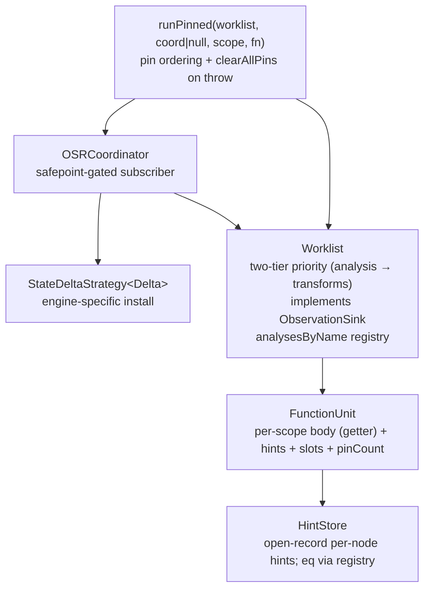

# Optimization Architecture: Spec and Walkthrough

Point of reference for the py-slang specialization framework.

**Above the evolving-work divider is intended to be stable**: numbered
`SPEC-NN` claims describe the contracts that code and reviews can cite,
followed by the architecture walkthrough that grounds them and the
principles that shaped them. **Below the divider is forward-looking**:
consumer strategies, open gaps, and the changelog of resolved work.

For step-by-step pipeline walk-through see `docs/compilation-flow.md`.

---

> **Update (2026-04-13) — dispatch patching rename.** The classes
> previously called `OSRCoordinator` and `StateDeltaStrategy`, the
> concrete `SVMLSwapStrategy`, the unused `SVMLDelta.patches` /
> `OperandPatch` / `SVMLInterpreter.applyOperandPatches` branch, the
> `allowOnStack` arg on `patchFunction`, and the `runPinned` helper were
> all **deleted**. The install seam is now a direct
> `Worklist.onScopeChanged((scope, unit) => ...)` callback; the
> pin-ordering + clear-on-throw contract lives in
> `Worklist.withActiveScope`. The mechanism is **dispatch patching**
> (V8's "lazy replacement" / HotSpot's nmethod trampoline swap) — *not*
> OSR (no state mapping, no frame rebuild). Readers of the SPEC claims
> below should treat every mention of `OSRCoordinator`,
> `StateDeltaStrategy`, `SVMLSwapStrategy`, `runPinned`,
> `canInstallOnStack`, and `applyOperandPatches` as historical — SPEC-01,
> SPEC-07, SPEC-08, SPEC-14 have been rewritten below; downstream
> references in later SPECs and the changelog are retained for trace but
> reflect earlier architecture.

---

## Spec claims (stable reference)

Cite these as `SPEC-NN` in PR discussions, code comments, and reviewer
rebuttals. Each claim names the contract, points at where it lives, and
flags the guarding principle (see "Principles" section below) that keeps
it from being eroded.

### SPEC-01 — No facade; evaluators wire the framework directly

Every evaluator constructs exactly one `Worklist` and drives execution
through `worklist.withActiveScope(ast, fn)`. Engines that materialize
the AST into an external form (SVML) additionally register a dispatch
patcher via `worklist.onScopeChanged(cb)`. Evaluators **must not**
introduce a new facade layer between themselves and the worklist; the
prior `SpecializationEngine` / `OSRCoordinator` / `runPinned` layers
were dissolved because their sole load-bearing invariants (clear pins on
throw; route changes to an install closure) became methods on
`Worklist`.
*Location*: `src/specialization/framework/worklist.ts`
(`withActiveScope`, `onScopeChanged`); construction sites in
`src/conductor/PyCseEvaluator.ts`, `PySvmlEvaluator.ts`,
`PySvmlJitEvaluator.ts`, `PySvmlSinterEvaluator.ts`.
*Principle*: P-01 (Abstract over what's shared, not what differs),
P-05 (Don't coin nouns ahead of implementers).

### SPEC-02 — HintStore is an open record

`OptimizationHint` is an open record keyed on `AnalysisPass.name`. A
new analysis slots in by adding an optional field to the hint record and
shipping a module whose `name` matches. Equality is delegated to the
module's `latticeEquals`, dispatched through a per-worklist registry
(`analysesByName`) constructed from the analyses passed to the worklist
constructor. No separate key sub-object, no `hintGet` / `hintSet`
helpers.
*Location*: `src/specialization/framework/hint.ts` (`hintEquals`
registry dispatch), `src/specialization/framework/worklist.ts`
(`analysesByName`).
*Principle*: P-02 (Extension shape follows the extension point).

### SPEC-03 — `FunctionUnit.body` is a read-through getter

The unit never caches its body array. Consumers reading `unit.body` see
the current `funcAst.statements` / `funcAst.body` on every access,
eliminating the latent aliasing invariant between a unit field and an
AST field.
*Location*: `src/specialization/framework/function-unit.ts`.
*Principle*: P-03 (Don't cache what a getter can read).

### SPEC-04 — Two-tier worklist priority

`Worklist` drains all pending analysis blocks before any
transforms. Within analysis, earlier modules complete before later
(type before const). Transforms fire only at local analysis fixpoint.
Monotonicity is preserved within each tier; non-monotone transforms
(`ScopeTransformRule.fireOnce = true` — currently
`MemoizationTransformRule`) carry a framework-level one-shot latch so
they cannot re-fire without a self-invalidating hint write.
*Location*: `src/specialization/framework/worklist.ts`
(`findActiveQueue`, `hasProcessableTransform`, `firedOneShotRules`).
*Principle*: P-04 (Order matters; fixpoint before mutation).

### SPEC-05 — `ObservationSink` is a nominal interface

The push-side interpreter-facing surface is a nominal interface in its
own file. `Worklist implements ObservationSink`; test mocks
and interpreter typings depend only on the interface shape, not on
`Worklist`'s full API. The interface has exactly one
production implementer today — the re-promotion from a prior `Pick<>`
alias was driven by test-mock ergonomics rather than a second
implementer landing.
*Location*: `src/specialization/framework/observation-sink.ts`.
*Principle*: P-13 (Re-promote dissolved nouns when the dissolution
blocks something concrete).

### SPEC-06 — Observation methods are synchronous (void return)

All four `ObservationSink` methods return `void`, never
`Promise<void>`. The OSR safepoint contract rests on observation being
a synchronous sub-call of the interpreter step that emits it. A
tripwire at the end of the `Worklist` constructor rejects
`async`-declared methods (`constructor.name === "AsyncFunction"`);
hand-rolled `Promise.resolve()` returns and transpiled async are out of
scope — the declared `void` type is the contract. The
`SINK_METHODS` tuple is pinned with `satisfies readonly (keyof
ObservationSink)[]` so interface drift is a compile error, not a silent
runtime gap.
*Location*: `src/specialization/framework/worklist.ts`
(constructor tripwire).
*Principle*: P-06 (Convert accidentally-correct orderings into
structural ones).

### SPEC-07 — Pin-count + `safeOnStack` gate transform installation

`Worklist.activateScope(key)` / `deactivateScope(key)` bracket every
interpreter frame on the target scope. Pin state lives on
`FunctionUnit.pinCount`. A transform enqueued against a pinned scope is
skipped at `processTransform` **unless** the rule sets
`safeOnStack = true`. For non-safe rules, the worklist re-fires them
after the pin count drops to zero and the surrounding
`withActiveScope` calls `tick()`. **Scope-change notifications
(`onScopeChanged`) are only emitted for scopes where a rule actually
mutated the AST, which for pinned scopes requires `safeOnStack`** —
installers do not need to re-check pin state. This is stronger than
"no mid-execution mutation": a transform can install on function F
while G is mid-execution, as long as F is not on the current stack OR
F's rule is `safeOnStack`.
*Location*: `src/specialization/framework/function-unit.ts`
(`pinCount`); `src/specialization/framework/worklist.ts`
(`activateScope`, `deactivateScope`, `processTransform`,
`withActiveScope`, `onScopeChanged`); `ScopeTransformRule.safeOnStack`
in `src/specialization/framework/interfaces.ts`.
*Principle*: P-07 (Gates live where the gated condition is tracked).

### SPEC-08 — `onScopeChanged` is the install seam

The worklist exposes `onScopeChanged((scope, unit) => void)` for
engines whose materialized form is external to the AST. The callback
runs synchronously inside the worklist's `notify` pass and is
responsible for any recompile + install work. For SVML, this is
`compiler.compileFunction(unit)` + `interpreter.patchFunction(index, ir)`
— dispatch patching via function-table slot swap. CSE does not
register a callback: its materialized form *is* the AST, so transforms
during `tick` are the install.

Safety rests on the engine's **direct-IR-ref invariant** (SVML's
`CallFrame.ir` captures the IR by reference at CALL time), combined
with the worklist-level guarantee that notifications for pinned scopes
only fire for `safeOnStack` rules. No separate strategy object; no
`Delta` type parameter; the closure captures whatever it needs.
*Location*: `src/specialization/framework/worklist.ts`
(`onScopeChanged`); `src/conductor/PySvmlJitEvaluator.ts` (registration
site); `src/engines/svml/svml-interpreter.ts` (`patchFunction`).
*Principle*: P-01 (Share the contract, vary the instantiation),
P-08 (Express "nothing to do" by omitting the participant, not by a
flag).

### SPEC-09 — Notifications carry scope sets, not diffs

`Worklist.subscribe(cb: (changed: ReadonlySet<Scope>) =>
void)` delivers a set of scope keys synchronously at the end of
`tick()`. Subscribers re-read current state via `worklist.units` /
`worklist.hintsFor`. The pin-count is the temporal gate that makes
re-read safe. Do not add diff/version plumbing unless a consumer with a
demonstrated need for it exists.
*Location*: `src/specialization/framework/worklist.ts`
(`subscribe`, `notify`).
*Principle*: P-09 (Shape persistence APIs against actual consumers).

### SPEC-10 — AST dispatch uses `kind` discriminants

Every AST dispatch site uses the `kind` discriminant field (or
`instanceof` on the `StmtNS` / `ExprNS` class hierarchy).
`constructor.name` is never used for dispatch; minification (rollup)
rewrites it to unstable short names.
*Location*: grep for `constructor.name` should return zero dispatch
sites. Positive examples in `src/specialization/framework/transform.ts`.
*Principle*: P-10 (Use identifiers under your control; avoid runtime
representation leaks).

### SPEC-11 — Function-unit discovery via `StmtNS.Visitor<void>`

`buildFunctionUnits` walks the AST through a
`StmtNS.Visitor<void>`. New statement kinds added to the visitor
interface fail the build here until scope semantics are resolved —
no silent drop of block-introducing forms (future `Try`/`With`/class/
method). Hand-rolled `instanceof` chains for AST traversal are out.
*Location*: `src/specialization/framework/function-unit.ts`
(`ScopeDiscoveryVisitor`).
*Principle*: P-11 (Let the type system carry the completeness check).

### SPEC-12 — Analyze and compile are two passes

Analysis runs to fixpoint before any compile pass begins. Single-pass
interleaving (analyze some, compile that, analyze more) is out — it is
incompatible with loop-body revisits during fixpoint iteration. The
order is permanent: parse → resolve → specialize → compile → execute.
*Location*: observed flow in `PySvmlJitEvaluator.ts` /
`PySvmlEvaluator.ts` / `PyCseEvaluator.ts`.
*Principle*: P-04 (Order matters).

### SPEC-13 — Interpreters have zero hint reads on hot paths

No interpreter (CSE, SVML, Sinter) queries `worklist.hintsFor` during
execution. SVML bakes hints at compile time; CSE expresses
specialization as AST-level transforms. Visualizers and debuggers
consume `HintStore` externally.
*Location*: grep `hintsFor` in `src/engines/**/*.ts` — only the
compiler reads at compile time; interpreters do not.
*Principle*: P-12 (Specialization flows through compile-time or
transform, not runtime query).

### SPEC-14 — `withActiveScope` owns the pin-ordering + clear-on-throw contract

The pin-release-then-tick sequence is not a caller responsibility.
`worklist.withActiveScope(rootScope, fn)`:
1. `activateScope(rootScope)` before `fn`.
2. On success: `deactivateScope(rootScope)` then `tick()` to drain any
   parked non-`safeOnStack` transforms.
3. On throw: `clearAllPins()` to reset pin counts across every unit
   (CSE does not pop envs during JS-stack unwind, so mid-execution
   throws leave pins dirty), skip the post-run tick (otherwise an
   `onScopeChanged` listener could try to install against a unit whose
   interpreter state has unwound), and rethrow.

Callers do not hand-roll the try/finally. Replaces the prior free
function `runPinned(worklist, coord|null, scope, fn)`; the
coordinator-null axis is gone because engines register or omit the
listener via `onScopeChanged`.
*Location*: `src/specialization/framework/worklist.ts`
(`withActiveScope`, `clearAllPins`).
*Principle*: P-06 (Structural ordering).

### SPEC-15 — New transforms land as `AnalysisPass` + `TransformRule`

Memoization, inlining, and any future optimization land through the
existing extension points: an `AnalysisPass<L>` for the analysis side
(if one is needed) and a `TransformRule` for the rewrite. Purity
checks, syntactic gates, etc., that have no lattice to accumulate stay
as standalone walkers (see Decision 4 in the narrative below).
Non-monotone transforms set `ScopeTransformRule.fireOnce = true` and
get a framework-level latch; they do **not** smuggle re-fire protection
into their `matches` predicate.
*Location*: `src/specialization/framework/interfaces.ts`;
existing transforms in `src/specialization/transforms/`.
*Principle*: P-02 (Extension shape follows the extension point).

### SPEC-16 — Memoization runtime lives under `src/runtime`

The memo side-table + intrinsic helpers (`memoLookup`, `memoPut`,
`MEMO_MISS`, `MEMO_INTRINSIC_NAMES`) are runtime concerns, not
dataflow-analysis concerns — the directory name reflects the
responsibility. Resolver, stdlib, and SVML builtins all import from
this single module; the intrinsic names are destructured as
`[MEMO_HAS_NAME, MEMO_GET_NAME, MEMO_PUT_NAME] = MEMO_INTRINSIC_NAMES`
at every site so the list ordering is authoritative and
name-to-opcode cannot drift.
*Location*: `src/runtime/memo.ts`; consumers in `src/stdlib.ts`,
`src/engines/svml/builtins.ts`, `src/resolver/resolver.ts`,
`src/specialization/transforms/memoization.ts`.
*Principle*: P-14 (Put runtime primitives under a runtime name).

---

## Architecture walkthrough

Four layers. No facade: the coordinator subscribes to the worklist; the
worklist owns the units and hints; `runPinned` is the outer wrapper that
evaluators call.



### `HintStore` (SPEC-02)

Open-record map from `node.id` to `OptimizationHint`. Analyses read and
write named fields (`hint.type`, `hint.constVal`, `hint.callCount`,
`hint.memoized`, …). The constructor takes an `eq` callback;
production callers pass
`(a, b) => hintEquals(a, b, worklist.analysesByName)`, which dispatches
each field's equality through the registered `AnalysisPass.latticeEquals`.
Unregistered fields default to inequality (conservative
over-invalidation). `HINT_EQ_NEVER` is the sentinel callback for test
merge-collectors that never double-write a node.

### `FunctionUnit` (SPEC-03, SPEC-07)

Per-scope container: `funcAst` reference, `HintStore`, `(token: Token) => SlotInfo`,
`structuralVersion`, `pinCount`. The unit is the scope's identity;
`body` is a getter onto `funcAst`, never a cached field. `pinCount` is
the single owner of pin-set state — the parallel `activeScopes` map
and external `pinSet` argument both dissolved into this field. Units
are built by `buildFunctionUnits` via `ScopeDiscoveryVisitor`
(SPEC-11).

### `Worklist` (SPEC-04, SPEC-05, SPEC-06, SPEC-07, SPEC-09)

The scheduler. Two-tier priority; per-unit pin-count; directly
implements the `ObservationSink` interface. `subscribe(cb)` publishes
scope-set notifications. `addScopePass` registers scope-level passes
(e.g. `CallCountScopePass`, `PurityScopePass` for memoization) that
fold per-scope state into hints after the expression-level fixpoint
converges. The sink synchrony tripwire runs at the end of the
constructor.

### `OSRCoordinator` (SPEC-07, SPEC-08)

Subscribes to the worklist. For each changed scope that is not pinned
(or is pinned and the strategy opts in via `canInstallOnStack`) and
passes `strategy.canInstall`, drives `computeDelta` → `applyDelta`.
CSE's path does not construct a coordinator — the absence is the
"nothing to install" signal (P-08).

### `StateDeltaStrategy<Delta>` (SPEC-08)

Engine-specific install seam. Current production instance:

| Engine | Strategy | `Delta` | Coordinator? |
|---|---|---|---|
| CSE | *none* | *n/a* | `null` — AST is the materialized form, transforms mutate during `tick` |
| SVML | `SVMLSwapStrategy` | `{ kind: 'whole', ir } \| { kind: 'patches', patches }` | yes |

`SVMLSwapStrategy` supports both granularities; automatic operand-diff
emission from `computeDelta` is pending (see Open gaps — D1).

### `ObservationSink` (SPEC-05)

Nominal interface in `framework/observation-sink.ts`. Four methods:
`observeWrite`, `observeCall`, `activateScope`, `deactivateScope`.
`Worklist implements ObservationSink`; interpreter and test
typings import the interface and stay independent of worklist internals.

### `runPinned` (SPEC-14)

The free function every evaluator calls. Signature:

```ts
runPinned<T>(
  worklist: Worklist,
  coordinator: OSRCoordinator<unknown> | null,
  rootScope: StmtNS.FileInput | StmtNS.FunctionDef,
  fn: () => Promise<T> | T,
): Promise<T>
```

Starts the coordinator (if any), pins `rootScope` via
`worklist.withActiveScope`, runs `fn`, stops the coordinator, calls
`worklist.clearAllPins()` on throw. Replaces the dissolved
`SpecializationEngine.run`.

---

## Why the pin-set exists (hazard catalogue)

The AST is a shared mutable structure. Transforms mutate it in place.
The safepoint contract (SPEC-07) prevents consumers from observing
partially-applied mutations. Five failure classes motivate it:

**Class 1 — Structural shift.** `stmts.splice()` while a consumer
iterates the same array. Dead-branch elimination replaces an `If` with
its taken branch; if the CSE machine is iterating the parent
`StatementSequence.body`, it skips statements or visits the same one
twice. Silent wrong behavior.

**Class 2 — Identity orphaning.** A node replaced via
`parent[field] = newNode` breaks maps keyed on node identity (e.g.
`functionEnvironments`). Current transforms don't replace `FunctionDef`
nodes, but this is latent the moment function inlining or dead-function
elimination lands.

**Class 3 — Dangling reference.** The CSE machine stores persistent
references: `Closure.node` is re-read on every call,
`WhileInstr.test`/`body` re-read on every iteration,
`BoolOpInstr.srcNode.right` is a deferred read. If a transform splices
the referenced subtree, these references are stale.

**Class 4 — Mid-expression mutation.** Constant folding overwrites
`expr.right` between the creation of a `BoolOpInstr` (from `expr.left`)
and the handler reading `srcNode.right`. Short-circuit evaluation uses
the wrong operand.

**Class 5 — Annotation flicker.** A node is replaced, loses its hint,
and is re-annotated on a later pass. Consumers may see inconsistent
hints across an expression. Low severity because hints are
monotonically refined and conservative fallbacks are safe.

**Resolution.** The pin-count (SPEC-07) covers Classes 1–4 completely:
while a scope's pinCount > 0, transforms targeting that scope's unit
stay parked. They fire after `deactivateScope` reduces the pin count
and the `runPinned` / `withActiveScope` finally block calls `tick()`
(SPEC-14). Class 5 is handled conservatively.

**Class 6 — Non-monotone transforms.** A transform that introduces
new nodes at lattice ⊥ (memoization wrapping) creates a temporary
precision dip before re-analysis propagates upward. Handled by
`fireOnce` (framework-level one-shot latch) plus `safeOnStack` (the
transform asserts its rewrite is on-stack-safe; memoization is,
because the interpreter copies `fd.body` at call time). See Open gaps
— D2 for the missing half of the `safeOnStack` contract.

---

## Principles

What we're reaching for, and the kinds of drift that pull us away from
it. These ground the `SPEC-NN` claims above and also frame why certain
past proposals didn't land.

### P-01 — Abstract over what's shared, not over what differs

The install seam is shared (`StateDeltaStrategy<Delta>`); the install
implementation differs per engine. That's the right cut. A past
`Backend` interface tried to abstract over the *implementation* —
dissolved because the leaks were larger than the shared surface.
The `SpecializationEngine` facade dissolved for the same reason: it
abstracted over "what every evaluator does to drive specialization,"
which turned out to be two lines (`new Worklist(...)`;
`await runPinned(...)`), not a layer.

### P-02 — Extension shape follows the extension point

A new analysis is an `AnalysisPass` + a named hint field. The module
carries the name; the name doubles as the hint-record field key and
the equality-registry key. The registry itself is built once in the
worklist constructor from the analyses array — no auxiliary
`AnalysisKey<L>` sub-object, no separate registration call. When
designing an extension surface, make the extension artifact be the
registry entry.

### P-03 — Don't cache what a getter can read

`FunctionUnit.body` used to be a cached array field that had to be
kept in sync with `funcAst`. It's now a getter. The invariant "unit
field matches AST field" evaporates when the unit field doesn't
exist. Applies whenever "these two things must stay equal" is a
candidate comment. Corollary: the same logic retired the external
`pinSet` Map that used to alias `activeScopes` — `pinCount` on the
unit is the single owner.

### P-04 — Order matters; fixpoint before mutation

Analysis to fixpoint, *then* transforms. Analyze-compile
interleaving was considered and rejected — while-loop fixpoint
iteration revisits loop bodies multiple times, and locality arguments
don't outweigh the correctness cost. Two-tier within the worklist
reflects the same principle at finer grain.

### P-05 — Don't coin nouns ahead of implementers

Most dissolutions in the changelog below came from this principle:
`Backend`, `SpecializationEngine`, `InPlaceASTStrategy`,
`AnalysisKey<L>`, `assertSyncObservationSink` (as a separate
exported function). The question to ask any new interface is "what's
the second implementer, and when does it land?" The counter-rule is
P-13 below — some nouns get re-promoted when their absence blocks
something concrete (`ObservationSink` went back to a nominal interface
for test-mock ergonomics; `HintStore` stayed as a class because eq
encapsulation earns its keep across 16 call sites).

### P-06 — Convert accidentally-correct orderings into structural ones

Three orderings in this codebase were previously only textually
enforced: `converge→execute`, `deactivate→tick`, observe-is-synchronous.
Each was found through explicit async-lifecycle review. Remediation:
`runPinned` owns the finally (SPEC-14); the sink tripwire rejects
`async` declarations and is pinned to the interface shape via
`satisfies` (SPEC-06). When you see "this works because the statements
happen to be in this order," ask whether a wrapper or a type-level
check can make it structural.

### P-07 — Gates live where the gated condition is tracked

The pin-count lives on `FunctionUnit` because the unit owns the
scope's other mutable state (hints, body). Earlier drafts had a
separate `activeScopes` map on the worklist plus an external `pinSet`
argument threaded through the evaluator — three parallel views of one
fact. Collapsed. When a gate needs to reference state, put the gate
next to the state.

### P-08 — Express "nothing to do" by omitting the participant

CSE's "no code install" is represented by `coordinator: null` at the
`runPinned` call site, not by an `InPlaceASTStrategy` whose `applyDelta`
is a no-op and whose `needsInstall = false` flag short-circuits the
coordinator. The earlier shape had three degenerate nouns
(`InPlaceASTStrategy` class, `needsInstall` flag, `OSRStats` for a
coordinator that never installs) documenting the same single idea.
When a component's instance is purely degenerate, prefer a nullable
field over an always-no-op instance.

### P-09 — Shape persistence APIs against actual consumers

`HintStore.version`, `changesSince`, `mergeInto`, and
`hintStoreVersion` were built for a hypothetical incremental-pull
consumer (LSP) that never materialized. The pull interface settled as
"notification set + re-read," which doesn't need any of them. Stripped.
Don't build change-log / version plumbing on speculation; wait for the
consumer and shape the API around what they actually query.

### P-10 — Use identifiers under your control

AST dispatch uses the `kind` discriminant, never `constructor.name`,
because rollup / minification rewrites runtime names. Applies broadly:
anything you key on should be something you set explicitly, not a
name the runtime happens to expose.

### P-11 — Let the type system carry the completeness check

`ScopeDiscoveryVisitor implements StmtNS.Visitor<void>` means any new
`visitXStmt` method added to the visitor interface forces a compile
error here until the scope-discovery decision for that form is made.
Similarly, `SINK_METHODS satisfies readonly (keyof ObservationSink)[]`
makes interface drift a compile error in the sync tripwire. When
enumerating a closed set, ask whether the type system can enforce the
enumeration rather than relying on code review.

### P-12 — Specialization flows through compile-time or transform, not runtime query

The interpreter is specialization-agnostic on the hot path.
SVML bakes hints at compile time into opcode selection; CSE expresses
specialization as AST-level rewrites. Runtime hint queries are a
coupling that ties interpreter evolution to framework evolution, and
they're expensive (per-step lookup). If you find yourself wanting to
read a hint from the interpreter, first ask whether the same effect
can be achieved by a transform that rewrites the operation into its
specialized form.

### P-13 — Re-promote dissolved nouns when the dissolution blocks something concrete

`ObservationSink` started as an interface, collapsed to a
`Pick<Worklist, …>` alias when it had one implementer, and
got re-promoted to a nominal interface when test-mock ergonomics
required subtyping a four-method surface instead of a full worklist.
P-05 is the default; P-13 is the escape hatch — invoked when the
dissolution forces consumers to import implementation details they
don't actually depend on. The test: can you cite a concrete consumer
and what they can't do today?

### P-14 — Put runtime primitives under a runtime name

The memo side-table and intrinsics live under `src/runtime/memo.ts`,
not `src/specialization/memoization-analysis/runtime.ts`, because the
concern is runtime behavior (cache storage + lookup protocol), not
dataflow analysis. The prior location miscategorized the file and
created the illusion that deleting the specialization framework would
also delete the memo runtime. Directory names are documentation;
keep them accurate.

---

## Narrative history of decisions

The numbered decisions below are the original design-decision log.
They remain accurate but are now secondary to the `SPEC-NN` claims
above; they stay here for context and rationale.

### Decision 1: Persistent worklist — unified scheduling primitive

The worklist is the single scheduling primitive for all work:

| Work item            | Producer                    | Effect                                                    |
|----------------------|-----------------------------|-----------------------------------------------------------|
| Analysis fact        | DFA transfer function       | Compute block OUT, propagate to successors                |
| Runtime observation  | Interpreter (via sink)      | Write to HintStore, enqueue affected blocks               |
| Transform            | Analysis crossing threshold | Mutate AST, bump `structuralVersion`, enqueue neighbours  |
| Call count           | `CallCountScopePass`         | Increment saturating counter on callee's `HintStore`      |

Two-tier priority (SPEC-04). The worklist is a long-lived mailbox:
`tick()` processes available items and returns when idle. `converge()`
is an initial drain before execution begins. After-execution ticks are
driven by the `withActiveScope` finally block (SPEC-14).

### Decision 2: Non-coupled evaluators

Four evaluators in `src/conductor/`, each `BasicEvaluator`:

- `PySvmlEvaluator` — one-shot: converge, compile, execute. No OSR loop.
- `PySvmlJitEvaluator` — reactive JIT: runtime observations feed the
  worklist; OSR swaps IR between safepoints.
- `PySvmlSinterEvaluator` — compiles to SVML bytecode and executes on
  the Sinter WebAssembly VM. No reactive loop.
- `PyCseEvaluator` — tree-walking CSE machine.

All four construct a `Worklist` directly; only
`PySvmlJitEvaluator` constructs an `OSRCoordinator`. The others pass
`coordinator: null` to `runPinned`. Shared code is the specialization
phase; engines diverge in compile + execute.

### Decision 3: Safepoint-gated mutation

`StateDeltaStrategy.applyDelta` is never called while a frame of the
target scope is on the stack. The per-unit `pinCount` is the gate
(SPEC-07). This is a stronger statement than "no mid-execution
mutation": it is per-scope rather than per-program, so a transform can
install on function F while G is mid-execution, as long as F is not on
the current stack.

Install mechanisms:

- **CSE**: AST is the materialized form; transforms mutate it during
  `tick`; no coordinator runs.
- **SVML whole-function**: `SVMLProgram.withSpecializedFunction` +
  `interpreter.patchFunction(index, newIR)`.
- **SVML operand-level**: `interpreter.applyOperandPatches(index,
  patches)` mutates the function's typed arrays in place.

### Decision 4: Memoization is AnalysisPass + ScopePass + TransformRule

Memoization detection is not an external profiler signal (SPEC-15). It
is:

- A `CallCountScopePass` (implementing the `ScopePass` interface) that
  folds the per-scope `callObservations` buffer into a saturating
  `callCount` hint on the callee `FunctionDef`. Runs once per scope
  per generation from the transform phase, after the expression-level
  fixpoint has converged.
- A `PurityEffectAnalysis` (`AnalysisPass<PureEffect>`) paired with a
  `PurityScopePass` (`ScopePass`) that fold per-expression purity
  marks into a scope-level `pure` hint on the callee `FunctionDef`.
- A `MemoizationTransformRule` (a `ScopeTransformRule` with
  `fireOnce = true` and `safeOnStack = true`) that reads `callCount`
  and `pure` from the hint and wraps the flagged `FunctionDef` body in
  cache-check prelude + `return __memo_put(...)`.
- Three runtime intrinsics (`__memo_has`, `__memo_get`, `__memo_put`)
  backed by `src/runtime/memo.ts` (SPEC-16), registered in both the
  CSE stdlib and SVML builtins tables.

### Decision 5: Subscription + pin-count (not event log)

An earlier iteration chose "Option D: event log with batch delivery."
The actual implementation is **Option B: subscriptions** with
**scope-level granularity** and **Approach 5: deferred structural
transforms** (SPEC-09). Notifications carry a `ReadonlySet<Scope>`,
not a diff. Subscribers re-read current state. Synchrony (SPEC-06) is
enforced at worklist construction; pin ordering (SPEC-14) is enforced
by `runPinned` + `withActiveScope`.

---

# Evolving work — below this line is not spec

Forward-looking. Open gaps, resolved changelog. This section is
expected to shift; do not cite lines below this divider as contract.

---

## Consumer strategies

### Compiled backends (SVML)

- **Recompilation is expensive.** SVML does not recompile after every
  lattice refinement. The coordinator fires only when a transform
  *actually* fires on an unpinned scope — analyses alone (hint
  refinements without a transform) do not trigger install. This is the
  batching.
- **Two granularities.** `SVMLSwapStrategy` supports both whole-function
  swap (`{ kind: 'whole', ir: SVMLIR }` via `patchFunction`) and
  operand-level patch (`{ kind: 'patches', patches: OperandPatch[] }`
  via `applyOperandPatches`). The seam is live; automatic operand-diff
  emission is a follow-up (currently emits `{ kind: 'whole' }`
  unconditionally) — see Open gaps D1.

### Tree-walking consumers (CSE)

- **No code install.** CSE's materialized form is the AST. The
  evaluator passes `coordinator: null` to `runPinned`, so the OSR loop
  does not run at all.
- **No interpreter hint reads** (SPEC-13). Visualizer consumers read
  `worklist.hintsFor(node)` externally.

### Future consumers

- **LSP / IDE integration.** Wants annotations-as-diagnostics with fast
  incremental updates after edits. Would subscribe at file granularity.
- **REPL autocompletion.** Wants annotations at cursor position with
  low latency — must read best-effort analysis, not wait for
  convergence.

---

## Open gaps

### D1 — `canInstallOnStack` is per-strategy; should be per-delta

**Status:** open.

`StateDeltaStrategy.canInstallOnStack?(scopeKey)` is a strategy-level
opt-in. The real axis is per-*delta*: whole-function recompile is
on-stack-safe (`CallFrame` holds a direct IR reference, old frame runs
to completion while new calls dispatch patched slot); operand-patch is
not (mutates live-read typed arrays). `SVMLSwapStrategy.canInstallOnStack`
currently returns true for every `FunctionDef` — which is correct
*only* while `computeDelta` always emits `{ kind: 'whole' }`. The
moment operand-patch emission lands, this quiet assumption breaks.

*Quiet noun that remains:* `canInstallOnStack` on `StateDeltaStrategy`
(`osr.ts:90`) and on `SVMLSwapStrategy` (`svml-swap-strategy.ts:54-60`).
The flag is load-bearing today (if removed, recursive workloads like
fib never install a specialized version of themselves in a single
execution — the outer frame stays pinned from entry to return) but
lives at the wrong granularity.

**Fix when it matters:** add `delta.onStackSafe: boolean` computed by
`computeDelta`. Whole → true, operand-patch → false. Retire the
strategy-level hook. Natural trigger: when operand-patch emission
comes due.

### D2 — `safeOnStack` without `reconcileLiveFrame` sibling

**Status:** open.

`ScopeTransformRule.safeOnStack?: boolean` declares "my rewrite is safe
even while a frame of the target scope is live." Memoization sets it
true and is safe by accident of its rewrite shape (the interpreter
copies `fd.body` at call time, so mutating `fd.body` only affects
future calls). The framework does not verify this — there is no
`reconcileLiveFrame(unit, frame): void` sibling method on the rule
that would let the framework call it to restore the live frame's
invariants after an on-stack rewrite.

*Quiet noun that remains:* `safeOnStack` on `ScopeTransformRule`
(`interfaces.ts:67`). Currently documents an invariant the framework
does not check. Low urgency while `MemoizationTransformRule` is the
sole user.

**Fix when it matters:** when a second `safeOnStack: true` transform
appears, require `reconcileLiveFrame` as a sibling method and have the
worklist call it during `applyTransformPass`.

### D3 — Per-block dependency tracking (incremental layer gap S1)

**Status:** open. Highest-impact gap; substantial scope.

The reactive layer is incremental *in intent* only. Every runtime
observation that flips a hint calls `rebuildAndReseed(scope)` — a full
re-analysis of the scope from its entry block. A `generation` stamp on
queue items discards stale work from prior rebuild rounds. This is
correct but coarse: the scheduler doesn't know *which* block's
transfer function actually read the mutated hint, so it can't dirty
only the affected blocks.

*Quiet nouns that remain:*
- `rebuildAndReseed(scope)` in `worklist.ts` (four call
  sites) — compensation for the missing per-block dep tracking.
- `generation` on `ScopeWorkState` / queue items — stale-item
  discrimination in a reseed-everything scheme.
- `hasSafeOnStackScopeRule` cache + the conditional tick in
  `observeCall` — compensation for the scheduler not knowing when to
  flush.

**Fix:** replace `rebuildAndReseed(scope)` with dirty-block re-enqueue.
In `handleValueObservation`, when `hints.setById` returns true, build
and consult `unit.nodeToBlock`, re-enqueue only the owning block + CFG
successors. Retires all three quiet nouns above.

### D4 — `buildFunctionUnits` rebuild for new scopes

**Status:** groundwork done; wiring pending.

Groundwork: `FunctionUnit.body` is a getter (SPEC-03); scope discovery
is visitor-based (SPEC-11). With those in place, registering new
scopes after memoization wraps a `FunctionDef` is additive: run the
same visitor over the new subtree, call `addScope(key, new
FunctionUnit(...))` per newly-found `FunctionDef`, enqueue analysis
and transforms. Still deferred: wiring the actual
`Worklist.registerScopeSubtree(root)` method, which should
ride with a future transform that synthesizes new `FunctionDef` nodes.
Memoization does not (it wraps the body, doesn't introduce a new
`FunctionDef`), so the method stays unused until inlining or similar
lands.

### D5 — Operand-diff emission in `SVMLSwapStrategy.computeDelta`

**Status:** open.

The seam supports both `{ kind: 'whole' }` and `{ kind: 'patches' }`,
but `computeDelta` emits `whole` unconditionally. Automatic diff
emission (detecting type-specialization `ADDG → ADDF` and similar)
is the follow-up. Blocked on D1 for on-stack safety — the two land
together.

### D6 — Non-monotone transform handling (Class 6)

**Status:** partially closed.

Memoization landed with `fireOnce` + `safeOnStack`, so the immediate
Class-6 case (precision dip from wrapping) is handled by the one-shot
latch. Still open: a second non-monotone transform (e.g. loop
unrolling with bound specialization) would exercise paths the current
machinery hasn't been tested on. Mitigations documented in hazard
catalogue above remain available if needed.

### D7 — CFG mutation API

**Status:** open; only a bottleneck if D3 shows batch re-analysis is
too slow.

`buildCFG` still produces a fresh CFG per transform round. Incremental
`addEdge` / `removeEdge` / `splitBlock` on a mutable CFG is the
follow-up if profiling warrants.

---

## Resolved gaps (changelog)

- **Gap 1 — `FunctionDef → functionIndex` mapping.** Resolved by
  `ScopeIndexMap` (populated during `SVMLCompiler.fromProgramUnit` /
  `fromFunctionNode` in DFS order).
- **Gap 2 — Interpreter program swap.** Resolved by
  `SVMLInterpreter.patchFunction` (whole-function) and
  `SVMLInterpreter.applyOperandPatches` (operand-level).
  `SVMLSwapStrategy` drives both.
- **Gap 3 — Persistent worklist.** Resolved by `Worklist`
  with external `enqueue` (via `ObservationSink`), `tick`,
  `subscribe`, per-unit `pinCount`.
- **SpecializationEngine facade.** Dissolved. The one load-bearing
  invariant (clear pins on throw) became the free function `runPinned`;
  every other responsibility was already owned by the worklist. The
  facade abstracted over two lines of code, which didn't justify a
  layer.
- **`InPlaceASTStrategy` + `needsInstall` + `OSRStats`.** Three
  degenerate nouns for "CSE doesn't install." Deleted. CSE's
  `PyCseEvaluator` passes `coordinator: null` to `runPinned`; the OSR
  loop doesn't run at all.
- **`hintEquals` hard-coded `switch (name)` over `type` / `constVal`
  with `default: return false`.** Replaced by registry dispatch
  through `AnalysisPass.latticeEquals`, keyed on the per-worklist
  `analysesByName` Map (SPEC-02). `typeLatticeEquals` and
  `constLatticeEquals` helpers inlined into each module's
  `latticeEquals` and deleted from `hint.ts`. Open-record dispatch is
  now data-driven; adding an extension field no longer requires a
  `case` in a central switch.
- **External `pinSet` Map argument.** Dissolved. The three parallel
  views of pin state (`activeScopes` on worklist, `pinSet` parameter
  threaded through evaluator, `context.runtime.pinSet` in CSE)
  collapsed onto `FunctionUnit.pinCount` (SPEC-07).
- **`ObservationSink` as `Pick<Worklist, …>`.** Re-promoted
  to a nominal interface in `framework/observation-sink.ts` (SPEC-05,
  P-13). Driven by test-mock ergonomics — test stubs now implement a
  four-method surface instead of subtyping the full worklist.
- **`assertSyncObservationSink` as exported helper.** Inlined into
  the `Worklist` constructor with a `satisfies keyof
  ObservationSink` check on the `SINK_METHODS` tuple so interface
  drift is a compile error (SPEC-06, P-11).
- **`SpecializationEngine.hintsFor`.** Moved to
  `Worklist.hintsFor` (routes to the owning unit's
  `HintStore` via a `nodeId → FunctionUnit` cache).
- **`deactivateAndTick` private method.** Inlined into
  `withActiveScope`'s finally — single caller, no API boundary earned.
- **`src/specialization/memoization-analysis/runtime.ts` → `src/runtime/memo.ts`.**
  Runtime primitives live under a runtime name (SPEC-16, P-14).
- **`MEMO_INTRINSIC_NAMES` duplicated across 5 sites.** Deduplicated
  to one source; consumers destructure
  `[MEMO_HAS_NAME, MEMO_GET_NAME, MEMO_PUT_NAME] = MEMO_INTRINSIC_NAMES`
  at use — name-to-opcode in SVML and name-to-builtin in stdlib cannot
  drift.
- **Barrel trim.** 9 unused re-exports deleted from
  `src/specialization/index.ts` (`ExternalWorkItem`, `Subscriber`,
  `SlotInfo`, `(token: Token) => SlotInfo`, `buildSlotTable`, `ExprTransformRule`,
  `StmtTransformRule`, `buildCFG`, `MutableEnv`). Tests that used
  these import deep paths.
- **Dead-infra review items.** Resolved by framework tightening
  (`StateDeltaStrategy` rename, open-record hint store, dead strategy
  triangle removal).
- **Interpreter-hint coupling.** Resolved by removing CSE's per-step
  `runtime.hintsFor` read; visualizer consumes `worklist.hintsFor`
  externally (SPEC-13).
- **`AnalysisKey<L>` as a separate type.** Folded into
  `AnalysisPass<L>`. The module's own `name` doubles as the
  hint-record field name and the equality-registry key;
  `latticeEquals` replaces `key.equals`. Analyses read named fields
  directly (SPEC-02).
- **`HintStore` speculative surface.** `version`, `changesSince`,
  `mergeInto`, `HintChangeRecord`, and
  `Worklist.hintStoreVersion` stripped. Decision 5 showed
  they weren't needed.
- **`Scope` type alias duplicated across 7 files.** Inlined at all
  sites as `StmtNS.FileInput | StmtNS.FunctionDef`.
- **`FunctionUnit.body` cached field.** Replaced by read-through
  getter (SPEC-03).
- **Hand-rolled AST walk in `buildFunctionUnits`.** Replaced by
  `ScopeDiscoveryVisitor implements StmtNS.Visitor<void>` (SPEC-11).
- **Dual ring-buffer compaction with drifting thresholds.** Unified as
  `compactQueue` helper with single threshold (64).
- **`HintStore` dissolution to raw `Map<number, OptimizationHint>` +
  free `setHint`.** Rejected post-audit. 45 call sites across 16 files
  would need the eq callback threaded; the class already encapsulates
  it in one place. Anti-oscillation discipline: consumer-count
  evidence said the dissolution was a burden shift, not a reduction.
